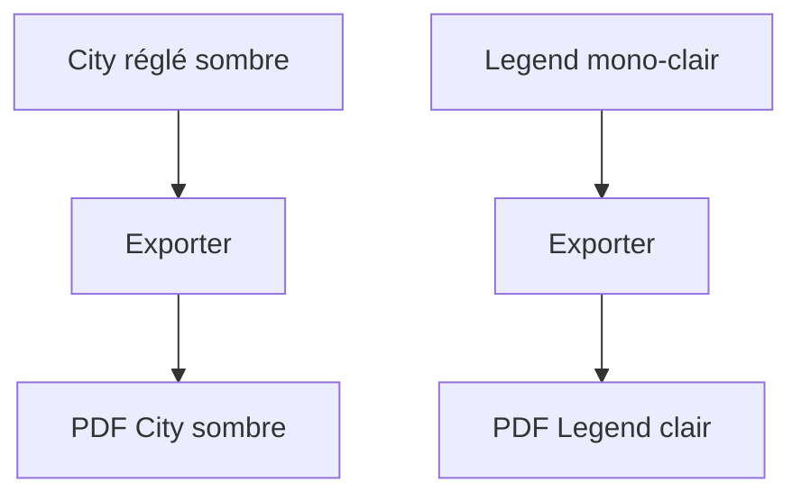
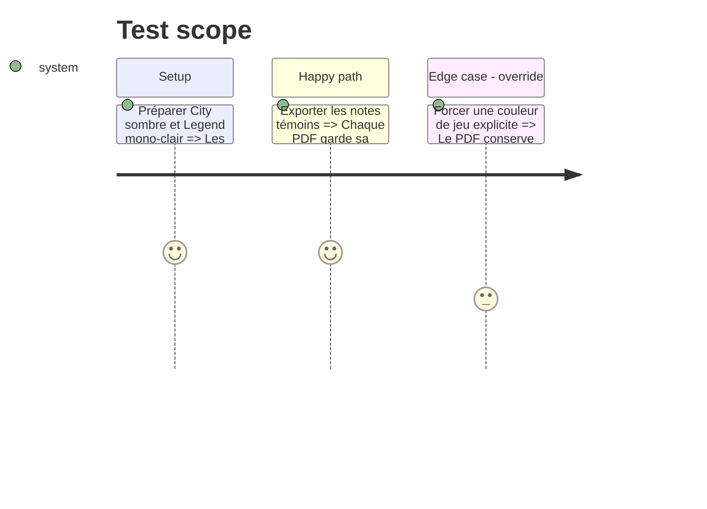

# Instruction: Réaligner l’impression sur la polarité active

## Architecture projection

```txt
obsidian-handbook/
├── src/BrumesPlugin.ts                ✏️ retire toute couche print qui remplace la polarité
├── src/features/modes/styleElement.ts ✏️ conserve les tokens actifs sur `.print`
└── src/styles/_print.scss             ✏️ limite les règles aux garanties Chromium communes
```

## User Journey



## Test Scope



## Tasks to do

### `1)` Retirer la normalisation light

1. Supprimer tout générateur print qui remplace `light`/`dark` par une couche unique.
2. Conserver le sélecteur `.print .markdown-preview-view` pour transmettre les tokens actifs au DOM d’export.

### `2)` Garder les garanties neutres

1. Limiter la CSS commune à `print-color-adjust` et aux simplifications sans identité visuelle.
2. Vérifier l’absence de couleur, police et polarité de pack dans cette couche.

## Test acceptance criteria

| Task | Acceptance criteria |
| --- | --- |
| 1 | City sombre n’hérite d’aucune valeur light; Legend reste clair. |
| 2 | La CSS d’impression commune ne contient aucun token visuel propre à un jeu. |
