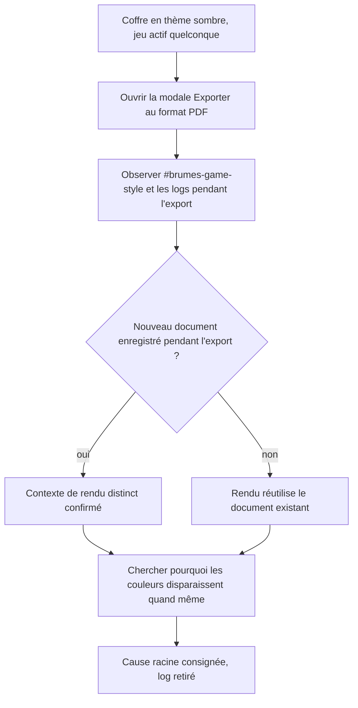

<!-- Fill or omit these sections; never add, rename, or reorder one. -->

# Instruction: Investigation du contexte de rendu PDF

## Architecture projection

> Tree of the final files. ✅ create · ✏️ modify · ❌ delete

```txt
obsidian-handbook/
└── src/features/modes/
    └── styleElement.ts                 ✏️ log temporaire (retiré en fin de phase)
```

## User Journey



## Tasks to do

### `1)` Instrumenter l'enregistrement des documents

> Savoir si l'export PDF passe par un `Document` jamais annoncé à `GameStyleWriter`.

1. Ajouter un `console.debug` temporaire dans `GameStyleWriter.addDocument` (`src/features/modes/styleElement.ts`) traçant l'URL/le titre du document et si `doc === window.document`.
2. Builder (`rtk proxy pnpm build`) et déployer dans un des deux coffres de test.

### `2)` Observer un export PDF réel

> Confirmer ou infirmer l'hypothèse d'un contexte de rendu séparé.

1. Coffre en thème sombre, jeu actif avec deux polarités déclarées (ex. City of Mist).
2. Ouvrir la note témoin, lancer "Exporter au format PDF", garder les DevTools ouverts sur la console pendant toute la modale.
3. Noter si un nouveau log `addDocument` apparaît pendant l'export ou seulement au chargement initial.
4. Une fois le PDF produit, l'ouvrir et comparer ses couleurs à la note affichée à l'écran (attendu actuel : dégradation constatée dans le brief).

### `3)` Chercher la cause si le document est réutilisé

> Si aucun nouveau document n'apparaît, la disparition des couleurs vient d'ailleurs que d'un contexte manquant.

1. Émuler `@media print` dans DevTools ("Rendering → Emulate CSS media type: print") sur la fenêtre principale, sans lancer d'export, et observer si les couleurs du thème disparaissent déjà à ce stade.
2. Si oui : chercher une règle `@media print` propre à Obsidian (dans les feuilles de style natives visibles depuis l'onglet "Sources" des DevTools) qui réinitialiserait `color`/`background`, ou un défaut Chromium (`print-color-adjust` non forcé) qui retire fonds et couleurs de fond par défaut à l'impression.
3. Si non (les couleurs survivent à l'émulation `@media print` mais disparaissent quand même dans le vrai export), la cause est spécifique au pipeline `printToPDF` d'Electron/Obsidian (options d'impression, pas du CSS) — consigner cette conclusion et son impact sur la phase 2.

### `4)` Nettoyer et consigner

> Ne pas laisser de log de diagnostic dans le code livré.

1. Retirer le `console.debug` ajouté à la tâche 1.
2. Consigner la conclusion (contexte réutilisé ou non, cause identifiée) dans le corps de ce fichier ou dans les Decisions du plan si elle change une décision actée.

## Test acceptance criteria

| Task | Acceptance criteria |
| ---- | -------------------- |
| 1 | Le log ajouté distingue sans ambiguïté le document de la fenêtre principale de tout autre document qui recevrait le style. |
| 2 | Un export PDF réel a été observé avec les DevTools ouverts, et la présence ou l'absence d'un nouveau document pendant l'export est constatée, pas supposée. |
| 3 | La cause exacte de la disparition des couleurs à l'impression est démontrée par une observation reproductible (émulation `@media print` ou pipeline `printToPDF`), pas une hypothèse non vérifiée. |
| 4 | Aucun `console.debug` de diagnostic ne subsiste dans `styleElement.ts` une fois la phase close. |

## Conclusion

Observé le 2026-09-12, coffre Legend in the Mist (`Handbook - Test blocs LITM`), export PDF réel via la modale "Exporter au format PDF", DevTools ouverts (niveau de log Verbose activé) :

1. **Aucun contexte de rendu distinct.** Les deux logs `addDocument` observés (au chargement de la note, puis à l'ouverture de la modale) portent tous les deux `doc === window.document`. Aucun nouveau document n'apparaît pendant l'export : `GameStyleWriter` écrit dans le même document que celui utilisé pour produire le PDF, `#brumes-game-style` y est donc bien présent et à jour au moment de l'export.
2. **Pas de reset CSS natif d'Obsidian.** Recherche exhaustive de `@media print` dans les feuilles de style natives (onglet Sources, recherche globale) : 5 occurrences, toutes limitées au rendu du lecteur PDF embarqué (`.xfaTextfield`/`.xfaSelect` de pdf.js, `.pdf-embed` pour les PDF intégrés dans une note) — aucune ne touche `color`, `background`, les titres ou une classe liée au rendu Markdown/thème.
3. **Panneau Rendering absent** de ce build Electron/Obsidian (menu "More tools" limité à Performance/Memory/Application/Security/Lighthouse/Recorder) : la comparaison `getComputedStyle` avant/après émulation `@media print` prévue à la tâche 3.1 n'a pas pu être faite par ce moyen précis.

**Cause retenue par élimination** : ni un contexte de rendu séparé, ni une règle Obsidian native n'expliquent la disparition des couleurs/fonds à l'export. La cause restante, cohérente avec tout ce qui a été observé et avec le comportement documenté de Chromium/Electron, est le comportement par défaut du pipeline d'impression qui omet fonds et images de fond tant que `print-color-adjust: exact` (`-webkit-print-color-adjust: exact`) n'est pas explicitement posé — exactement ce que la phase 2 (tâche 2.3) et la phase 3 (tâche 3) du plan ajoutent. Aucune tâche 4 (extension de la surface de documents) n'est nécessaire : le document est réutilisé, pas séparé.
