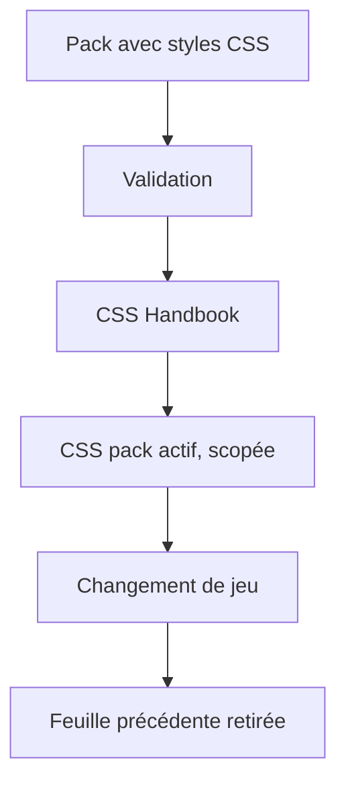
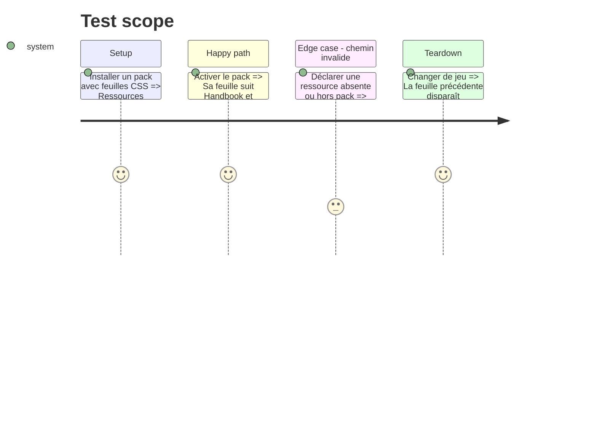

# Instruction: Étendre le contrat de pack avec une feuille CSS

## Architecture projection

```txt
schema-in-the-mist/handbook/<game>/
├── pack.json                         ✏️ déclare une liste de feuilles CSS et la version minimale Handbook
└── styles/*.css                       ✅ règles propres au jeu
obsidian-handbook/
├── src/games/types.ts                ✏️ modèle la ressource CSS
├── src/games/fromSchema.ts           ✏️ la valide
├── src/games/assets.ts               ✏️ la résout dans le pack installé
└── src/features/modes/styleElement.ts ✏️ valide la portée, injecte et retire les feuilles
```

## User Journey



## Test Scope



## Tasks to do

### `1)` Définir le contrat

1. Mettre à jour manifeste et exemples de `schema-in-the-mist` selon #11 avec une liste ordonnée de chemins CSS relatifs.
2. N’autoriser que des chemins validés, sous le répertoire du pack, vers des CSS dont chaque sélecteur de règle est préfixé par `body.brumes--<id-du-pack>`.
3. Publier une version de schéma déclarant la version minimale Handbook qui sait charger ce contrat.

### `2)` Consommer le contrat

1. Étendre lecteur de pack, modèles typés et résolution locale.
2. Rejeter une feuille qui porte un sélecteur non scopé ; charger les feuilles valides dans leur ordre déclaré, après `styles.css`, dans chaque document, et les nettoyer au changement de source ou de jeu.
3. Vérifier le rechargement d’une source installée et le refus explicite d’un pack demandant une version Handbook trop ancienne.

### `3)` Prouver isolation et compatibilité

1. Tester ordre, chemin, portée et retrait de feuille.
2. Vérifier qu’un pack token-only garde son comportement actuel.

## Test acceptance criteria

| Task | Acceptance criteria |
| --- | --- |
| 1 | Un pack peut déclarer des feuilles relatives, ordonnées et préfixées par son sélecteur de jeu, avec une version minimale Handbook. |
| 2 | Une feuille non scopée est rejetée ; les feuilles actives suivent Handbook puis disparaissent sans fuite et une source rechargée remplace leur version précédente. |
| 3 | Les chemins illégitimes et versions incompatibles sont rejetés, et les anciens packs restent compatibles. |
