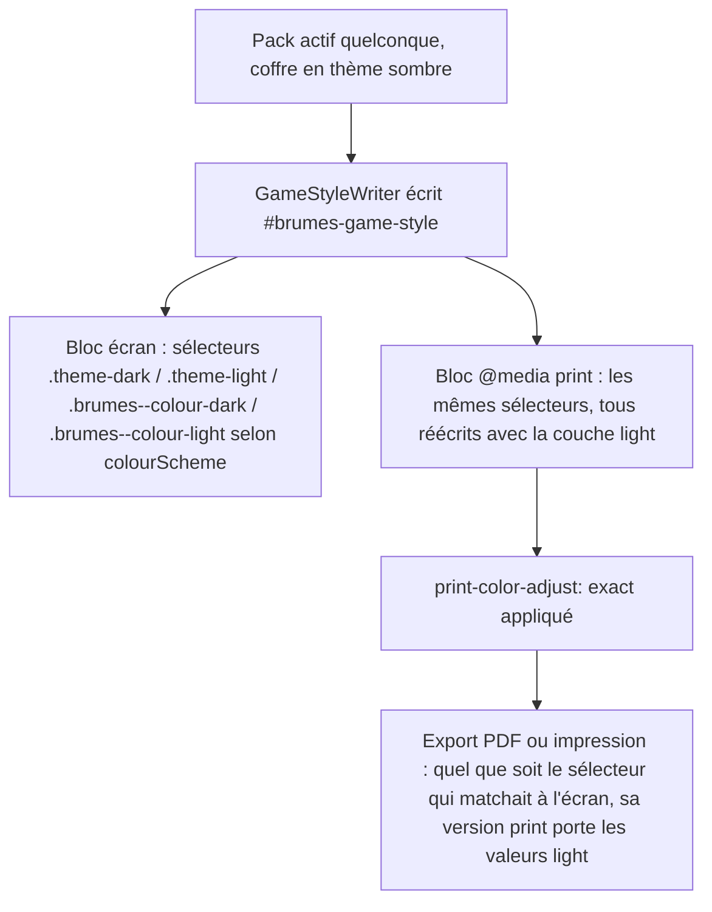

<!-- Fill or omit these sections; never add, rename, or reorder one. -->

# Instruction: Mécanisme d'impression générique dans styleElement.ts

## Architecture projection

> Tree of the final files. ✅ create · ✏️ modify · ❌ delete

```txt
obsidian-handbook/
└── src/
    ├── features/modes/
    │   └── styleElement.ts             ✏️ ajoute et exporte buildPrintOverride()
    └── BrumesPlugin.ts                 ✏️ appelle buildPrintOverride() et concatène sa sortie à block dans applyGameStyle()
```

## User Journey



## Tasks to do

### `1)` Comprendre pourquoi un simple second appel à `buildGameStyle` ne suffit pas

> Vérifié dans `src/features/modes/styleElement.ts` (L.66-186) : quand on appelle `buildGameStyle(..., colourScheme: "light")`, `polarityClass` (L.66-79) renvoie `.brumes--colour-light` — une classe posée sur `body` uniquement quand le réglage **réel** du coffre est l'override "light" (`setBrumesColourSchemeClass`). Forcer le paramètre à la génération ne pose aucune classe sur le DOM : si le coffre est en thème sombre, le bloc généré ne correspond à aucun sélecteur présent et ne s'applique jamais, tandis que le bloc écran `body.brumes--<mode>.theme-dark ...` (ou `.brumes--colour-dark`), non exclu du média `print`, continue de s'appliquer avec une spécificité égale ou supérieure. Un second appel à `buildGameStyle` avec une polarité forcée est donc du CSS mort, pas une correction.

1. Ne pas modifier la signature ni le comportement de `buildGameStyle` : la fonction reste correcte pour l'écran, telle quelle.

### `2)` Ajouter une fonction dédiée qui réécrit tous les sélecteurs possibles avec la couche light

> Le bloc print doit gagner par spécificité égale + ordre de source, jamais par une classe qui ne sera pas posée.

1. Dans `src/features/modes/styleElement.ts`, ajouter et exporter (elle est appelée depuis `BrumesPlugin.ts`, cf. tâche 3) une fonction `buildPrintOverride(mode, values, workspaceTheme, polarities)` qui :
   - détermine `const printLayer = polarities.includes("light") ? values.light : values.base;` — jamais une valeur inventée, toujours une couche déjà déclarée par le pack ;
   - réutilise les fonctions déjà existantes `noteSelector`, `workspaceSelector` et `renderLayer` (ne pas dupliquer leur construction de sélecteur) pour produire, avec `printLayer`, un bloc pour **chacune** des variantes de sélecteur que l'écran peut produire : le sélecteur nu (`noteSelector(mode)` / `workspaceSelector(mode)`, couvre les packs à 0 ou 1 polarité), puis, si `polarities.length === 2`, les quatre combinaisons `noteSelector(mode, "light", "obsidian")`, `noteSelector(mode, "dark", "obsidian")` (sélecteurs `.theme-light`/`.theme-dark`), `noteSelector(mode, "light", "light")`, `noteSelector(mode, "dark", "dark")` (sélecteurs `.brumes--colour-light`/`.brumes--colour-dark`), et leurs équivalents `workspaceSelector` ;
   - concatène tous ces blocs et les enveloppe dans `@media print { ... }`.
2. Si `polarities.length !== 2`, ne pas générer de bloc print du tout dans deux cas : `polarities.length === 0` (le pack ne déclare aucune polarité, le sélecteur nu affiche déjà `base` en toute circonstance — cas où `printLayer` vaudrait `values.base`, strictement identique à ce que l'écran affiche déjà) ou `polarities[0] === "light"` (cas Legend in the Mist : le sélecteur nu affiche déjà light en toute circonstance, mécanisme documenté en L.119-126 du fichier). Dans les deux cas, un bloc print serait un doublon octet pour octet de la règle écran déjà active, jamais exclue du média `print`.
3. Ajouter, dans ce même bloc `@media print`, une règle ciblant le sélecteur du mode (`.brumes--<mode>`) qui pose `print-color-adjust: exact` et `-webkit-print-color-adjust: exact`.

### `3)` Concaténer le bloc dans le même élément de style

> `GameStyleWriter.applyGameStyle` (L.219, `styleElement.ts`) ne reçoit qu'une chaîne CSS déjà construite — ni `mode`, ni `values`, ni `polarities` : la concaténation doit se faire chez l'appelant, pas dans `GameStyleWriter`.

1. Dans `BrumesPlugin.applyGameStyle()` (`src/BrumesPlugin.ts`, L.281-343), juste après la construction de `block` via `buildGameStyle(...)` (L.317-331) et avant la concaténation de `calloutCss`, appeler `buildPrintOverride(pack.id, { ...style, base: { note: { ...style.base.note, ...images }, workspace: style.base.workspace } }, this.settings.features.workspaceTheme, this.overrides.polarities ?? appearance.polarities)` — les mêmes arguments déjà assemblés pour `buildGameStyle`, sans rien recalculer.
2. Concaténer sa sortie à `block` (par exemple `` `${block}\n\n${printOverride}` ``) avant que `calloutCss` ne soit ajouté, pour que le tout parte ensemble vers `this.gameStyle.applyGameStyle(...)`.
3. Vérifier que `sanitizeValue` s'applique toujours aux mêmes valeurs sources (`values`) sans chemin de contournement — le bloc print consomme les mêmes données déjà nettoyées par `renderTokens`.

### `4)` Étendre la surface de documents si la phase 1 l'exige

> Ne faire cette tâche que si la phase 1 a confirmé un contexte de rendu distinct.

1. Si confirmé : identifier dans `src/BrumesPlugin.ts` l'événement ou hook Obsidian pertinent (probablement absent du SDK public — à vérifier) permettant d'enregistrer ce contexte auprès de `gameStyle.addDocument`.
2. Si aucun hook n'existe côté API Obsidian, consigner cette limite comme un risque assumé plutôt que d'inventer un contournement fragile (ex. polling du DOM).
3. Si la phase 1 a confirmé que le document est réutilisé (pas de contexte séparé), sauter cette tâche entièrement.

## Test acceptance criteria

| Task | Acceptance criteria |
| ---- | -------------------- |
| 1 | `buildGameStyle` n'a subi aucune modification de signature ni de comportement — son usage écran existant reste identique. |
| 2 | `buildPrintOverride` ne contient aucune valeur littérale de couleur : `printLayer` provient toujours de `values.light` ou `values.base`, jamais d'une valeur écrite en dur ; le bloc généré couvre les sélecteurs `.theme-light`, `.theme-dark`, `.brumes--colour-light`, `.brumes--colour-dark` et le sélecteur nu. |
| 3 | En émulant `@media print` dans DevTools sur la fenêtre principale, coffre en thème sombre (`.theme-dark` posé sur `body`), les couleurs appliquées correspondent à la polarité light du pack actif — vérifié en comparant les valeurs calculées (`getComputedStyle`) avant/après l'émulation, pas seulement à l'œil. |
| 4 | Si la tâche 4 s'applique, le contexte identifié en phase 1 reçoit désormais le style ; sinon, le fichier documente explicitement pourquoi elle a été sautée. |
