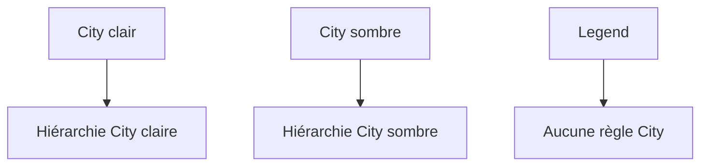
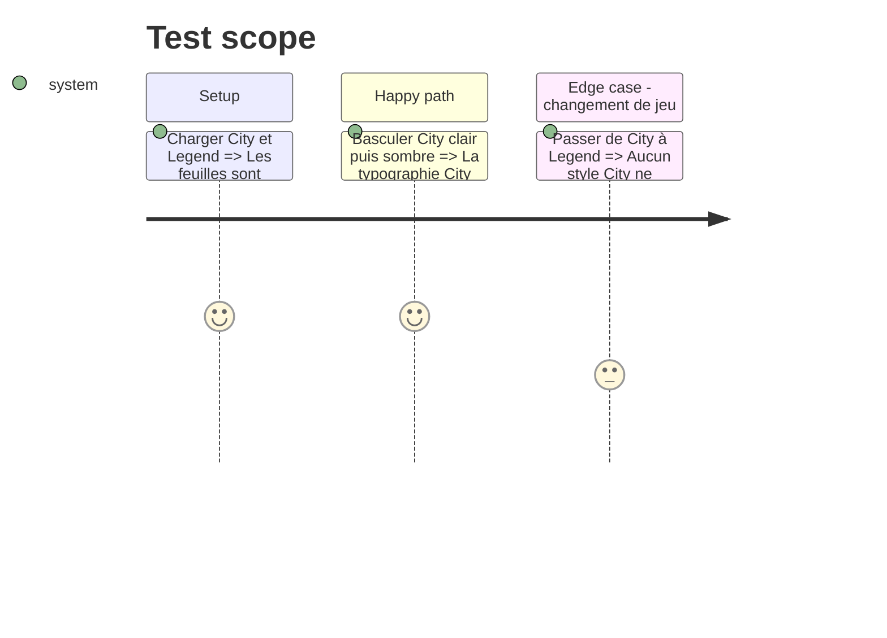

# Instruction: Migrer City vers le style fourni par son schéma

## Architecture projection

```txt
schema-in-the-mist/handbook/city-of-mist/
├── pack.json                         ✏️ rôles typographiques et feuille CSS
└── style.css                         ✅ cartes, callouts et chrome City
obsidian-handbook/src/styles/city-of-mist/
└── **/*.scss                         ✏️ retire toutes les décisions visuelles City migrées
```

## User Journey



## Test Scope



## Tasks to do

### `1)` Établir les rôles City

1. Comparer titres, texte, cartes et callouts aux PDFs de référence City.
2. Déclarer les rôles de composants dans le pack, sans police City codée en dur dans Handbook.

### `2)` Déplacer les règles City

1. Auditer toutes les partials City pour séparer les mécanismes réellement partagés des décisions visuelles City.
2. Migrer styles structurels, typographiques et chrome City vers les feuilles du pack, scopées au jeu et alimentées par ses tokens.
3. Retirer chaque doublon local et vérifier qu’aucun sélecteur City ne reste hors de la migration documentée.

## Test acceptance criteria

| Task | Acceptance criteria |
| --- | --- |
| 1 | Le pack déclare les rôles de titres et composants nécessaires. |
| 2 | City clair/sombre sont distincts, l’audit couvre toutes les partials City et City ne fuit jamais vers Legend. |
