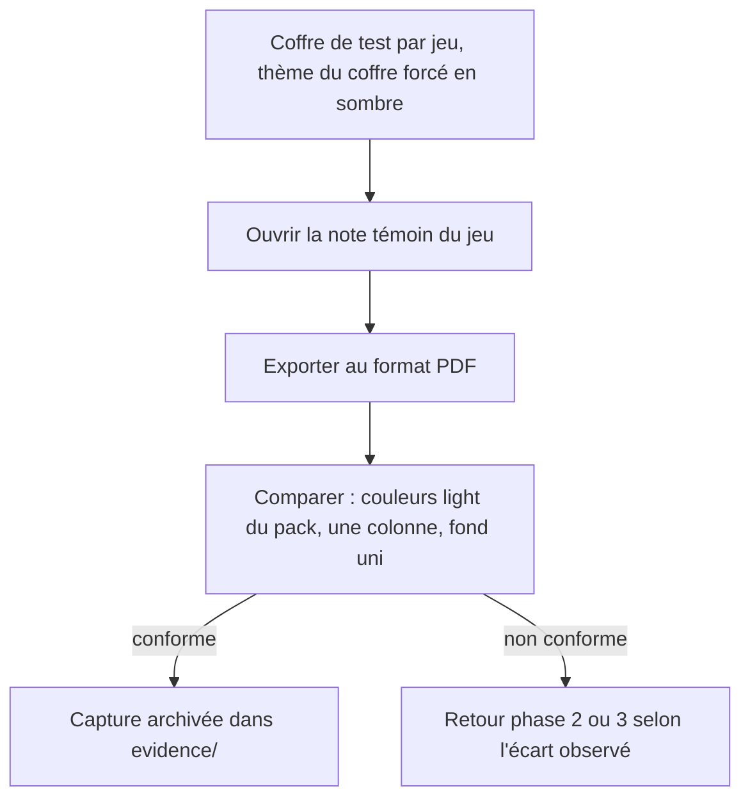

<!-- Fill or omit these sections; never add, rename, or reorder one. -->

# Instruction: Recette visuelle croisée sur les quatre jeux

## Architecture projection

> Tree of the final files. ✅ create · ✏️ modify · ❌ delete

```txt
obsidian-handbook/
└── aidd_docs/tasks/2026_09/2026_09_12_print-export-theme-fidelity/
    └── evidence/
        ├── print-city-of-mist.pdf          ✅
        ├── print-legend-in-the-mist.pdf    ✅
        ├── print-otherscape.pdf            ✅
        └── print-adrenaline.pdf            ✅
```

## User Journey



## Tasks to do

### `1)` Exporter un PDF réel par jeu, coffre en thème sombre

> Vérifier que la polarité light est bien forcée indépendamment du thème du coffre.

1. Pour chacun des quatre jeux (City of Mist, Legend in the Mist, Otherscape, Adrenaline), dans le coffre de test correspondant, forcer le thème du coffre en sombre.
2. Ouvrir la note témoin du jeu (bancs `Handbook - Test blocs *.md` ou équivalent), lancer "Exporter au format PDF".

### `2)` Vérifier la fidélité du PDF produit

> Juger sur le PDF réel, pas sur le rendu écran.

1. Couleurs et police du thème présentes, en polarité light (pas dark, pas la valeur par défaut d'Obsidian).
2. Callouts et blocs de jeu (statblocks/fiches/cartes) fidèles à leur habillage habituel.
3. Une seule colonne (là où le jeu en avait deux à l'écran) et un fond uni sans texture.

### `3)` Confirmer ou ajuster le choix de fond

> La Decision actée (fond = couleur light du pack) doit rester lisible sur les quatre jeux.

1. Si un jeu produit un fond illisible ou surprenant, ne pas corriger localement : remonter l'ajustement à la Decision du plan (ex. si un pack a une couleur light trop saturée pour un usage de fond de page imprimée).

### `4)` Archiver les preuves

> Une preuve par jeu, pas une captée à l'écran.

1. Enregistrer chaque PDF produit dans `evidence/` sous ce dossier de tâche, nommé `print-<jeu>.pdf`.

## Test acceptance criteria

| Task | Acceptance criteria |
| ---- | -------------------- |
| 1 | Un PDF réel a été produit pour chacun des quatre jeux, coffre en thème sombre au moment de l'export. |
| 2 | Chaque PDF montre les couleurs/police en polarité light du pack, les callouts et blocs de jeu fidèles, une seule colonne et un fond uni. |
| 3 | Le choix de fond reste lisible sur les quatre jeux sans correctif ad hoc ; tout ajustement nécessaire est tracé comme une révision de la Decision, pas un patch local. |
| 4 | `evidence/` contient les quatre PDF, un par jeu. |
