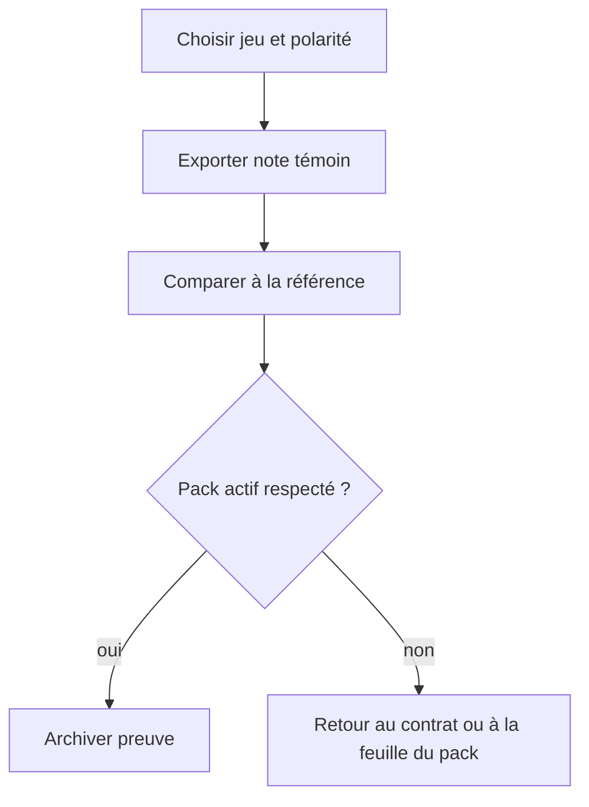
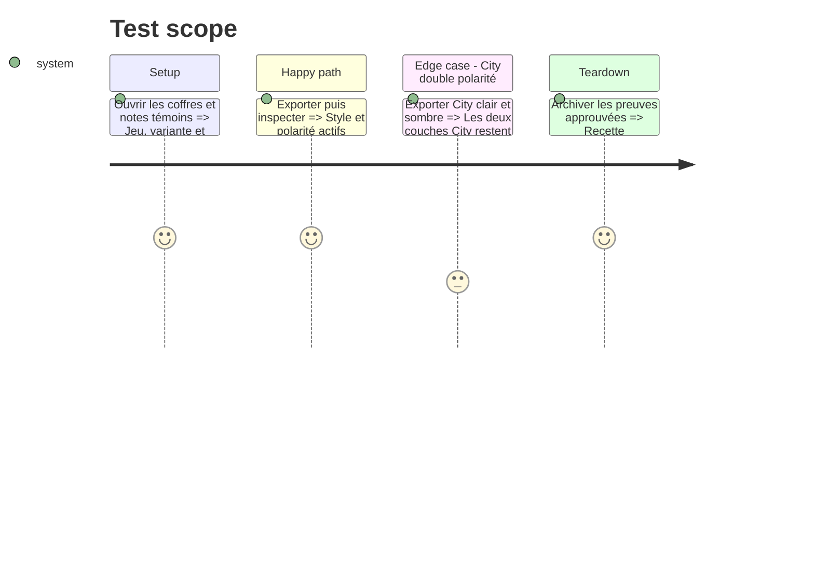

# Instruction: Recette croisée et archivage

## Architecture projection

```txt
aidd_docs/tasks/2026_09/2026_09_12_print-export-theme-fidelity/evidence/
├── city-of-mist-light.pdf             ✅ preuve City light
├── city-of-mist-dark.pdf              ✅ preuve City dark
├── legend-in-the-mist.pdf             ✅ preuve Legend mono-claire
├── otherscape-<variant>.pdf           ✅ preuve de variante
└── adrenaline-<polarity>.pdf          ✅ preuve de polarité
```

## User Journey



## Test Scope



## Tasks to do

### `1)` Préparer la matrice de recette

1. Consigner jeu, variante, polarité et référence pour chaque export.
2. Tester City en clair et sombre; ne jamais inventer une polarité Legend.

### `2)` Exporter et inspecter

1. Vérifier fond, contraste, polices, callouts, cartes, colonnes et absence de fuite entre jeux.
2. Retourner vers la phase propriétaire du contrat en cas d’écart.

### `3)` Archiver les preuves conformes

1. Nommer chaque PDF avec le réglage effectivement utilisé.
2. Ne conserver dans `evidence/` que les exports approuvés.

## Test acceptance criteria

| Task | Acceptance criteria |
| --- | --- |
| 1 | Chaque preuve indique le réglage réellement utilisé. |
| 2 | Les PDFs respectent leur pack et ne confondent pas City, Legend, Otherscape et Adrenaline. |
| 3 | Les preuves archivées sont reproductibles et nommées sans ambiguïté. |
