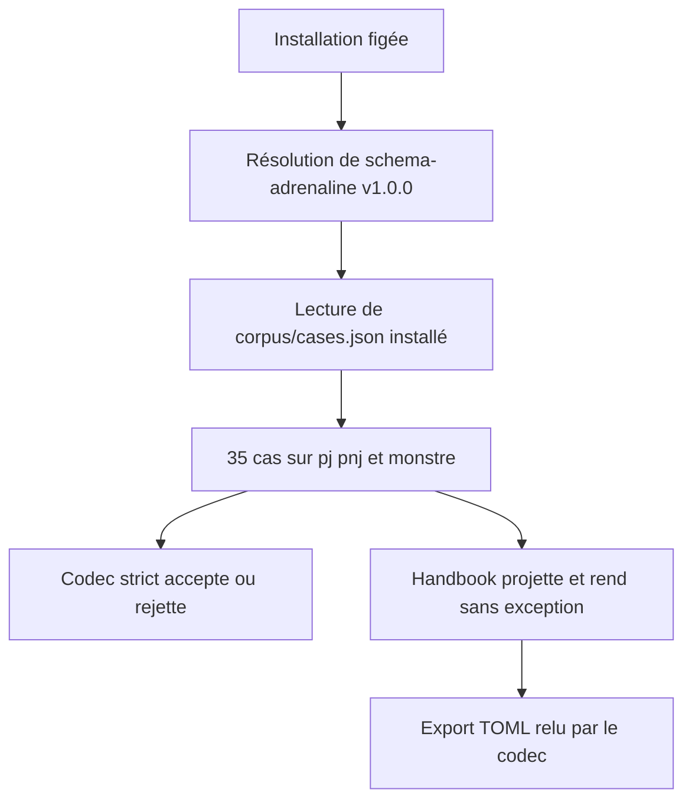
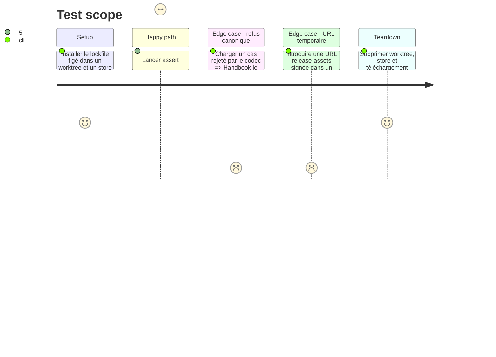

# Instruction: Épinglage reproductible et harnais de contrat

## Architecture projection

> Tree of the final files. ✅ create · ✏️ modify · ❌ delete

```txt
obsidian-handbook/
├── package.json                               ✏️ ajoute schema-adrenaline et assert:adrenaline-contract
├── package-lock.json                          ✏️ conserve résolution publique et SRI npm
├── pnpm-lock.yaml                             ✏️ conserve spécificateur, tarball public et SRI pnpm
└── tools/
    ├── adrenalineContractCorpus.mts            ✅ résout et vérifie le manifeste publié
    ├── assert-adrenaline-contract.mjs          ✅ verrouille release/lockfiles puis exécute le harnais
    └── assertAdrenalineContract.harness.mts    ✅ couvre codecs, projection, rendu et export TOML
```

## User Journey



## Test Scope



## Tasks to do

### `1)` Épingler l’asset de release dans les métadonnées reproductibles

> Déclarer et verrouiller la seule archive publique `schema-adrenaline` v1.0.0.

1. Ajouter `schema-adrenaline` aux dépendances avec l’URL stable `https://github.com/RebelliousSmile/schema-adrenaline/releases/download/v1.0.0/schema-adrenaline-1.0.0.tgz`, puis régénérer les deux lockfiles sans conserver de redirection signée GitHub.
2. Ajouter `assert:adrenaline-contract` et son lanceur; y vérifier hors ligne que `package.json`, `package-lock.json` et `pnpm-lock.yaml` portent l’URL publique, leur intégrité SRI et aucun domaine `release-assets.githubusercontent.com`.
3. Vérifier séparément l’archive téléchargée dans un répertoire temporaire contre le digest SHA-256 publié, puis prouver `pnpm install --frozen-lockfile` avec un store vide et nettoyer toutes les ressources temporaires.

### `2)` Centraliser l’accès au corpus et aux codecs installés

> Donner aux harnais une lecture sûre du package, indépendante du layout de `node_modules`.

1. Créer `adrenalineContractCorpus.mts`, résolvant `schema-adrenaline/package.json` depuis le projet avec `createRequire`, puis chargeant et validant `corpus/cases.json`, ses chemins internes et l’unicité des entrées.
2. Exiger la version de manifeste 1, `tomlVersion`/version du package `1.0.0`, les formats `json|toml`, les verdicts `accept|reject`, l’ensemble exact des cibles `pj|pnj|monstre` et l’existence de chaque source sans sortie de la racine du package.
3. Fournir au harnais le lecteur strict correspondant à chaque entrée (`parseJson` pour JSON, `parseToml` pour TOML), la source TOML originale quand elle existe et, pour chaque JSON accepté, une conversion canonique `codec.parseJson → codec.stringifyToml`; un JSON refusé reste une preuve stricte et ne reçoit aucun TOML inventé.

### `3)` Prouver le contrat strict et le consommateur tolérant

> Exercer les trois codecs publiés, les trois blocs enregistrés et leurs exports sur chaque cas applicable.

1. Pour chaque entrée, appeler le lecteur du codec adapté à son format: tout `accept` doit survivre à `parseJson → stringifyJson → parseJson` ou `parseToml → stringifyToml → parseToml` avec égalité profonde; tout `reject` doit échouer explicitement par ce même lecteur.
2. Pour chaque cas TOML et chaque JSON accepté converti canoniquement, mapper les cibles aux ids `adrenaline-pj`, `adrenaline-pnj` et `adrenaline-monstre`; exiger que le parseur tolérant ne jette pas puis, si la projection est non nulle, produise un rendu textuel non vide. Les JSON rejetés restent couverts par le verdict strict, sans fixture TOML artificielle.
3. Pour chaque projection exportable issue d’un cas canonique accepté, convertir avec l’entrée `TOML_EXPORTS`, faire accepter le résultat par `parseToml` du codec correspondant, le relire dans Handbook et comparer le texte rendu avant/après; rapporter séparément les 10 acceptations, 25 refus, trois codecs, trois blocs et trois exports observés.

## Test acceptance criteria

| Task | Acceptance criteria |
| --- | --- |
| 1 | Les dépendances et lockfiles ne portent que l’URL de release v1.0.0, une SRI vérifiable et aucune URL GitHub temporaire; une installation figée depuis un store vide réussit. |
| 2 | Le helper charge les 35 entrées publiées, couvre exactement PJ/PNJ/monstre et refuse un manifeste, un chemin ou un verdict invalide. |
| 3 | Les 10 acceptations et 25 refus sont lus avec leur format canonique; les cas convertibles ne font pas jeter les trois projections, leurs rendus non nuls ont du contenu et tout export Handbook valide conserve son rendu après relecture. |
