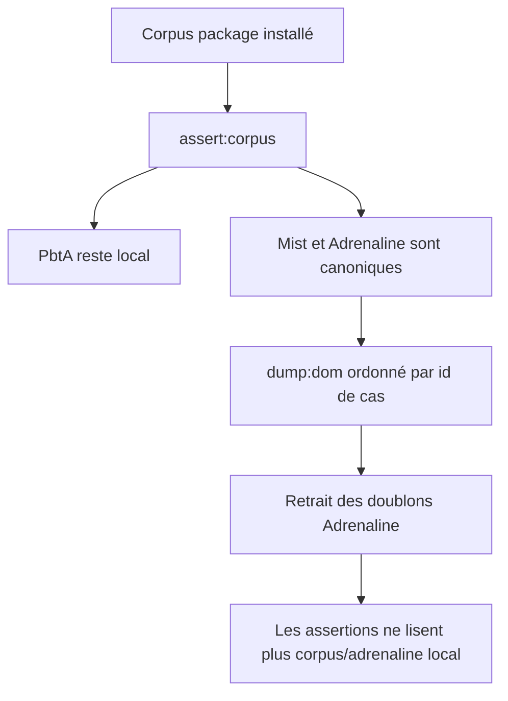
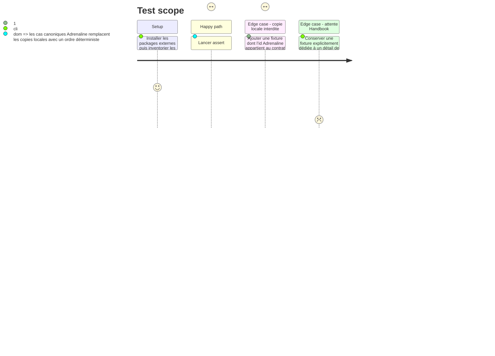

# Instruction: Bascule du corpus et retrait sélectif des doublons

## Architecture projection

> Tree of the final files. ✅ create · ✏️ modify · ❌ delete

```txt
obsidian-handbook/
├── corpus/
│   ├── README.md                                                   ✏️
│   ├── temoins/{adrenaline-pj,adrenaline-pnj,adrenaline-monstre}.toml ❌ si chaque cas est couvert canoniquement
│   └── refus/adrenaline-{pj,pnj,monstre}.*.toml                   ❌ si duplications métier du manifeste v1
└── tools/
    ├── assert-corpus.mjs                                          ✏️ bundle le helper de corpus Adrenaline
    ├── assertCorpus.harness.mts                                   ✏️ combine PbtA local, Mist et Adrenaline installés
    ├── dump-dom.mjs                                               ✏️ bundle le helper de corpus Adrenaline
    ├── dumpDom.harness.mts                                        ✏️ produit les cas Adrenaline canoniques stables
    ├── assert-adrenaline-source.mjs                               ❌ checkout frère remplacé par le contrat installé
    ├── assertAdrenalineSource.harness.mts                         ❌ validation Zod/exemples du checkout remplacée
    └── assertAdrenalineZombiologyStyle.harness.mts                ✏️ lit une source canonique ou une fixture visuelle explicitée
```

## User Journey



## Test Scope



## Tasks to do

### `1)` Faire cohabiter les corpus propriétaires dans les gardes globales

> Garder `assert:corpus` universel sans exiger de témoins locaux pour un contrat publié.

1. Étendre `assertCorpus.harness.mts` avec le helper Adrenaline, sur le modèle de Mist, afin de vérifier couverture de lecture et aller-retour des trois blocs depuis les cas canoniques acceptés; PbtA reste le seul corpus local de contrat.
2. Adapter les lanceurs esbuild (`assert-corpus.mjs`, `dump-dom.mjs`) pour que le helper puisse résoudre les packages externes au runtime du bundle CommonJS.
3. Ajouter une garde refusant tout nouveau témoin/refus local dont l’id est `adrenaline-pj`, `adrenaline-pnj` ou `adrenaline-monstre`, comme celle qui protège déjà Mist; continuer de vérifier directives et dégradation des formats réellement locaux.

### `2)` Faire consommer les cas canoniques aux sorties DOM

> Préserver la preuve du rendu complet, tolérant et nul sans chemins locaux Adrenaline.

1. Ajouter à `dumpDom.harness.mts` les sources TOML Adrenaline et les JSON acceptés convertis canoniquement, avec des en-têtes déterministes `adrenaline/<path>` et le helper partagé.
2. Pour chaque source alimentable, représenter `null` sans renderer et imprimer la projection dégradée lorsqu’elle existe; pour un refus JSON sans TOML canonique, imprimer un marqueur déterministe `strict reject` plutôt que d’inventer un document, afin que le dump reste exhaustif sur le manifeste sans masquer les zones optionnelles réellement rendables.
3. Modifier `assertAdrenalineZombiologyStyle.harness.mts`, qui lit aujourd’hui `corpus/temoins/adrenaline-pnj.toml`, pour charger un cas PNJ TOML canonique par le helper; si aucune entrée canonique ne porte la géométrie visuelle nécessaire, créer une fixture dédiée sous `tools/fixtures/` et documenter qu’elle n’est pas un cas de contrat.

### `3)` Retirer les copies et l’assertion de checkout devenues concurrentes

> Supprimer le contrat local seulement après que les consommateurs lisent l’archive installée.

1. Établir d’abord la correspondance de chaque témoin et refus Adrenaline local avec `corpus/cases.json`, puis supprimer seulement ceux qui décrivent le même contrat métier; déplacer sous `tools/fixtures/` et nommer comme attente visuelle tout fichier indispensable à un comportement de renderer non exprimé par le producteur.
2. Supprimer `assert-adrenaline-source.mjs` et son harnais, dont la validation des cibles Zod et des exemples exige `SCHEMA_ADRENALINE_ROOT`; conserver les assertions de thème/pack hors de `pnpm check` tant qu’elles nécessitent intentionnellement le checkout de développement.
3. Mettre à jour les scripts et les documents qui citent l’ancienne assertion afin que `assert:adrenaline-contract` soit la preuve normale de compatibilité et que `pnpm check` n’ait plus aucune dépendance à `../schema-adrenaline`.

## Test acceptance criteria

| Task | Acceptance criteria |
| --- | --- |
| 1 | Tout bloc enregistré conserve une preuve de lecture et une commande de copie; les trois blocs Adrenaline sont couverts uniquement par le package et toute copie locale future est rejetée. |
| 2 | `dump:dom` imprime de façon stable les sources Adrenaline consommables et marque les refus JSON non convertibles comme `strict reject`, sans chemin sous `corpus/` pour ces trois ids. |
| 3 | Aucun témoin/refus métier Adrenaline dupliqué ni assertion de checkout Zod ne reste; les attentes de rendu réellement propres à Handbook demeurent identifiables et `pnpm check` n’exige pas le dépôt frère. |
