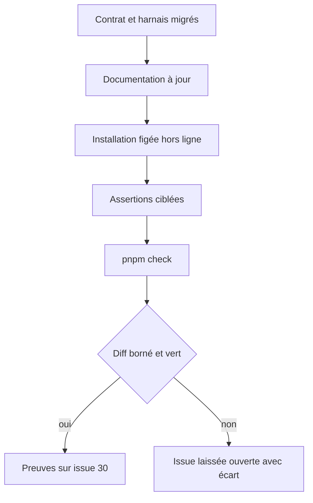
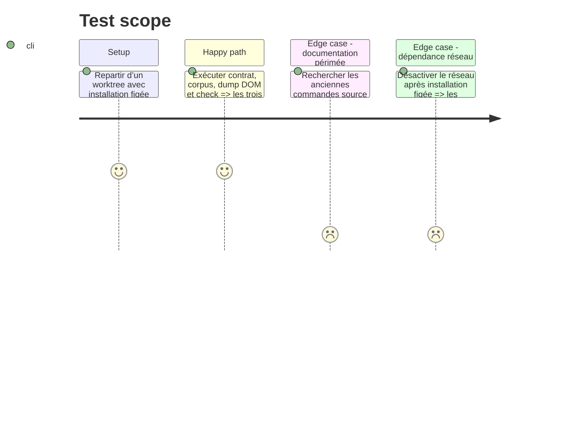

# Instruction: Documentation et validation intégrale

## Architecture projection

> Tree of the final files. ✅ create · ✏️ modify · ❌ delete

```txt
obsidian-handbook/
├── README.md                         ✏️ décrit le contrat Adrenaline v1 installé
├── CLAUDE.md                         ✏️ remplace les commandes et hypothèses de checkout normales
├── corpus/README.md                  ✏️ attribue Adrenaline au package canonique
└── aidd_docs/guidelines/schema-design.md ✏️ décrit le manifeste Adrenaline mixte JSON/TOML
```

## User Journey



## Test Scope



## Tasks to do

### `1)` Aligner les guides sur le propriétaire du contrat

> Rendre claire la séparation entre contrat Adrenaline, projection Handbook et assertions optionnelles de pack.

1. Mettre à jour `README.md`, `corpus/README.md` et `schema-design.md` pour désigner `schema-adrenaline` v1.0.0 comme source des codecs et du manifeste canonique, y compris ses cas JSON et TOML, et pour orienter les nouveaux cas métier vers ce dépôt.
2. Mettre à jour `CLAUDE.md` et toute aide de script: `assert:adrenaline-contract` devient la validation normale; les contrôles de thème/pack qui utilisent `SCHEMA_ADRENALINE_ROOT` sont explicitement optionnels et réservés au développement coordonné.
3. Documenter la règle stricte/tolérante: le codec du package décide `accept|reject`, Handbook ne doit jamais jeter sur ces entrées et ne conserve localement que ses attentes de rendu.

### `2)` Vérifier la migration complète et son autonomie hors ligne

> Démontrer que la release et ses deux consommateurs de corpus suffisent au dépôt.

1. Depuis une installation figée propre, exécuter `pnpm assert:adrenaline-contract`, `pnpm assert:corpus` et `pnpm dump:dom`, en conservant les totaux, l’intégrité vérifiée et le dump de référence comme preuves de la migration.
2. Exécuter `pnpm check` sans `../schema-adrenaline` ni `SCHEMA_ADRENALINE_ROOT`; vérifier séparément que les éventuelles assertions externes restantes ne sont pas des prérequis de cet agrégat.
3. Auditer le diff et les recherches textuelles: aucun URL signé, aucune version Adrenaline obsolète, aucun chemin de corpus local Adrenaline devenu supprimé, ni changement de dépendance sans rapport.

### `3)` Clore l’issue avec une preuve unique

> Fermer #30 uniquement sur une migration démontrée, sans publication latérale.

1. Relire l’état et les commentaires de l’issue #30 immédiatement avant toute écriture externe afin d’éviter un doublon de compte rendu.
2. Ajouter au plus un commentaire indiquant l’URL et le digest de l’asset, les totaux par codec/corpus, les commandes réussies, les fixtures supprimées et l’absence de checkout dans `pnpm check`.
3. Fermer l’issue seulement si toutes les validations sont vertes; dans le cas contraire, la laisser ouverte en rapportant l’écart et sa commande de reproduction. Ne pas créer de release dans ce travail.

## Test acceptance criteria

| Task | Acceptance criteria |
| --- | --- |
| 1 | La documentation identifie sans ambiguïté le package v1.0.0 comme propriétaire du corpus métier, réserve le checkout aux contrôles de pack coordonnés et explique les deux frontières de validation. |
| 2 | Après une installation figée, les assertions de contrat, corpus, DOM et `pnpm check` passent hors ligne sans checkout `schema-adrenaline`; le diff ne contient aucun artefact temporaire ou changement étranger. |
| 3 | L’issue ne reçoit qu’une preuve non redondante et est fermée uniquement avec les validations réussies; aucune release n’est créée. |

