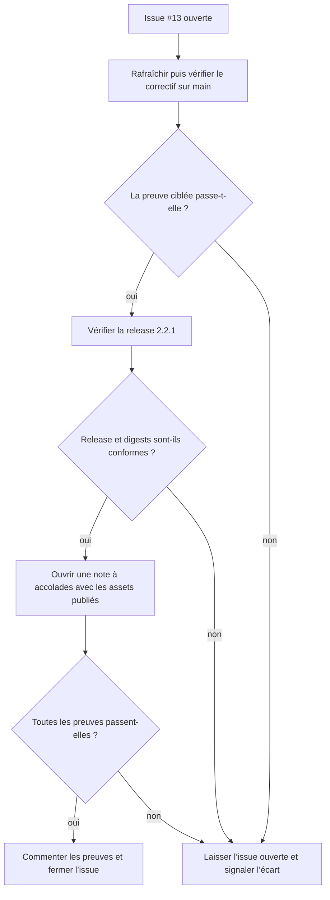
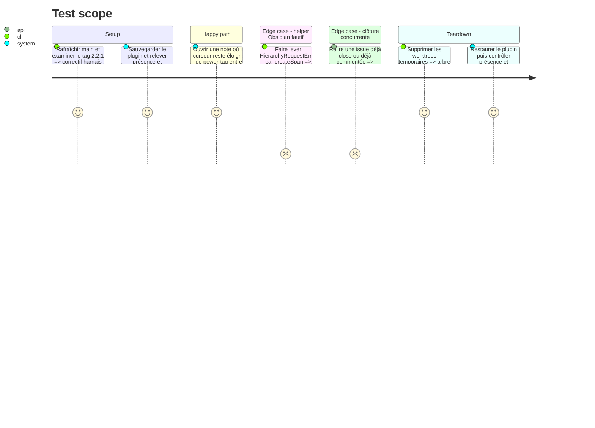

# Instruction: Vérification de livraison et clôture

## Architecture projection

> Tree of the final files. ✅ create · ✏️ modify · ❌ delete

```txt
obsidian-handbook/
└── (aucun changement de fichier produit)
```

## User Journey



## Test Scope



## Tasks to do

### `1)` Confirmer le correctif sur la branche principale

> Prouver le comportement livré sans modifier de nouveau le widget.

1. Rafraîchir `origin/main`, puis vérifier que les commits `23cef0b` et `d3ca064` en sont ancêtres.
2. Confirmer que `HiddenBracketWidget.toDOM()` crée un élément XHTML détaché, le masque, conserve son texte et n’appelle pas `Document.createSpan()`.
3. Créer un worktree temporaire de `origin/main`, y installer le lockfile avec `pnpm install --frozen-lockfile`, puis exécuter `pnpm assert:tag-widget` pour reproduire le cas où `createSpan()` lève `HierarchyRequestError` et confirmer que le widget reste fonctionnel.
4. Supprimer le worktree de `origin/main` dans tous les cas, succès ou échec.

### `2)` Confirmer la livraison 2.2.1

> Relier la correction au tag et à la release demandés par le ticket.

1. Vérifier que le tag `2.2.1` contient le correctif et le harnais de régression, créer un worktree temporaire sur ce tag, y installer le lockfile avec `pnpm install --frozen-lockfile`, exécuter l’assertion dédiée puis supprimer le worktree dans tous les cas, succès ou échec.
2. Confirmer dans ce tag l’alignement de `package.json`, `manifest.json` et `versions.json` sur 2.2.1.
3. Confirmer que la release GitHub `2.2.1` est publique, associée au même tag et fournit les trois assets attendus avec leurs digests.
4. Télécharger `main.js`, `manifest.json` et `styles.css` depuis cette release, vérifier leurs digests publiés, sauvegarder les fichiers de plugin existants puis relever la présence initiale de `data.json` et son empreinte s’il existe avant d’installer ensemble les assets dans un coffre de test.
5. Activer Handbook 2.2.1 dans Obsidian, puis ouvrir une note Markdown contenant une ligne de texte ordinaire suivie d’une ligne `{power-tag}` ; placer le curseur sur la ligne ordinaire afin que `HiddenBracketWidget` masque bien les accolades et confirmer que la feuille principale rend la note sans `HierarchyRequestError`.
6. Après le test ou dès qu’une étape échoue, restaurer les fichiers de plugin sauvegardés et confirmer que `data.json` a conservé sa présence ou son absence initiale ainsi que son empreinte s’il existait.

### `3)` Fermer l’issue avec les preuves

> Résoudre le décalage de suivi sans publier de nouvelle version.

1. Relire l’état et les commentaires de l’issue immédiatement avant la mutation.
2. Si le commentaire de preuve n’existe pas, l’ajouter une seule fois en mentionnant le correctif `d3ca064`, l’assertion `23cef0b`, le contrôle `pnpm assert:tag-widget`, les digests conformes, le smoke test Obsidian réussi et la release 2.2.1.
3. Fermer l’issue #13 uniquement si toutes les preuves précédentes sont positives et si elle est encore ouverte ; ne jamais la rouvrir si elle a été fermée entre-temps.
4. Ne modifier aucun fichier produit et ne créer aucune release supplémentaire pour ce ticket déjà livré.

## Test acceptance criteria

| Task | Acceptance criteria |
| --- | --- |
| 1 | Sur `origin/main`, `HiddenBracketWidget.toDOM()` retourne un `span` XHTML détaché, caché et porteur du caractère attendu même lorsque `createSpan()` lève `HierarchyRequestError`. |
| 1 | L’assertion dédiée réussit dans un worktree propre de `origin/main` sans changement du code produit. |
| 2 | Le tag et la release publique 2.2.1 contiennent le correctif et l’assertion, avec les trois métadonnées de version alignées et les digests des assets téléchargés conformes. |
| 2 | L’assertion dédiée réussit dans un worktree propre du tag 2.2.1 après installation de son lockfile. |
| 2 | Une note où `{power-tag}` se trouve hors de la sélection s’ouvre dans Obsidian avec le plugin 2.2.1 actif et ses assets publiés, masque les accolades et ne produit ni feuille vide ni `HierarchyRequestError`. |
| 2 | Après succès ou échec, tous les worktrees temporaires sont supprimés et le coffre de test retrouve ses fichiers de plugin initiaux avec la présence et, le cas échéant, l’empreinte de `data.json` inchangées. |
| 3 | L’issue #13 est fermée avec un commentaire qui permet de retrouver les commits, le contrôle de non-régression et la release. |
| 3 | Une réexécution ne duplique pas le commentaire de preuve et ne rouvre jamais une issue déjà fermée. |
| 3 | Aucune nouvelle release et aucune modification du code produit ne sont introduites pour clore ce ticket déjà livré. |
