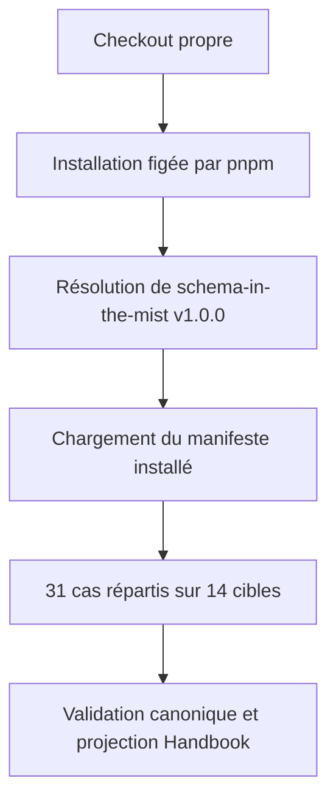
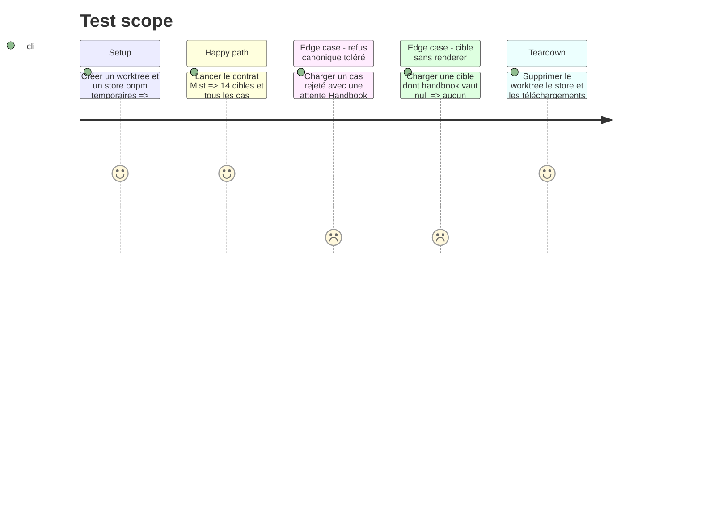

# Instruction: Épinglage reproductible et lecteur canonique

## Architecture projection

> Tree of the final files. ✅ create · ✏️ modify · ❌ delete

```txt
obsidian-handbook/
├── pnpm-lock.yaml                         ✏️
└── tools/
    ├── assert-mist-contract.mjs           ✏️
    ├── assertMistContract.harness.mts     ✏️
    └── mistContractCorpus.mts             ✅
```

## User Journey



## Test Scope



## Tasks to do

### `1)` Rendre l’épinglage pnpm durable

> Faire du lockfile une preuve reproductible de l’asset GitHub Release v1.0.0.

1. Régénérer la résolution `schema-in-the-mist` depuis l’URL stable déjà déclarée dans `package.json`, sans conserver l’URL temporaire signée de `release-assets.githubusercontent.com` actuellement expirée.
2. Exiger dans `assert-mist-contract.mjs` que le manifeste de dépendances et les deux lockfiles nomment la release v1.0.0 stable avec une intégrité, puis refuser toute URL signée ou jeton temporel ; ce contrôle local doit rester exécutable hors ligne.
3. Lors de la validation d’implémentation, télécharger séparément l’archive publiée vers un répertoire temporaire, comparer son SHA-256 au digest de la release, puis la supprimer ; ne pas rendre l’assertion locale dépendante du réseau.
4. Prouver l’installation dans un worktree temporaire avec un store pnpm vide et le lockfile figé, afin qu’aucun cache local ne masque un lien périmé ; supprimer le worktree et le store dans tous les cas et refuser tout changement de dépendance sans rapport.

### `2)` Centraliser la lecture du corpus installé

> Fournir aux harnais un accès unique, typé et indépendant du layout pnpm au contrat canonique.

1. Créer `mistContractCorpus.mts` pour résoudre `schema-in-the-mist/package.json` via une API Node ancrée sur `process.cwd()`, dériver la racine du package et charger `corpus/contract/cases.json` ainsi que chaque source TOML ; éviter `import.meta` afin que le helper reste valable dans les bundles CommonJS actuels.
2. Déclarer dans ce helper la correspondance explicite entre les 14 cibles canoniques et les 12 ids de blocs Handbook, avec deux cibles intentionnellement sans renderer.
3. Valider la structure du manifeste, l’unicité des ids, l’existence des fichiers, l’ensemble exact des 14 cibles et les seules attentes Handbook autorisées : `render`, `degraded` ou `null`.
4. Remplacer dans `assertMistContract.harness.mts` le chemin `node_modules` codé en dur et son mapping local par ce helper partagé.

### `3)` Exercer les deux contrats sur chaque cas

> Mesurer le codec strict et le consommateur tolérant sans faire dépendre l’un du verdict de l’autre.

1. Pour chaque cas, vérifier le verdict `canonical` avec le codec exporté pour sa cible ; les cas acceptés doivent survivre à `parse → stringify → parse` avec une égalité profonde sémantique.
2. Vérifier explicitement les sentinelles réellement publiées par le corpus v1.0.0 qui protègent `0`, `false`, les listes vides et les optionnels absents, sans inventer de cas absent de cette release immuable.
3. Pour chaque attente `handbook: render`, exiger le bloc mappé, un parse non nul et un rendu non vide ; pour `degraded`, exiger que la projection tolérante ne jette pas et rende encore du contenu ; pour `null`, exiger l’absence intentionnelle de mapping.
4. Pour chaque cas `render`, sérialiser la projection Handbook avec l’entrée correspondante de `TOML_EXPORTS`, faire accepter cette sortie par le codec canonique de la cible, puis la relire dans Handbook et comparer le rendu avant/après.
5. Rapporter les totaux de cas, cibles, acceptations, refus, rendus, dégradations et sorties Handbook validées, et échouer si les 14 cibles, les 12 renderers ou les 12 exporters ne sont pas tous réellement exercés.

## Test acceptance criteria

| Task | Acceptance criteria |
| --- | --- |
| 1 | Dans un worktree isolé et avec un store vide, `pnpm install --frozen-lockfile` télécharge `schema-in-the-mist` par l’URL stable v1.0.0, vérifie son intégrité et ne rencontre aucun jeton expiré ; les ressources temporaires sont ensuite supprimées. |
| 1 | Aucun lockfile commité ne contient d’URL GitHub signée ou temporaire pour Mist ; le contrôle local reste hors ligne et le téléchargement ponctuel séparé correspond au digest SHA-256 publié. |
| 2 | Le corpus est résolu depuis le package public sans supposer un chemin plat sous `node_modules` et sans `import.meta` incompatible avec les bundles CommonJS ; son manifeste expose exactement 31 cas uniques sur 14 cibles. |
| 2 | La table de support relie exactement 12 cibles aux 12 ids Mist existants et classe explicitement les deux autres comme non rendues. |
| 3 | Chaque cas respecte son verdict canonique ; tout cas accepté conserve sa valeur après un aller-retour TOML avec égalité profonde, y compris les valeurs limites recensées. |
| 3 | Chaque attente Handbook du manifeste est observée : rendu complet, rendu dégradé sans exception, ou absence volontaire de renderer selon la cible. |
| 3 | Les sorties réelles des 12 entrées Mist de `TOML_EXPORTS` sont acceptées par leur codec canonique, puis relues par Handbook avec un rendu équivalent à la projection initiale. |
