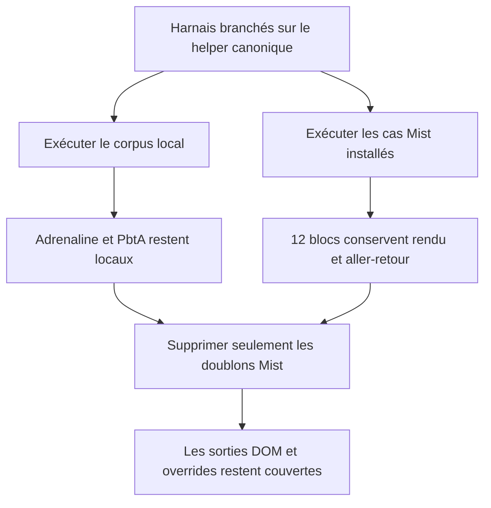
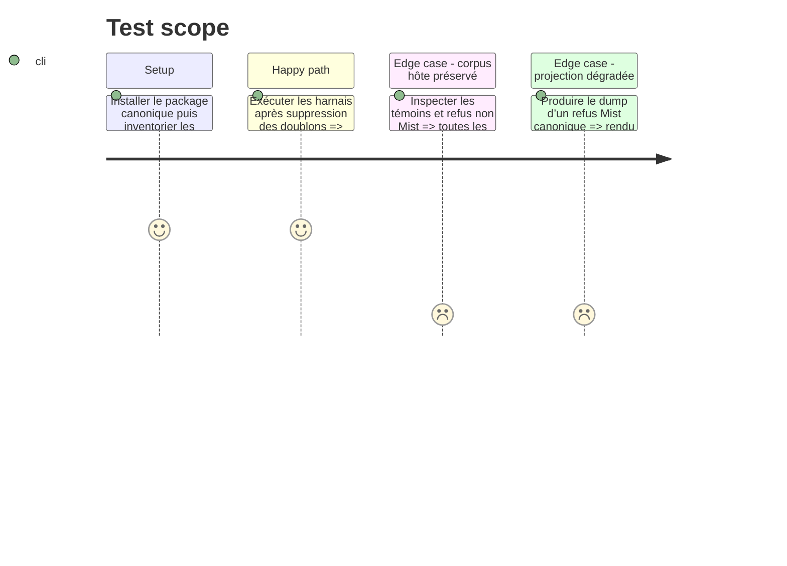

# Instruction: Bascule des harnais et retrait des doublons Mist

## Architecture projection

> Tree of the final files. ✅ create · ✏️ modify · ❌ delete

```txt
obsidian-handbook/
├── corpus/
│   ├── README.md                                      ✏️
│   ├── temoins/
│   │   ├── {com-danger,com-theme-card}.toml           ❌
│   │   ├── {litm-challenge,litm-journey}.toml         ❌
│   │   ├── litm-theme-kit.toml                        ❌
│   │   ├── {os-challenge,os-character-trope}.toml     ❌
│   │   ├── {os-loadout-item,os-power-set}.toml        ❌
│   │   ├── {os-theme,os-theme-kit}.toml               ❌
│   │   └── theme-card.toml                            ❌
│   └── refus/
│       ├── com-danger.*.toml                          ❌
│       ├── com-theme-card.*.toml                      ❌
│       ├── litm-{challenge,journey,theme-kit}.*.toml  ❌
│       ├── os-{challenge,character-trope}.*.toml      ❌
│       ├── os-{loadout-item,power-set}.*.toml         ❌
│       ├── os-{theme,theme-kit}.*.toml                ❌
│       └── theme-card.*.toml                          ❌
└── tools/
    ├── assertCorpus.harness.mts                       ✏️
    ├── dumpDom.harness.mts                            ✏️
    └── overrideRoundTrip.harness.mts                  ✏️
```

## User Journey



## Test Scope



## Tasks to do

### `1)` Faire cohabiter corpus externe et corpus hôte

> Conserver `assert:corpus` comme garde globale sans demander un témoin local aux blocs Mist externalisés.

1. Refactorer `assertCorpus.harness.mts` pour continuer à parcourir les témoins et refus locaux d’Adrenaline et PbtA, mais déléguer la preuve des blocs Mist au corpus canonique partagé.
2. Construire l’inventaire de couverture à partir des ids réellement fournis par chaque source, puis exiger pour tout bloc enregistré une source de corpus et une commande de copie TOML.
3. Exercer l’aller-retour copie/rendu des 12 blocs Mist sur leurs cas canoniques valides et conserver le même contrôle pour les formats hôte sur leurs témoins locaux.
4. Ajouter une garde qui échoue si un futur fichier local reprend l’un des ids Mist externalisés.

### `2)` Migrer les harnais spécialisés

> Éviter que la suppression des fichiers locaux ampute les preuves DOM et overrides.

1. Faire lire à `dumpDom.harness.mts` les cas Mist du manifeste installé en plus des cas hôte locaux, avec des libellés déterministes portant l’id canonique.
2. Inclure dans le dump les cas `render` et `degraded`, et représenter explicitement les attentes `null`, pour préserver la comparaison des zones absentes.
3. Faire obtenir à `overrideRoundTrip.harness.mts` les sources `litm-challenge-secrets` et `litm-journey-valid` par leur id canonique au lieu de chemins locaux ; le premier est nécessaire au scénario qui masque puis restaure la zone `secrets`.
4. Stabiliser l’ordre des autres cas par leur id afin qu’une évolution d’ordre du manifeste ne rende pas les assertions aléatoires.

### `3)` Retirer uniquement les copies Mist

> Supprimer les fixtures dont le package v1 est désormais propriétaire, sans toucher aux autres contrats.

1. Supprimer les 12 témoins Mist locaux et tous les refus portant leurs ids après la réussite des harnais migrés.
2. Conserver intégralement les témoins et refus Adrenaline ainsi que les témoins PbtA, qui n’appartiennent pas à `schema-in-the-mist`.
3. Mettre à jour `corpus/README.md` pour identifier le propriétaire de chaque corpus, documenter le champ `handbook` du manifeste Mist et expliquer où ajouter désormais un cas.
4. Exécuter à nouveau toutes les assertions consommatrices afin de prouver qu’aucun chemin ne dépend d’une copie supprimée.

## Test acceptance criteria

| Task | Acceptance criteria |
| --- | --- |
| 1 | Chaque bloc enregistré possède toujours une preuve de lecture et une commande de copie, mais aucun bloc Mist n’exige une fixture locale. |
| 1 | L’ajout d’un fichier local portant un id Mist échoue comme duplication, tandis qu’une fixture hôte nouvelle reste acceptée par le parcours local. |
| 2 | Le dump DOM couvre de façon déterministe les rendus complets, dégradés et nuls déclarés par le manifeste Mist installé. |
| 2 | Le scénario d’override modifie puis restaure octet pour octet `litm-challenge` et laisse `litm-journey` inchangé à partir de sources canoniques. |
| 3 | Il ne reste sous `corpus/temoins` et `corpus/refus` aucun fichier dont l’id appartient aux 12 blocs Mist ; toutes les fixtures Adrenaline et PbtA initiales restent présentes. |
| 3 | `assert:mist-contract`, `assert:corpus`, `dump:dom` et `assert:override` réussissent après la suppression des copies Mist. |
