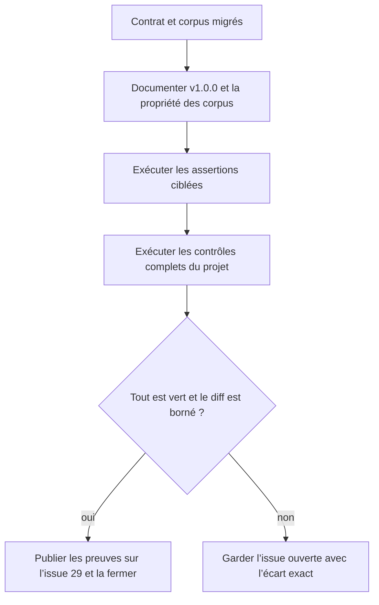
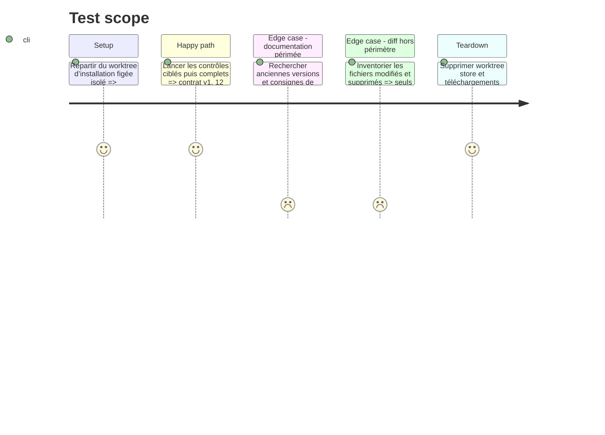

# Instruction: Documentation et validation intégrale

## Architecture projection

> Tree of the final files. ✅ create · ✏️ modify · ❌ delete

```txt
obsidian-handbook/
├── README.md                                ✏️
└── aidd_docs/
    └── guidelines/
        └── schema-design.md                 ✏️
```

## User Journey



## Test Scope



## Tasks to do

### `1)` Aligner la documentation sur le contrat v1

> Rendre durable la frontière entre package canonique, projections Handbook et corpus propres au dépôt.

1. Mettre à jour `README.md` pour annoncer `schema-in-the-mist` v1.0.0, les 14 cibles du contrat et les 12 formats réellement rendus par Handbook, sans présenter les deux cibles non rendues comme des fonctions du produit.
2. Réviser `schema-design.md` pour dire qu’un format externe utilise le corpus publié par son contrat, alors qu’un format possédé par Handbook conserve témoins et refus locaux.
3. Conserver explicitement la règle « schéma strict, consommateur tolérant » et préciser que les verdicts `canonical` et `handbook` du même manifeste protègent les deux comportements.
4. Remplacer la consigne générique d’ajout d’une fixture locale par une orientation vers le dépôt propriétaire du contrat, avec repli local seulement pour les formats possédés ici.

### `2)` Vérifier l’ensemble du dépôt

> Prouver que la bascule ne se limite pas au harnais dédié.

1. Exécuter l’installation figée propre, puis `pnpm assert:mist-contract`, `pnpm assert:corpus`, `pnpm assert:override` et une production déterministe de `pnpm dump:dom`.
2. Exécuter `pnpm check`, qui agrège le build TypeScript/esbuild, le lint et toutes les assertions cœur déclarées hors contrats externes, puis relever séparément toute assertion externe pertinente qui n’y figure pas.
3. Inspecter le diff et rechercher toute ancienne version `schema-in-the-mist`, URL signée, dépendance à un fichier local Mist ou suppression non Mist restante.
4. Vérifier que le diff du lockfile est limité à la résolution Mist nécessaire et que les totaux du corpus attestent 14 cibles canoniques et 12 renderers Handbook.

### `3)` Clore le suivi avec les preuves

> Fermer l’issue uniquement lorsque le contrat reproductible et la non-régression sont démontrés.

1. Relire l’état et les commentaires de l’issue #29 juste avant toute mutation.
2. Ajouter, si aucun commentaire équivalent n’existe, un résumé unique donnant l’URL et le digest de l’asset, les totaux du corpus, la liste des validations réussies et le périmètre exact des fixtures supprimées.
3. Fermer l’issue seulement si l’installation propre et toutes les validations sont positives ; sinon la garder ouverte et documenter la commande et l’écart exacts.
4. Ne pas créer de release dans ce ticket : laisser le versionnement et la publication à leur workflow dédié.

## Test acceptance criteria

| Task | Acceptance criteria |
| --- | --- |
| 1 | La documentation nomme v1.0.0, distingue sans ambiguïté les 14 cibles canoniques des 12 renderers Handbook et oriente chaque nouveau cas vers le corpus qui en est propriétaire. |
| 1 | La frontière entre rejet canonique strict et rendu Handbook tolérant est décrite conformément aux verdicts réellement exécutés du manifeste partagé. |
| 2 | Une installation figée sans cache et toutes les assertions ciblées réussissent après suppression des copies locales Mist. |
| 2 | `pnpm check` réussit sans dépendre d’un fichier Mist sous `corpus/`, de même que toute assertion externe pertinente explicitement exécutée hors de cet agrégat. |
| 2 | Le diff ne contient aucune montée de dépendance sans rapport, aucune suppression Adrenaline/PbtA, aucune URL signée et aucune référence documentaire obsolète à v0.4.0. |
| 3 | L’issue #29 reçoit au plus un commentaire de preuves et n’est fermée que si l’asset, les 14 cibles, les 12 renderers, la tolérance et le nettoyage sélectif sont tous attestés. |
| 3 | Aucune release n’est créée dans le cadre de cette implémentation. |
