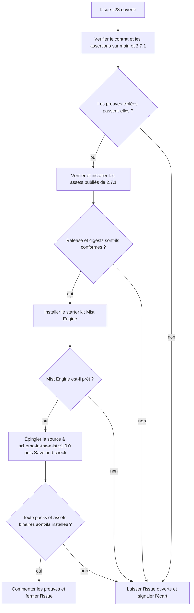
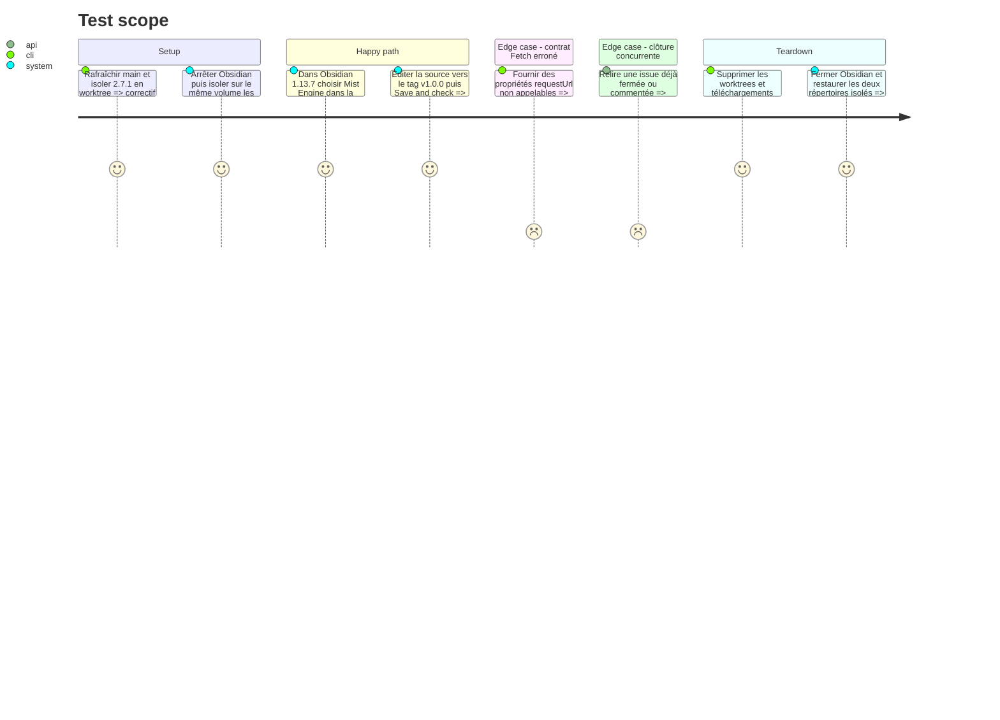

# Instruction: Vérification de livraison et clôture

## Architecture projection

> Tree of the final files. ✅ create · ✏️ modify · ❌ delete

```txt
obsidian-handbook/
└── (aucun changement de fichier produit)
```

## User Journey



## Test Scope



## Tasks to do

### `1)` Confirmer le contrat et le correctif

> Prouver la frontière `RequestUrlResponse` sans modifier de nouveau le client GitHub.

1. Rafraîchir `origin/main`, puis vérifier que l’assertion `a700799` et le correctif `076bc88` en sont ancêtres ainsi que du tag `2.7.1`.
2. Confirmer dans les types Obsidian installés que `RequestUrlResponse.text` est une chaîne et `RequestUrlResponse.arrayBuffer` un `ArrayBuffer`, contrairement aux propriétés promises de `RequestUrlResponsePromise`.
3. Depuis le checkout de travail basé sur `origin/main`, exécuter `pnpm assert:github-sources`, `pnpm assert:source-installer` et `pnpm assert:starter-kits` avec les dépendances déjà installées.
4. Créer un worktree temporaire propre de `2.7.1`, installer son lockfile et y exécuter les trois mêmes assertions.
5. Supprimer le worktree dans tous les cas, succès ou échec ; si une assertion ciblée échoue, laisser l’issue ouverte et documenter l’écart.

### `2)` Confirmer la release et les parcours Obsidian

> Tester les mêmes propriétés sur les assets réellement distribués et de vraies réponses réseau.

1. Vérifier que le tag `2.7.1` aligne `package.json`, `manifest.json`, `versions.json` et le changelog, puis confirmer que la release publique porte `main.js`, `manifest.json` et `styles.css` avec leurs digests.
2. Télécharger ces trois assets, vérifier chaque SHA-256 et confirmer que le `manifest.json` téléchargé annonce la version 2.7.1.
3. Arrêter complètement le processus Obsidian, produire un manifeste déterministe des chemins et empreintes des répertoires complets `.obsidian/plugins/obsidian-handbook` et `.obsidian/handbook`, puis les renommer atomiquement vers un répertoire temporaire frère du coffre, hors de sa racine mais sur le même volume, quand ils existent ; créer un répertoire de plugin neuf contenant seulement les trois assets 2.7.1 et relever la taille initiale du journal Obsidian.
4. Ouvrir le coffre avec Obsidian 1.13.7 et installer « Mist Engine » depuis la modale de premier démarrage.
5. Attendre la notice « Mist Engine is ready. », puis confirmer l’absence des messages `text is not a function` et `arrayBuffer is not a function`, la présence de la source installée, des manifestes de packs et d’au moins un asset binaire, ainsi que l’activation du mode City of Mist.
6. Lire la révision immuable écrite dans `source.json`, confirmer qu’elle désigne un commit GitHub de `RebelliousSmile/schema-in-the-mist`, puis comparer octet pour octet le `handbook.json` et un manifeste de pack installés avec les fichiers de cette révision ; depuis le manifeste de pack, prendre la première entrée de `pack.assets.images`, dériver son chemin distant et son chemin installé avec `assets.root`, puis comparer les octets binaires correspondants. Exclure `source.json`, dont `checkedAt` est local.
7. Dans les réglages Handbook, cliquer « Check » pour la source `RebelliousSmile/schema-in-the-mist`, choisir la référence `Tag`, saisir `v1.0.0` et exécuter « Save and check ».
8. Attendre la fermeture sans erreur de la modale, puis confirmer que `source.json` porte la révision du tag v1.0.0, que les manifestes texte et assets binaires correspondent aux fichiers GitHub de cette révision, et qu’aucun message `text is not a function` ou `arrayBuffer is not a function` n’apparaît dans l’interface ni dans les entrées du journal ajoutées depuis l’offset relevé.
9. Après succès ou échec, arrêter complètement Obsidian, supprimer les répertoires créés pour le test, remettre les deux sauvegardes à leur chemin initial ou préserver leur absence initiale, puis comparer leurs manifestes de chemins et empreintes. Supprimer le répertoire frère de sauvegarde seulement après égalité complète ; en cas d’écart, le conserver, signaler son chemin exact et arrêter. Supprimer les autres téléchargements temporaires.
10. Si l’un des deux parcours échoue pour une cause distincte de `requestUrl`, relever le message exact et laisser l’issue ouverte sans attribuer cet échec au défaut initial.

### `3)` Fermer l’issue avec les preuves

> Résoudre le décalage de suivi sans publier une seconde correction.

1. Relire l’état et les commentaires de l’issue immédiatement avant toute mutation.
2. Si aucun commentaire équivalent n’existe, en ajouter un seul qui référence `a700799`, `076bc88`, les trois assertions, les digests de 2.7.1, les deux révisions inscrites successivement dans `source.json`, les fichiers texte et binaire comparés et les deux parcours Obsidian réussis.
3. Fermer l’issue seulement si toutes les preuves précédentes sont positives et si elle est encore ouverte ; ne jamais la rouvrir ni dupliquer le commentaire.
4. Ne modifier aucun fichier produit et ne créer aucune nouvelle release pour ce correctif déjà livré.

## Test acceptance criteria

| Task | Acceptance criteria |
| --- | --- |
| 1 | Les types Obsidian, le code de `origin/main` et celui du tag 2.7.1 concordent : les champs texte et binaire de la réponse résolue sont lus comme des valeurs, jamais appelés comme des méthodes. |
| 1 | Les trois assertions ciblées réussissent dans le checkout basé sur `origin/main` et dans un worktree propre de `2.7.1`. |
| 2 | Le tag et la release publique 2.7.1 contiennent le correctif et son harnais, avec les métadonnées de version alignées, le manifeste téléchargé en 2.7.1 et les digests conformes. |
| 2 | Dans Obsidian 1.13.7, la notice « Mist Engine is ready. » confirme l’installation, City of Mist est actif et les manifestes texte ainsi que l’asset dérivé du pack sont identiques aux fichiers GitHub du commit inscrit dans `source.json`. |
| 2 | « Save and check » sur `schema-in-the-mist` v1.0.0 ferme la modale sans erreur, réinstalle les manifestes texte et la première image déclarée depuis la révision du tag, et ne produit aucune erreur d’appel de `text` ou `arrayBuffer` dans l’interface ni dans les nouvelles entrées du journal. |
| 2 | Après succès ou échec, le worktree a disparu et les répertoires complets du plugin et du stockage Handbook retrouvent exactement leur présence, leurs chemins et leurs contenus initiaux. |
| 2 | Une restauration non conforme conserve sa sauvegarde hors coffre et indique son chemin ; un échec étranger à `requestUrl` est rapporté sans fermer l’issue ni lui attribuer une cause erronée. |
| 3 | L’issue #23 est fermée avec un unique commentaire reliant les commits, assertions, digests, smoke tests et la release 2.7.1. |
| 3 | Aucune modification du code produit ni nouvelle release n’est introduite pour ce ticket déjà livré. |
