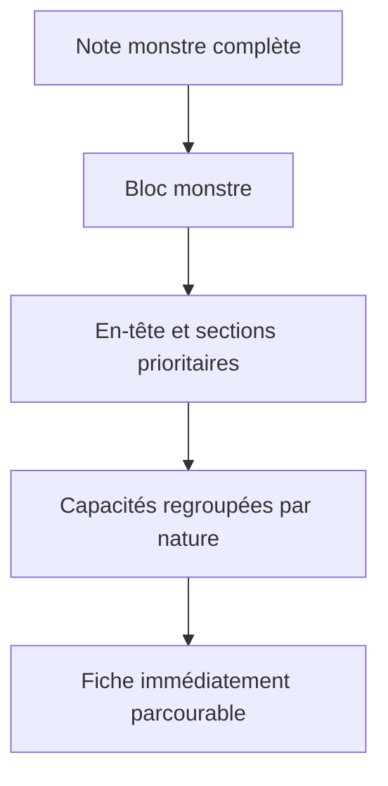
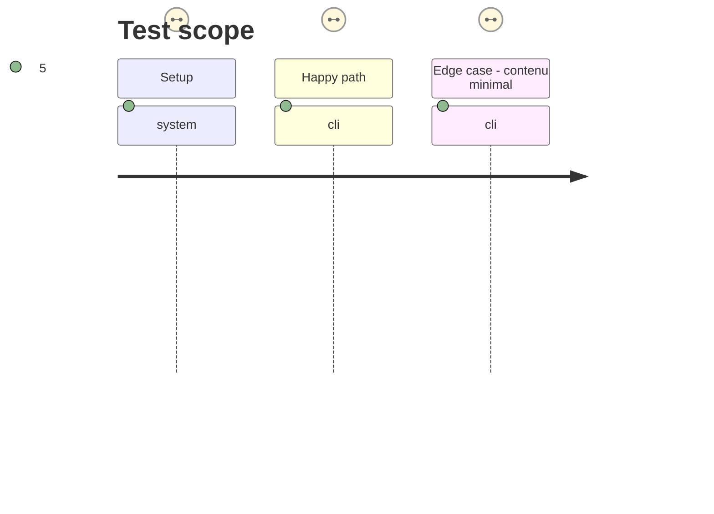

# Instruction: Hiérarchiser les données du monstre

## Architecture projection

> Tree of the final files. ✅ create · ✏️ modify · ❌ delete

```txt
.
└── src
    └── features
        └── adrenalineMonstre
            └── renderer.ts ✏️
```

## User Journey



## Test Scope



## Wireframe

```txt
┌────────────────────────────────────┐
│ (1) Identité et niveau              │
├────────────────────────────────────┤
│ (2) Détection et mouvement          │
├────────────────────────────────────┤
│ (3) Actions et comportement         │
├────────────────────────────────────┤
│ (4) Données physiques               │
├────────────────────────────────────┤
│ (5) Santé et protections            │
├────────────────────────────────────┤
│ (6) Capacités                       │
│     (6a) traits · état              │
│     (6b) compétences · équipement   │
│     (6c) contagion · narration      │
└────────────────────────────────────┘
```

1. Identité : repère de la créature et de son danger.
2. Mobilité : informations qui déterminent l'approche.
3. Comportement : informations qui déterminent le tour de jeu.
4. Données physiques : valeurs de référence immédiates.
5. Santé : résistance et protections.
6. Capacités : sous-groupes homogènes, parcourables sans confusion.

## Tasks to do

### `1)` Structurer la zone des capacités

> Restituer les familles de données du monstre sans les réduire à une liste de phrases indifférenciées.

1. Remplacer l'agrégat linéaire des capacités par des groupes DOM nommés correspondant aux traits, état alternatif, compétences, équipement, contagion et informations narratives effectivement présents.
2. Conserver les libellés, calculs de totaux, ordre des informations de la source et l'absence de groupe vide.
3. Garder l'en-tête et les cinq autres zones dans leur ordre contractuel actuel.

## Test acceptance criteria

| Task | Acceptance criteria |
| --- | --- |
| 1 | Un monstre riche permet d'identifier visuellement chaque famille de capacités sans perdre une donnée fournie par son document. |
| 1 | Un monstre minimal n'affiche ni panneau ni sous-groupe vide. |
| 1 | Les six zones publiques et leur ordre restent inchangés. |
