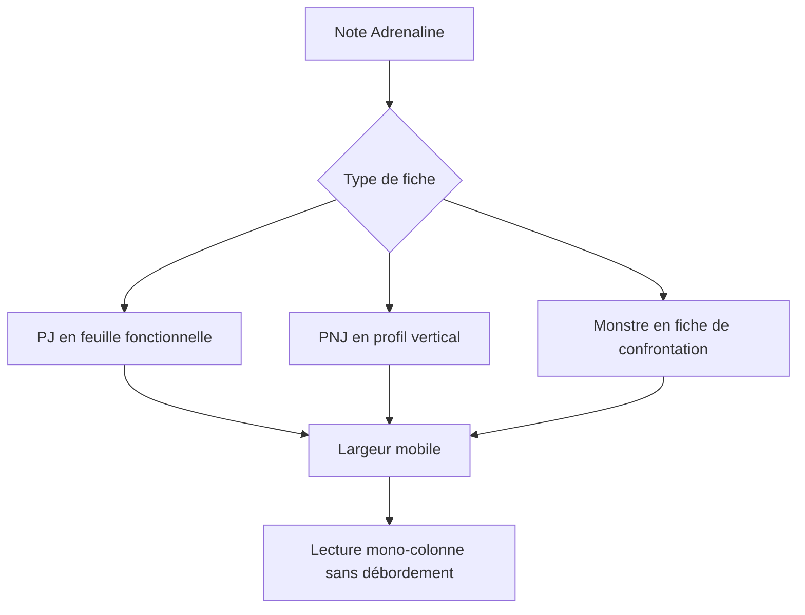
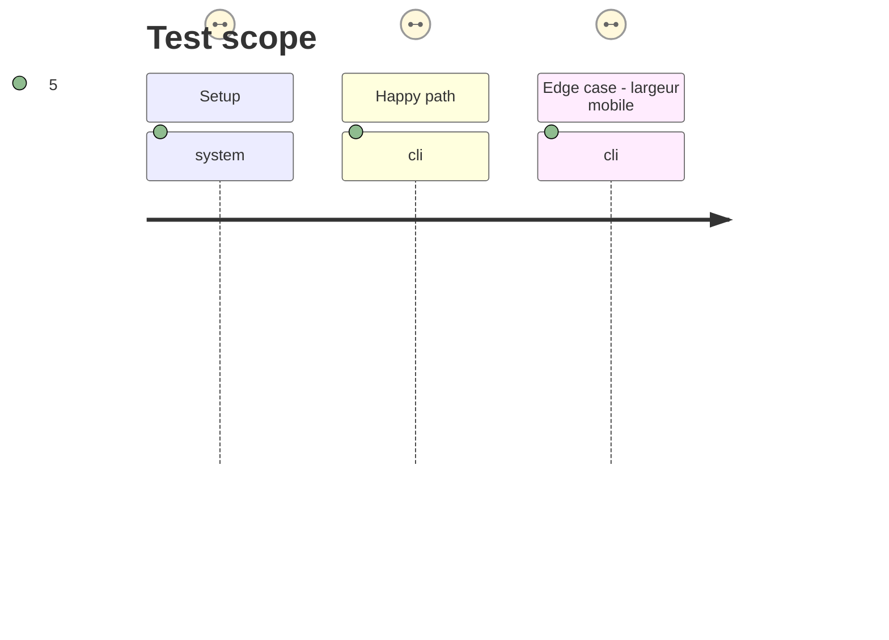

# Instruction: Composer chaque fiche selon son original

## Architecture projection

> Tree of the final files. ✅ create · ✏️ modify · ❌ delete

```txt
.
└── src
    └── styles
        └── adrenaline
            ├── _pj.scss ✏️
            ├── _pnj.scss ✏️
            └── _monstre.scss ✏️
```

## User Journey



## Test Scope



## Wireframe

```txt
┌──────────────────── PJ ────────────────────┐
│ (1) Identité                                │
├───────────────┬─────────────────────────────┤
│ (2) Formation │ (3) Compétences             │
├───────────────┴─────────────────────────────┤
│ (4) Caractéristiques                        │
├─────────────────────────────────────────────┤
│ (5) Équipement                              │
├─────────────────────────────────────────────┤
│ (6) Santé et protections                    │
└─────────────────────────────────────────────┘

┌──────── PNJ / MONSTRE ────────┐
│ (7) Identité et niveau         │
├────────────────────────────────┤
│ (8) Contexte ou confrontation   │
├────────────────────────────────┤
│ (9) Données de jeu              │
├────────────────────────────────┤
│ (10) Ressources spécialisées    │
└────────────────────────────────┘

┌──────────── mobile ────────────┐
│ (11) Même ordre de lecture      │
│      une région par ligne       │
└────────────────────────────────┘
```

1. PJ : identité sur toute la largeur de la feuille.
2. PJ : formations à gauche, zone de consultation rapide.
3. PJ : compétences à droite, zone de consultation détaillée.
4. PJ : caractéristiques accessibles sur une ligne fonctionnelle.
5. PJ : équipement séparé des décisions de santé.
6. PJ : santé et protections au bas de la feuille.
7. Fiche verticale : point d'identification compact.
8. PNJ : contexte narratif ; monstre : détection, déplacement, actions et comportement.
9. Fiche verticale : caractéristiques puis santé dans la séquence de jeu.
10. PNJ : compétences et équipement ; monstre : capacités hiérarchisées.
11. Mobile : les régions restent dans l'ordre de leur fiche d'origine, sans côte à côte forcé.

## Tasks to do

### `1)` Affiner la feuille PJ

> Faire de la PJ une feuille large et fonctionnelle, proche de son organisation imprimée.

1. Ajuster la grille, les portées de colonnes, les espacements et la densité des panneaux PJ pour distinguer les zones de consultation et préserver les données à pleine largeur.
2. Définir explicitement le repli mobile des formations, compétences, caractéristiques et seuils de santé.

### `2)` Différencier le profil PNJ

> Maintenir une carte verticale compacte où la présentation précède les données mécaniques.

1. Ajuster la densité, les séparateurs et le rythme typographique du PNJ sans lui imposer la grille de la PJ.
2. Préserver la description narrative comme paragraphe et le passage progressif vers caractéristiques, santé, compétences et équipement.

### `3)` Composer la fiche de confrontation du monstre

> Donner priorité à l'approche et au comportement de la menace avant ses capacités détaillées.

1. Distinguer visuellement mobilité, comportement, caractéristiques, santé et sous-groupes de capacités.
2. Adapter la densité et les listes longues afin que les groupes internes restent repérables à toutes les largeurs.

### `4)` Respecter les contraintes de thème et d'accessibilité

> Conserver la famille visuelle Zombiology sans figer des valeurs incompatibles avec Obsidian.

1. Utiliser uniquement les jetons Adrenaline existants pour les couleurs et conserver le focus visible.
2. Préserver les retours à la ligne, les largeurs minimales nulles et l'absence de débordement horizontal.

## Test acceptance criteria

| Task | Acceptance criteria |
| --- | --- |
| 1 | Sur écran large, la PJ garde deux zones de consultation côte à côte et ses zones globales sur toute la largeur. |
| 1 | À 520 pixels ou moins, la PJ devient une colonne lisible sans tronquer caractéristiques ni santé. |
| 2 | Le PNJ reste une carte verticale dont la présentation est distincte des informations mécaniques. |
| 3 | Le monstre expose l'approche et le comportement avant les données de résistance et les capacités détaillées. |
| 4 | Les trois fiches conservent les jetons de couleur, le focus clavier visible et les règles qui empêchent une largeur minimale concurrente. |
