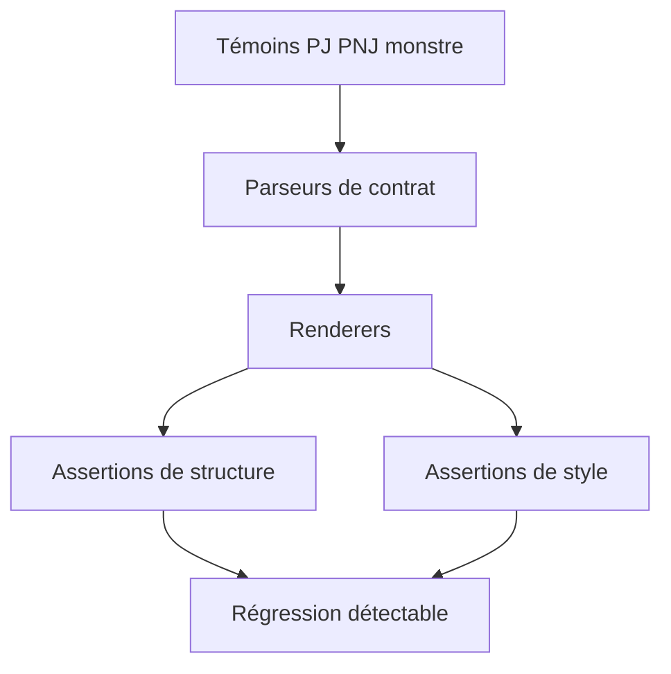
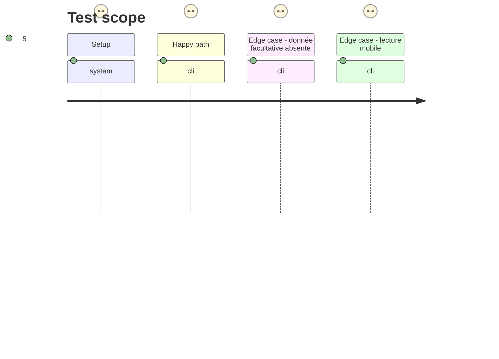

# Instruction: Verrouiller les rendus de référence

## Architecture projection

> Tree of the final files. ✅ create · ✏️ modify · ❌ delete

```txt
.
├── tools
│   ├── assertAdrenalineTheme.harness.mts ✏️
│   ├── assertAdrenalineZombiologyStyle.harness.mts ✏️
│   └── fixtures
│       └── adrenaline-visual.md ✏️
└── aidd_docs
    └── tasks
        └── 2026_09
            └── 2026_09_15_adrenaline-statblock-fidelity
                ├── plan.md ✅
                ├── phase-1.md ✅
                ├── phase-2.md ✅
                └── phase-3.md ✅
```

## User Journey



## Test Scope



## Wireframe

```txt
┌──────────────────────────────────────┐
│ (1) Témoins de contenu                │
├──────────────────────────────────────┤
│ (2) Structure rendue                  │
├──────────────────────────────────────┤
│ (3) Règles visuelles par fiche        │
├──────────────────────────────────────┤
│ (4) Résultat de non-régression        │
└──────────────────────────────────────┘
```

1. Témoins : exemples représentatifs des trois fiches.
2. Structure : ordre des zones et sous-groupes attendus.
3. Règles visuelles : géométrie propre à PJ, PNJ et monstre, y compris le repli mobile.
4. Résultat : une divergence est signalée avant livraison.

## Tasks to do

### `1)` Étendre les témoins représentatifs

> Couvrir les combinaisons de contenu qui rendent chaque composition utile à valider.

1. Compléter les témoins visuels avec un monstre possédant plusieurs familles de capacités, une PJ avec zones côte à côte et un PNJ avec présentation et données mécaniques.
2. Conserver un cas minimal par type afin de garantir l'absence de panneau fantôme.

### `2)` Rendre les intentions de composition testables

> Faire échouer les régressions qui ré-unifieraient involontairement les trois fiches.

1. Étendre le harnais de thème pour vérifier les ordres de zones, les groupes internes du monstre et les règles de repli propres à chaque fiche.
2. Étendre le harnais Zombiology pour vérifier les sélecteurs et jetons qui portent la différence PJ, PNJ et monstre, sans imposer de couleur littérale.
3. Garder les assertions de parsing et de cas minimaux au même niveau de couverture.

### `3)` Contrôler automatiquement les invariants mobiles

> Rendre vérifiable le comportement qui maintient les fiches lisibles en largeur réduite.

1. Vérifier pour les trois fiches la césure des contenus longs et l'absence de largeur minimale concurrente dans leurs panneaux.
2. Vérifier le repli de la grille PJ et la largeur maximale mobile des cartes PNJ et monstre à 520 pixels ou moins.

## Test acceptance criteria

| Task | Acceptance criteria |
| --- | --- |
| 1 | Les témoins exercent les zones spécifiques et les contenus facultatifs des trois types de statblock. |
| 1 | Chaque témoin minimal rend uniquement les régions nécessaires. |
| 2 | Une régression qui transforme les capacités du monstre en liste unique échoue. |
| 2 | Une régression qui retire le repli PJ ou homogénéise les géométries PJ et fiche verticale échoue. |
| 2 | Les contrôles de thème refusent les couleurs littérales et confirment les jetons Adrenaline. |
| 3 | Les assertions échouent si une fiche perd le retour à la ligne, si un panneau conserve une largeur concurrente ou si le repli mobile PJ, PNJ ou monstre est retiré. |
