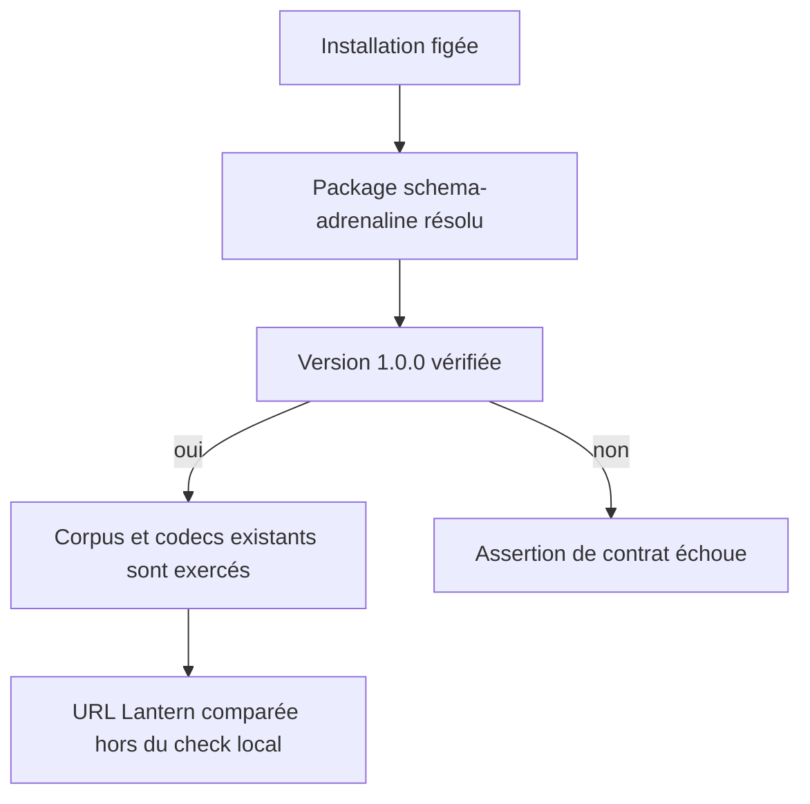
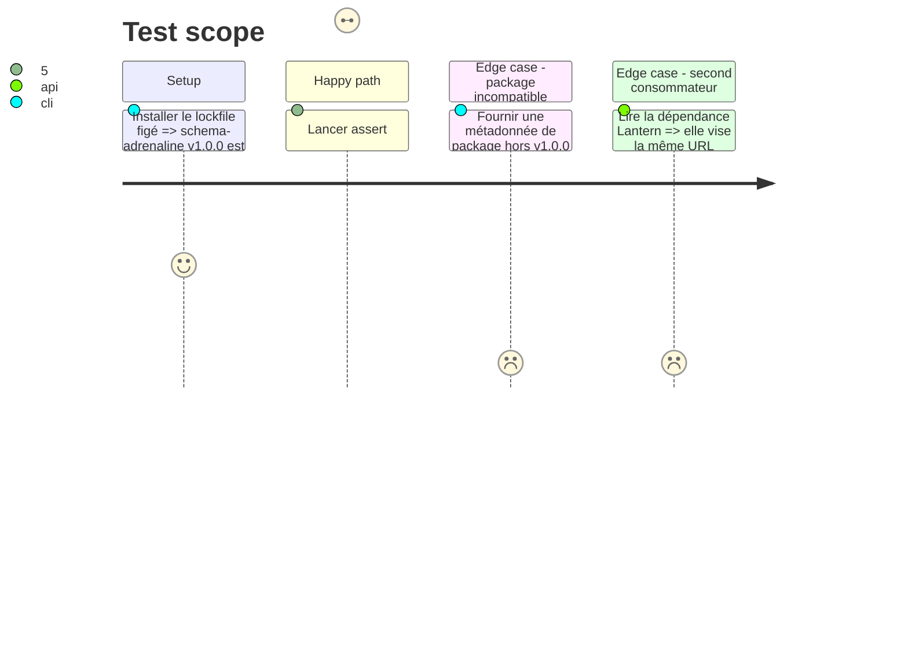

# Instruction: Verrouillage de version et preuve inter-consommateurs

## Architecture projection

> Tree of the final files. ✅ create · ✏️ modify · ❌ delete

```txt
obsidian-handbook/
├── tools/adrenalineContractCorpus.mts                       ✏️ exige la version du package résolu
└── aidd_docs/tasks/2026_09/2026_09_15_adrenaline-v1-contract-completion/
    ├── plan.md                                              ✅ décrit le complément de migration
    ├── phase-1.md                                           ✅ borne et prouve l’exécution
    └── backlog-link.json                                    ✅ relie l’issue producteur
```

## User Journey



## Test Scope



## Tasks to do

### `1)` Faire vérifier la version réellement installée

> Empêcher qu’un manifeste compatible masque un package distribué sous une version différente.

1. Résoudre `schema-adrenaline/package.json` depuis le même `createRequire` que le manifeste et exiger exactement `version: 1.0.0`.
2. Conserver la garde existante sur `manifestVersion`, `tomlVersion`, cibles, verdicts et confinement des chemins.
3. Exécuter l’assertion de contrat après une installation figée ; confirmer que le refus de version est un échec déterministe.

### `2)` Constater la parité avec Lantern sans coupler Handbook au réseau

> Vérifier le dernier critère multi-consommateur sans dégrader l’autonomie de `pnpm check`.

1. Lire la déclaration de dépendance de Lantern à l’instant de la livraison et comparer son URL à la constante immuable Handbook.
2. Consigner la parité comme preuve de l’issue ; ne pas ajouter de requête HTTP ou de dépendance Lantern aux scripts Handbook.

## Test acceptance criteria

| Task | Acceptance criteria |
| --- | --- |
| 1 | L’assertion refuse toute version de package autre que `1.0.0` tout en acceptant la release installée et son corpus canonique. |
| 2 | Lantern et Handbook visent l’URL publique v1.0.0 identique, tandis que `pnpm check` demeure autonome hors ligne. |
