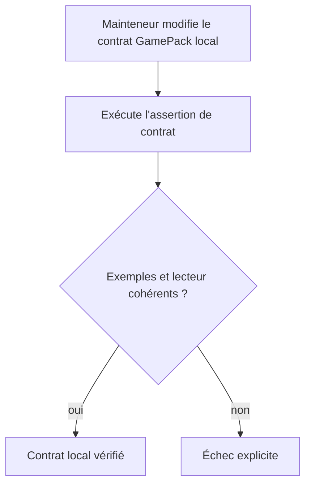
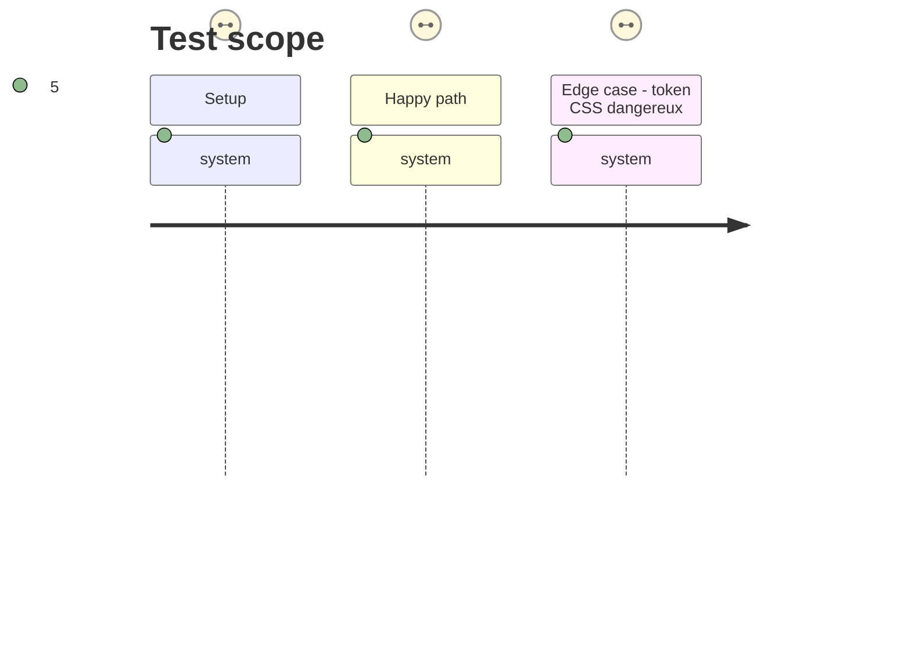

# Instruction: Établir le contrat local vérifiable

## Architecture projection

> Tree of the final files. ✅ create · ✏️ modify · ❌ delete

```txt
.
├── schemas/
│   └── appearance/
│       └── game-pack.schema.json             ✅ contrat JSON Schema possédé par Handbook
├── corpus/
│   └── game-packs/
│       ├── valid.json                         ✅ exemple minimal conforme
│       └── invalid-token-name.json            ✅ exemple invalide qui protège la frontière CSS
├── tools/
│   ├── assert-game-pack-contract.mjs          ✅ lanceur durable du contrat local
│   └── gamePackContract.harness.mts           ✅ validation Ajv et cohérence lecteur/schéma
└── package.json                               ✏️ commande d’assertion et dépendance de validation de développement
```

## User Journey



## Test Scope



## Tasks to do

### `1)` Publier le schéma local

> Capturer dans Handbook la forme versionnée aujourd’hui consommée par `readGamePack`.

1. Créer `schemas/appearance/game-pack.schema.json` avec un `$id` Handbook, les objets `style`, `assets`, `polarities` et `shapes`, ainsi que les contraintes de sécurité déjà imposées aux identifiants et noms de tokens.
2. Définir l’ouverture voulue des dictionnaires de tokens, images, fontes et zones sans autoriser de nouveaux champs structurels silencieux.
3. Ajouter un exemple conforme et un exemple de régression pour un nom de propriété CSS dangereux.

### `2)` Rendre le contrat exécutable en CI locale

> Prouver que le JSON Schema, les fixtures et le lecteur tolérant décrivent la même frontière utile.

1. Ajouter Ajv uniquement en dépendance de développement et une commande `assert:game-pack-contract`.
2. Construire le harnais selon la convention esbuild existante ; il valide les fixtures avec Ajv puis vérifie la projection de `readGamePack`.
3. Conserver la tolérance du lecteur : le schéma apporte le verdict strict, le rendu garde son comportement de dégradation documenté.

## Test acceptance criteria

| Task | Acceptance criteria |
| --- | --- |
| 1 | Le schéma local accepte un pack minimal, les couches de style, assets, polarités et formes prévus, et refuse un identifiant ou un token CSS dangereux. |
| 2 | `pnpm assert:game-pack-contract` échoue si la fixture, le schéma strict ou la projection de `readGamePack` divergent ; pour une faute isolée, le lecteur conserve le pack mais n’écrit pas la valeur refusée ; aucune dépendance distante n’est nécessaire. |
