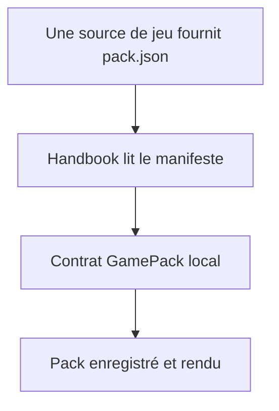
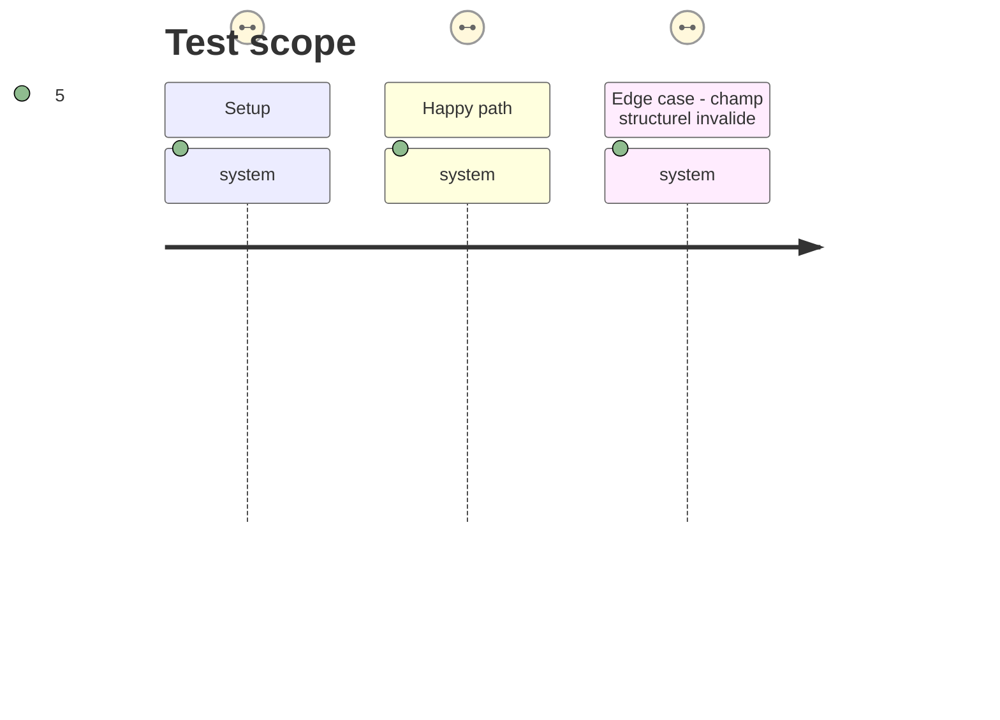

# Instruction: Rebrancher Handbook sur son contrat

## Architecture projection

> Tree of the final files. ✅ create · ✏️ modify · ❌ delete

```txt
.
├── src/games/
│   ├── fromSchema.ts                          ✏️ référence le contrat Handbook et conserve la lecture tolérante
│   ├── types.ts                               ✏️ désigne le schéma local comme format publié
│   └── pluginManifest.ts                      ✏️ borne clairement le manifeste strict autour du pack local
├── tools/
│   └── customPacks.harness.mts                ✏️ prouve qu’un pack fourni par une source externe respecte le contrat local
├── package.json                               ✏️ intègre l’assertion locale dans les vérifications documentées
└── CLAUDE.md                                  ✏️ remplace la frontière « schéma frère Mist » par l’autorité Handbook
```

## User Journey



## Test Scope



## Tasks to do

### `1)` Retirer les références d’autorité Mist du runtime

> Désigner sans ambiguïté Handbook comme propriétaire du format lu.

1. Mettre à jour les commentaires et types de `src/games` qui attribuent encore `appearance/game-pack.schema.json` à `schema-in-the-mist`.
2. Préserver les règles de compatibilité : aucun champ existant n’est renommé ni supprimé, et `readGamePack` reste le point unique de normalisation tolérante.
3. Faire passer la validation stricte des manifests et des sources installées par le contrat local, sans import ni téléchargement de schéma à l’exécution.

### `2)` Prouver l’absence de régression sur les sources

> Séparer la propriété du contrat de l’origine géographique des packs.

1. Étendre l’assertion de packs pour comparer un `pack.json` d’une source et sa lecture locale.
2. Exécuter les assertions des packs personnalisés, des variantes, des sources et du nouveau contrat, puis le build et les deux portées de lint prescrites par le projet.

## Test acceptance criteria

| Task | Acceptance criteria |
| --- | --- |
| 1 | Le code de jeu ne présente plus `schema-in-the-mist` comme propriétaire du schéma d’apparence et continue de lire tous les documents existants. |
| 2 | Un pack téléchargé depuis un dépôt de jeu est validé et rendu par Handbook avec le même comportement qu’avant ; un seul manifeste fautif n’empêche pas les autres de charger. |
