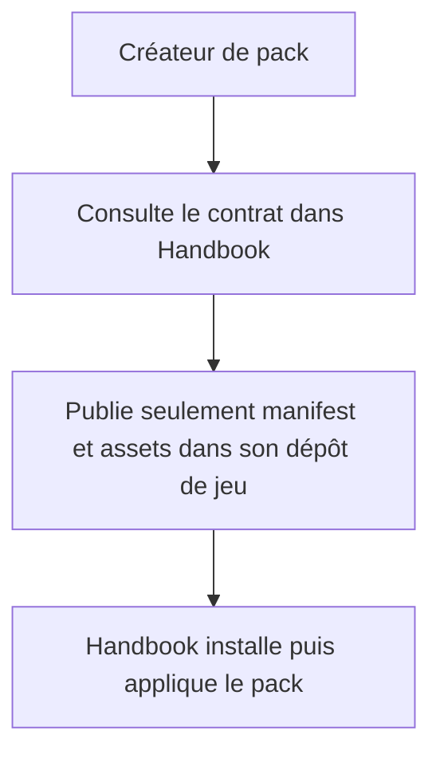
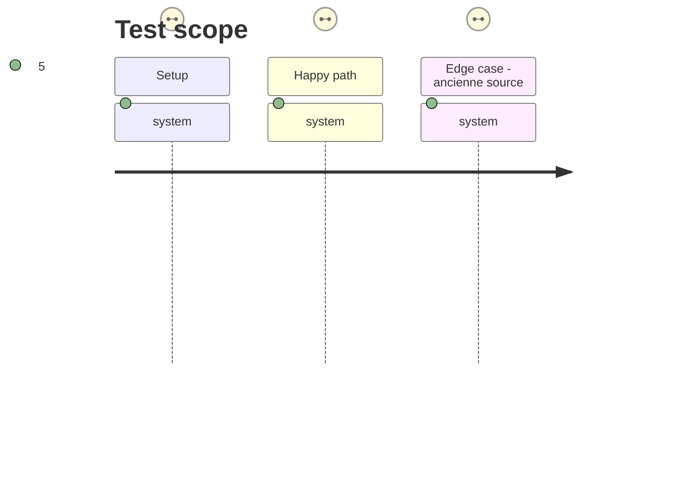

# Instruction: Clarifier la propriété et la migration

## Architecture projection

> Tree of the final files. ✅ create · ✏️ modify · ❌ delete

```txt
.
├── README.md                                  ✏️ explique que Handbook possède le format d’apparence
├── aidd_docs/guidelines/schema-design.md      ✏️ distingue contrats de contenu externes et contrat GamePack local
└── aidd_docs/tasks/2026_09/2026_09_15_local-game-pack-schema/
    └── migration.md                            ✅ procédure de retrait coordonné du duplicat externe
```

## User Journey



## Test Scope



## Tasks to do

### `1)` Documenter la frontière durable

> Éviter qu’un futur changement d’apparence recrée un second propriétaire du contrat.

1. Mettre à jour le README et la directive de conception : les schémas de contenu restent dans leurs dépôts spécialisés ; `GamePack` et son schéma appartiennent à Handbook.
2. Décrire le rôle des dépôts de jeux : ils versionnent et distribuent des manifests/ressources, sans devoir publier le schéma d’apparence.

### `2)` Préparer le retrait du duplicat externe

> Rendre le nettoyage de `schema-in-the-mist` sûr et indépendant de cette modification Handbook.

1. Écrire la migration : release Handbook avec lecteur compatible, mise à jour des liens de contributeurs, puis suppression/dépréciation du schéma du dépôt externe dans une tâche séparée.
2. Ne modifier ni l’historique ni les releases immuables de `schema-in-the-mist` ; les anciennes sources restent des données valides car la forme est conservée.

## Test acceptance criteria

| Task | Acceptance criteria |
| --- | --- |
| 1 | Un contributeur trouve le contrat GamePack dans Handbook et sait qu’un dépôt de jeu ne fournit que ses packs et assets. |
| 2 | La migration identifie un ordre de release réversible et garantit que les packs d’anciennes sources restent installables avant tout retrait externe. |
