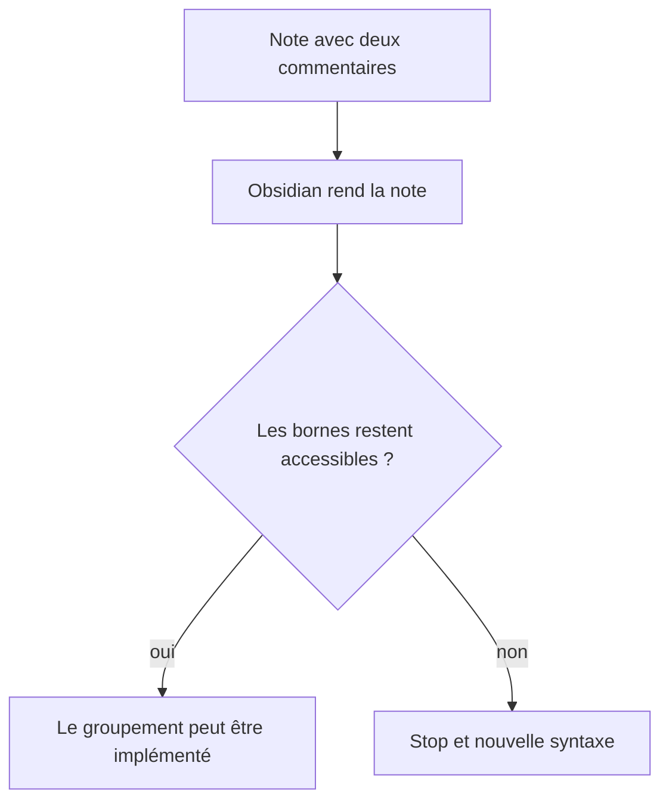
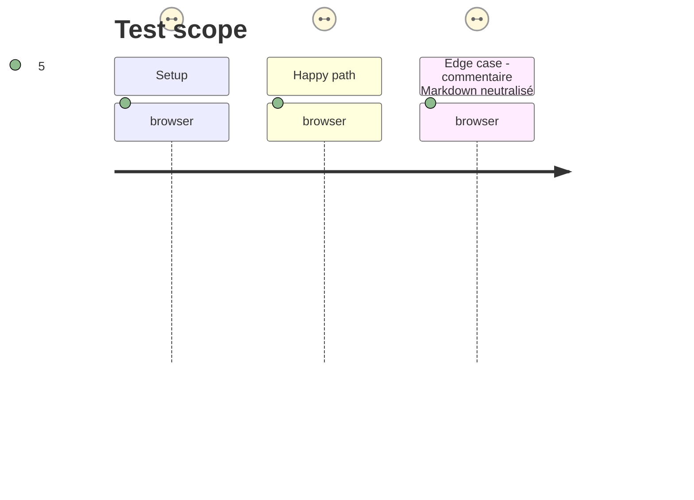

# Instruction: Prouver les bornes dans Obsidian

## Architecture projection

> Tree of the final files. ✅ create · ✏️ modify · ❌ delete

```txt
.
├── tools/e2e/
│   ├── layout-regions-journey.sh              ✅ ouvre une note de sonde dans Obsidian réel
│   └── README.md                              ✏️ décrit le parcours de sonde et ses captures
└── aidd_docs/tasks/2026_09/2026_09_15_markdown-layout-regions/
    └── phase-1.md                             ✏️ porte le verdict de faisabilité
```

## User Journey



## Test Scope



## Wireframe

```txt
┌──────────────── Note rendue ────────────────┐
│ Texte ordinaire                              │
│                                              │
│ (1) commentaire de début, invisible          │
│ ┌────────┐ ┌────────┐ ┌────────┐             │
│ │ bloc   │ │ bloc   │ │ bloc   │             │
│ └────────┘ └────────┘ └────────┘             │
│ (2) commentaire de fin, invisible            │
└──────────────────────────────────────────────┘
```

1. Début : borne de commentaire que le rendu doit conserver et rendre accessible.
2. Fin : seconde borne qui délimite la même liste de frères sans modifier leur rendu.

## Tasks to do

### `1)` Vérifier la faisabilité dans le vrai moteur Markdown

> Écarter dès le départ une syntaxe que le DOM Obsidian ne permettrait pas de traiter.

1. Créer une note de sonde avec `<!-- handbook-layout: columns=3 -->`, trois éléments frères et `<!-- /handbook-layout -->`.
2. Ouvrir la note dans Obsidian réel, contrôler le DOM des vues Markdown prises en charge et capturer le résultat.
3. Arrêter la réalisation si les bornes ne sont pas accessibles comme commentaires frères ; la phase documente alors le constat plutôt que de contourner le moteur avec une pseudo-imbrication.

## Test acceptance criteria

| Task | Acceptance criteria |
| --- | --- |
| 1 | Obsidian réel expose les deux commentaires comme bornes accessibles autour des éléments rendus, ou la phase s’arrête avant toute implémentation de groupement. |
