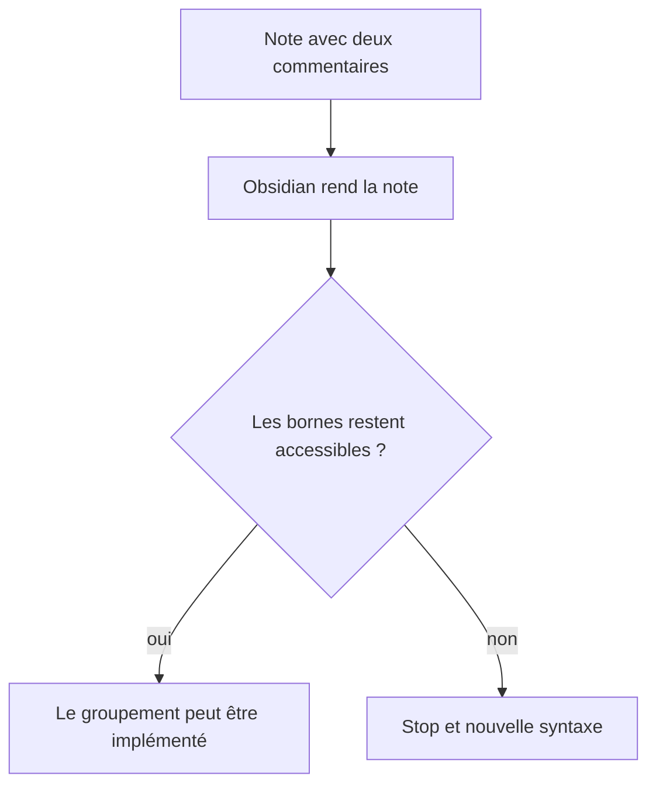
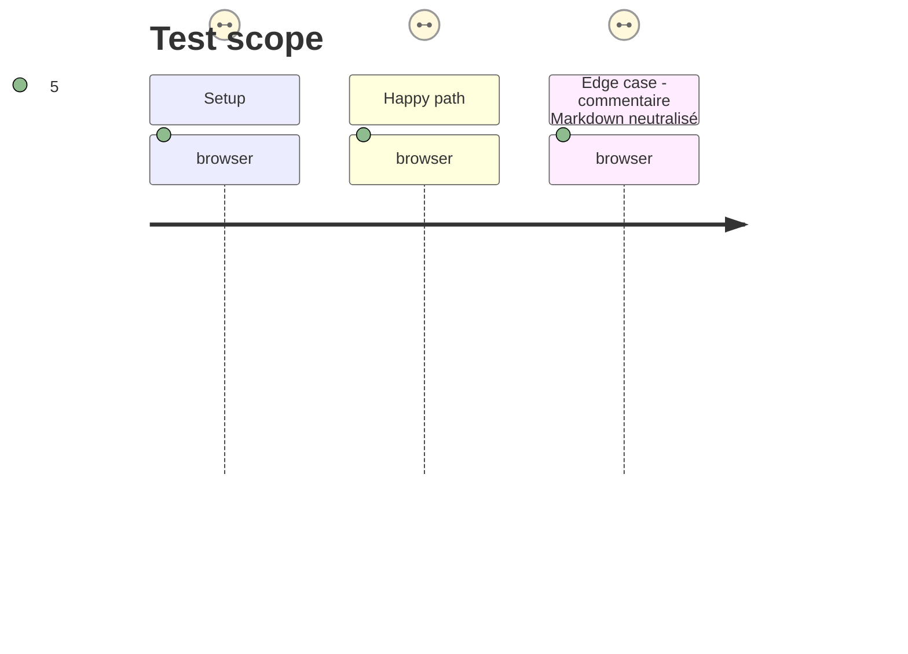

# Instruction: Prouver les bornes dans Obsidian

## Architecture projection

> Tree of the final files. ✅ create · ✏️ modify · ❌ delete

```txt
.
├── tools/e2e/
│   ├── layout-regions-journey.ps1             ✅ crée un coffre temporaire et lance Obsidian Windows isolé
│   ├── layout-regions-cdp.py                  ✅ inspecte les bornes et capture le rendu via CDP
│   └── README.md                              ✏️ décrit le parcours Windows et ses captures
└── aidd_docs/tasks/2026_09/2026_09_15_markdown-layout-regions/
    └── phase-1.md                             ✏️ porte le verdict de faisabilité
```

## User Journey



## Test Scope



## Wireframe

```txt
┌──────────────── Note rendue ────────────────┐
│ Texte ordinaire                              │
│                                              │
│ (1) commentaire de début, invisible          │
│ ┌────────┐ ┌────────┐ ┌────────┐             │
│ │ bloc   │ │ bloc   │ │ bloc   │             │
│ └────────┘ └────────┘ └────────┘             │
│ (2) commentaire de fin, invisible            │
└──────────────────────────────────────────────┘
```

1. Début : borne de commentaire que le rendu doit conserver et rendre accessible.
2. Fin : seconde borne qui délimite la même liste de frères sans modifier leur rendu.

## Tasks to do

### `1)` Vérifier la faisabilité dans le vrai moteur Markdown

> Écarter dès le départ une syntaxe que le DOM Obsidian ne permettrait pas de traiter.

1. Créer un lanceur PowerShell qui refuse une instance existante sur son port CDP, prépare un coffre temporaire hors du coffre utilisateur, lance `Obsidian.exe` masqué avec un port dédié, puis ne ferme que le PID qu’il a créé.
2. Créer le pilote Python CDP à partir du motif existant : il ouvre la note de sonde, contrôle les nœuds de commentaire et capture le rendu ; le lanceur nettoie le coffre et les captures temporaires même en échec.
3. Arrêter la réalisation si les bornes ne sont pas accessibles comme commentaires frères ; la phase documente alors le constat plutôt que de contourner le moteur avec une pseudo-imbrication.

## Test acceptance criteria

| Task | Acceptance criteria |
| --- | --- |
| 1 | Obsidian réel expose les deux commentaires comme bornes accessibles autour des éléments rendus, ou la phase s’arrête avant toute implémentation de groupement. |

## Verdict — 2026-09-15

La sonde `layout-regions-probe` a été inspectée dans Obsidian Windows réel par CDP. Son rendu contient les titres `ONE`, `TWO` et `THREE`, mais le parcours complet des commentaires DOM retourne `[]`. Les bornes HTML sont donc supprimées avant que le post-processeur ne puisse les parcourir.

La phase s’arrête ici, sans code de groupement. Une nouvelle planification doit choisir un mécanisme qui relie les bornes de la source Markdown aux éléments rendus, ou une syntaxe dont Obsidian préserve les bornes.
