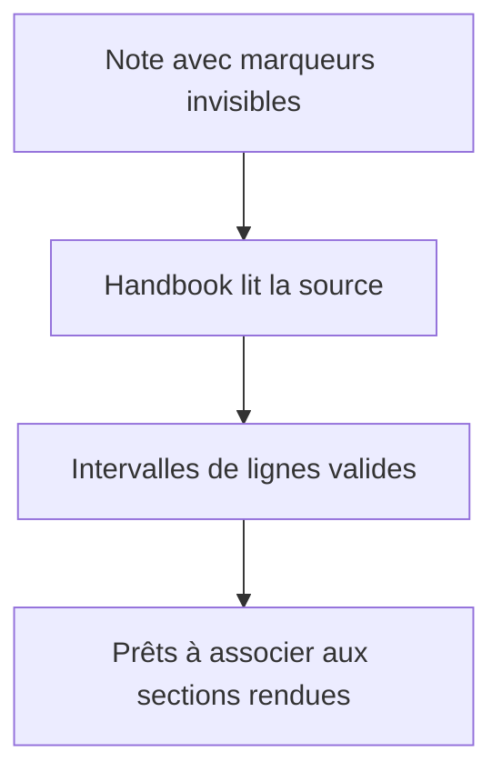
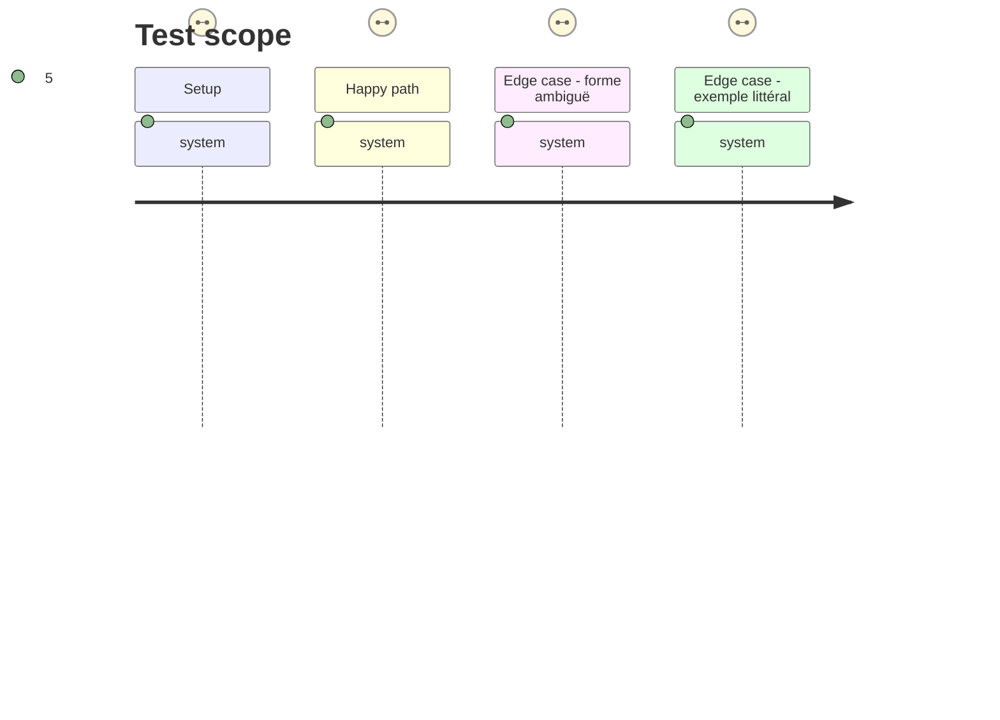

# Instruction: Cartographier les régions dans la source

## Architecture projection

> Tree of the final files. ✅ create · ✏️ modify · ❌ delete

```txt
.
├── src/features/layoutRegions/
│   └── parser.ts                              ✅ reconnaît les marqueurs et retourne des intervalles de lignes sûrs
├── tools/layoutRegions.harness.mts            ✅ exécute les assertions de grammaire compilées
├── tools/assert-layout-regions.mjs            ✅ bundle et lance le harnais durable
└── package.json                               ✏️ expose l’assertion de régions Markdown
```

## User Journey



## Test Scope



## Tasks to do

### `1)` Définir la grammaire et les intervalles source

> Produire des régions fiables avant toute mutation du DOM.

1. Accepter les bornes exactes isolées sur leur ligne, avec `columns` entier positif.
2. Suivre les blocs de code clôturés pour ignorer leurs exemples littéraux, puis retourner les bornes exclusives de chaque paire valide.
3. Refuser sans effet les ouvertures concurrentes, fermetures orphelines, régions non fermées, valeurs invalides et régions vides.

### `2)` Ajouter l’assertion durable

> Figer la grammaire indépendamment du moteur Obsidian.

1. Reprendre le motif esbuild des harnais `tools/`.
2. Affirmer les paires valides et successives, les erreurs isolées et les marqueurs dans du code clôturé.

## Test acceptance criteria

| Task | Acceptance criteria |
| --- | --- |
| 1 | Seules les paires source exactes et non ambiguës produisent des intervalles de lignes et un entier de colonnes positif. |
| 2 | `pnpm assert:layout-regions` prouve que les formes fautives et les blocs de code ne produisent aucune région. |
