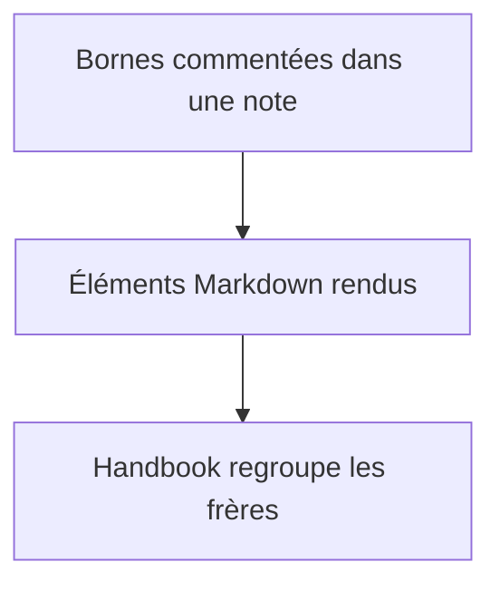
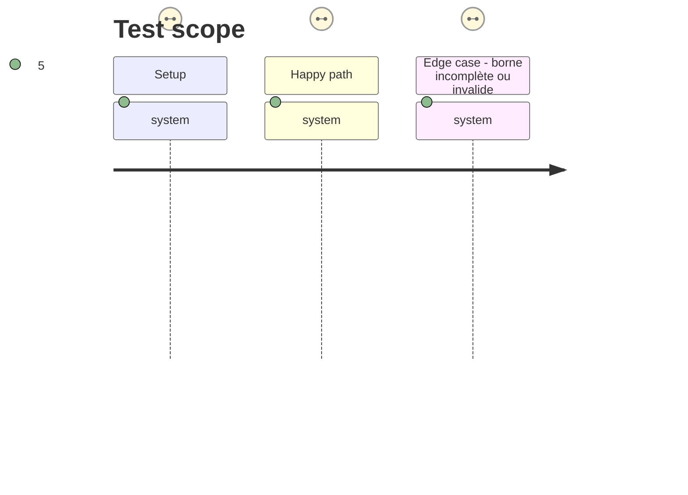

# Instruction: Interpréter et grouper les régions Markdown

## Architecture projection

> Tree of the final files. ✅ create · ✏️ modify · ❌ delete

```txt
.
├── src/features/layoutRegions/
│   ├── parser.ts                              ✅ reconnaît les bornes et valide `columns=N`
│   ├── postProcessor.ts                       ✅ groupe les frères DOM situés entre deux bornes
│   └── index.ts                               ✅ enregistre le post-processeur auprès du plugin
├── src/BrumesPlugin.ts                        ✏️ active la fonctionnalité au chargement
├── tools/layoutRegions.harness.mts            ✅ prouve la transformation DOM et les refus sûrs
├── tools/assert-layout-regions.mjs            ✅ bundle et lance l’assertion durable
└── package.json                               ✏️ expose l’assertion de régions Markdown
```

## User Journey



## Test Scope



## Wireframe

```txt
┌──────────── Note rendue ────────────┐
│ (1) ┌───┐ ┌───┐ ┌───┐                │
│     │ A │ │ B │ │ C │                │
│     └───┘ └───┘ └───┘                │
└──────────────────────────────────────┘
```

1. Région : le conteneur devient l’unique parent des frères situés entre les bornes.

## Tasks to do

### `1)` Définir la grammaire locale

> Lire les deux bornes et refuser les formes ambiguës avant toute mutation du DOM.

1. Accepter uniquement `<!-- handbook-layout: columns=N -->` où `N` est un entier positif, et `<!-- /handbook-layout -->` comme fermeture exacte.
2. Ignorer une ouverture sans fermeture, une fermeture isolée, des régions qui se chevauchent et une valeur invalide, sans déplacer le contenu.
3. Journaliser chaque diagnostic au plus une fois par région/source pour ne pas polluer le rendu.

### `2)` Grouper les éléments rendus

> Construire une région DOM autour des frères compris entre les deux bornes.

1. Parcourir les nœuds de commentaire du fragment Markdown, exiger que les bornes aient le même parent, puis déplacer seulement les éléments entre elles dans un conteneur Handbook.
2. Retirer les bornes après succès et conserver hors région tout ce qui est avant ou après.
3. Enregistrer le post-processeur global au chargement du plugin, sans modifier les processeurs des blocs fencés ni l’éditeur source.

### `3)` Ajouter une assertion durable

> Mesurer les mutations attendues et les refus sans dépendre d’Obsidian lancé.

1. Réutiliser le motif esbuild des harnais `tools/` avec un DOM minimal adapté aux commentaires, parents et déplacements de nœuds.
2. Affirmer une région à une et trois colonnes, plusieurs régions indépendantes, et les formes incomplètes ou invalides sans perte de contenu.

## Test acceptance criteria

| Task | Acceptance criteria |
| --- | --- |
| 1 | Les seules directives reconnues sont les bornes convenues avec un entier positif ; une note mal formée garde ses éléments rendus inchangés. |
| 2 | Les blocs et tableaux frères entre deux bornes deviennent les enfants d’un unique conteneur de région ; les blocs ne sont jamais imbriqués dans la syntaxe Markdown. |
| 3 | `pnpm assert:layout-regions` vérifie le groupement, l’isolement de régions successives et la conservation du contenu dans les cas fautifs. |
