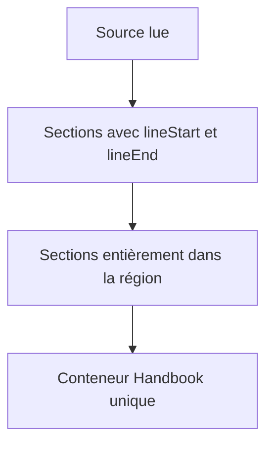
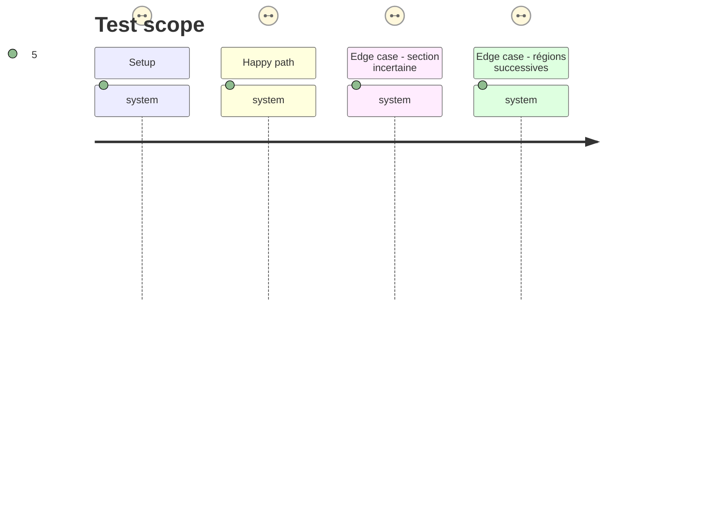

# Instruction: Grouper les sections rendues par leurs lignes

## Architecture projection

> Tree of the final files. ✅ create · ✏️ modify · ❌ delete

```txt
.
├── src/features/layoutRegions/
│   ├── sectionMapper.ts                       ✅ associe un intervalle source aux sections Markdown sœurs
│   ├── postProcessor.ts                       ✅ lit la note et crée une région unique
│   └── index.ts                               ✅ enregistre le post-processeur
├── src/BrumesPlugin.ts                        ✏️ active la fonctionnalité au chargement
└── tools/layoutRegions.harness.mts            ✏️ prouve mapping, ordre et refus sûrs
```

## User Journey



## Test Scope



## Tasks to do

### `1)` Associer sans ambiguïté source et rendu

> Ne sélectionner que les enfants directs strictement compris entre les deux marqueurs.

1. Obtenir le `TFile` depuis `context.sourcePath`, le lire avec `vault.cachedRead`, puis analyser les régions une fois par rendu.
2. Consulter `context.getSectionInfo()` juste avant le mapping et sélectionner les sections sœurs complètes et contiguës de l’intervalle.
3. Abandonner lorsque fichier, sections, parent commun ou frontière sont indisponibles; journaliser une fois.

### `2)` Créer le seul conteneur de mise en page

> Déplacer uniquement les sections Markdown déjà rendues, sans changer leur contenu interne.

1. Insérer `div.handbook-layout-region`, lui écrire `--handbook-layout-columns`, puis y déplacer les sections dans leur ordre initial.
2. Marquer parent et région pour empêcher une exécution asynchrone concurrente.
3. Enregistrer le processeur après les rendus structurels existants, sans toucher aux blocs fencés ni à la vue source.

### `3)` Étendre le harnais de transformation

> Mesurer la mutation, l’isolement et l’absence de perte de contenu.

1. Construire un DOM minimal pour parents, sections, attributs et déplacements.
2. Affirmer colonnes, ordre, régions indépendantes et refus sûrs.

## Test acceptance criteria

| Task | Acceptance criteria |
| --- | --- |
| 1 | Les commentaires supprimés du DOM n’empêchent pas le mapping : les lignes source et `getSectionInfo()` suffisent à identifier les sections sœurs. |
| 2 | Un conteneur unique entoure seulement les sections entre les marqueurs; aucun tableau, bloc interne ou voisin n’est restructuré. |
| 3 | L’assertion prouve groupements à une et trois colonnes et conservation du DOM dans les cas incertains. |
