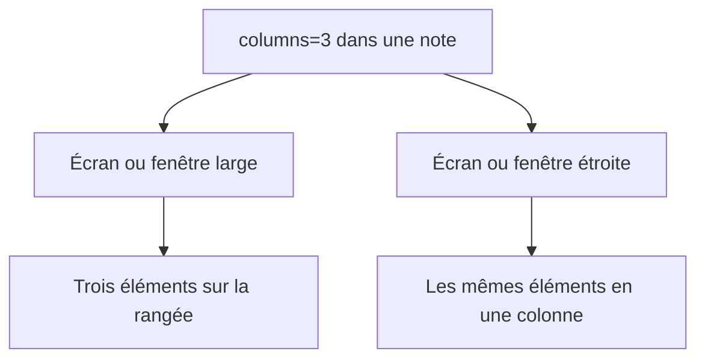
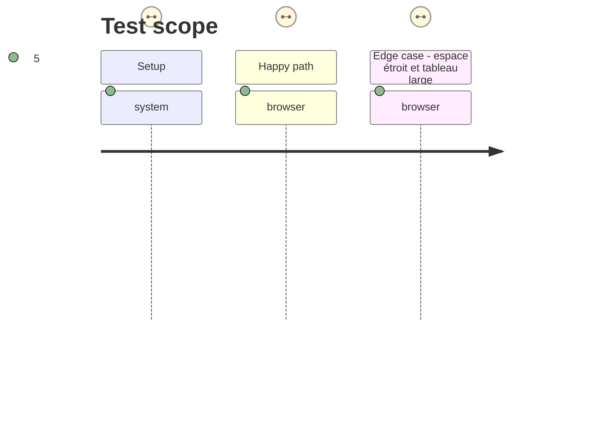

# Instruction: Rendre la grille responsive et documenter son usage

## Architecture projection

> Tree of the final files. ✅ create · ✏️ modify · ❌ delete

```txt
.
├── src/styles/
│   ├── _layout-regions.scss                   ✅ grille locale, tailles sûres et repli mobile
│   └── styles.scss                            ✏️ inclut la feuille de régions transversale
├── README.md                                  ✏️ montre la syntaxe et ses limites dans une note
├── tools/assert-layout-regions.mjs            ✏️ affirme les règles compilées et le repli
└── tools/e2e/layout-regions-journey.sh        ✏️ capture le résultat large et étroit dans Obsidian
```

## User Journey



## Test Scope



## Wireframe

```txt
┌────────────── Large ──────────────┐  ┌──── Étroit ────┐
│ (1) ┌───┐ ┌───┐ ┌───┐              │  │ (2) ┌────────┐ │
│     │ A │ │ B │ │ C │              │  │     │ A      │ │
│     └───┘ └───┘ └───┘              │  │     ├────────┤ │
│                                     │  │     │ B      │ │
└─────────────────────────────────────┘  │     ├────────┤ │
                                           │     │ C      │ │
                                           │     └────────┘ │
                                           └────────────────┘
```

1. Large : la région distribue ses enfants sur le nombre de colonnes déclaré.
2. Étroit : les mêmes enfants restent lisibles en une seule colonne.

## Tasks to do

### `1)` Poser la grille isolée

> Ne styliser que le conteneur créé par Handbook et ses enfants directs.

1. Définir une variable de nombre de colonnes écrite par le post-processeur et une grille avec des pistes qui peuvent rétrécir sans déborder.
2. Préserver la largeur et le défilement propres aux tableaux, images et blocs déjà stylés ; aucune règle ne cible un tableau hors région.
3. Employer un seuil responsive adapté aux fenêtres détachées et à la lecture mobile, qui force une seule colonne indépendamment de `N`.

### `2)` Rendre la syntaxe utilisable

> Donner un exemple complet, lisible et non ambigu.

1. Documenter une région `columns=1` pour un tableau/bloc large et une région `columns=3` pour des fiches côte à côte, avec les marqueurs `handbook-layout`.
2. Expliquer que la région organise les éléments frères, pas les cellules du tableau, et qu’elle ne s’applique pas dans la vue source.

### `3)` Garder le style vérifiable

> Éviter qu’une évolution SCSS supprime le repli ou élargisse la portée par accident.

1. Étendre l’assertion de régions pour vérifier les sélecteurs de région, la variable de colonnes, les enfants directs et la règle responsive dans le CSS compilé.
2. Terminer le parcours Obsidian commencé en phase 1 avec des captures large et étroite ; il prouve le groupement et le repli sans déplacer de contenu hors région.

## Test acceptance criteria

| Task | Acceptance criteria |
| --- | --- |
| 1 | Une région `columns=3` n’affecte que ses enfants directs, et une région `columns=1` ne modifie aucun élément voisin. |
| 2 | La documentation permet de produire une rangée de fiches ou une zone de tableau large sans blocs Markdown imbriqués. |
| 3 | À la largeur responsive, toute région repasse à une colonne ; les règles ne changent ni les cellules ni les tableaux hors région. |
