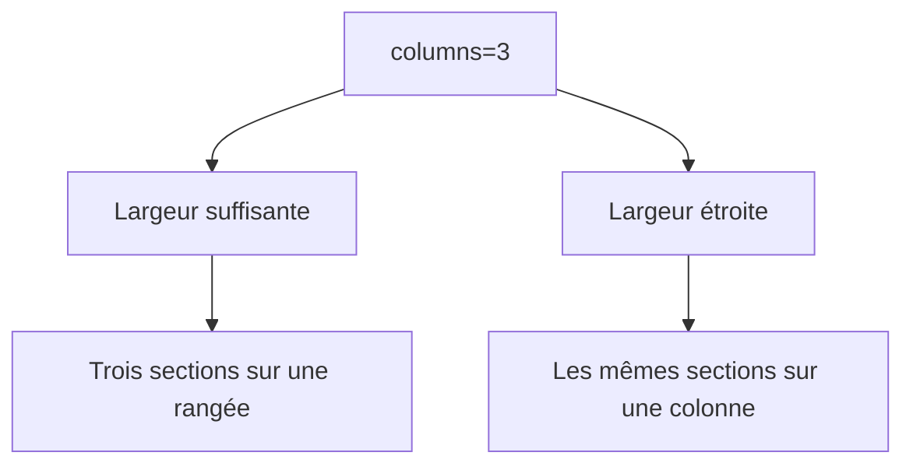
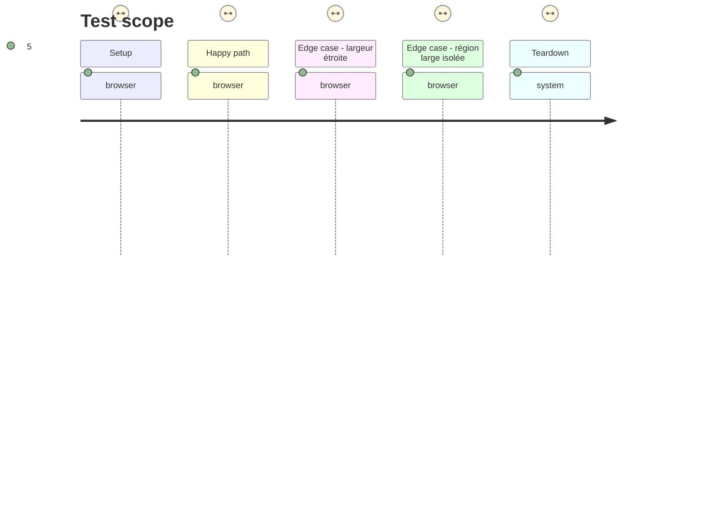

# Instruction: Styliser, documenter et vérifier dans Obsidian

## Architecture projection

> Tree of the final files. ✅ create · ✏️ modify · ❌ delete

```txt
.
├── src/styles/
│   ├── _layout-regions.scss                   ✅ grille locale et repli étroit
│   └── styles.scss                            ✏️ inclut la feuille transversale
├── README.md                                  ✏️ documente syntaxe et limites
├── tools/layoutRegions.harness.mts            ✏️ vérifie les sélecteurs CSS compilés
├── tools/e2e/
│   ├── layout-regions-journey.ps1             ✅ lance une instance Windows dédiée dans un coffre temporaire
│   ├── layout-regions-cdp.py                  ✅ contrôle les régions et capture les largeurs large et étroite
│   └── README.md                              ✏️ documente le parcours isolé
└── tools/assert-layout-regions.mjs            ✏️ inclut l’assertion CSS durable
```

## User Journey



## Test Scope



## Tasks to do

### `1)` Poser la grille strictement locale

> Donner la largeur demandée aux seuls enfants directs d’une région Handbook.

1. Employer `display: grid`, `repeat(var(--handbook-layout-columns), minmax(0, 1fr))` et des enfants directs rétrécissables.
2. Préserver largeur, défilement et sémantique des tableaux et médias; aucune règle ne cible hors région.
3. À un seuil adapté aux vues détachées et mobiles, imposer une seule piste quelle que soit la valeur déclarée.

### `2)` Documenter l’écriture dans une note

> Rendre les deux usages demandés immédiatement reproductibles.

1. Montrer `columns=1` autour d’un tableau ou bloc large et `columns=3` autour de fiches sœurs, avec deux commentaires isolés sur leur ligne.
2. Expliquer que les marqueurs organisent des sections Markdown de premier niveau, ne sont pas actifs dans la vue source et n’organisent jamais les cellules d’un tableau.

### `3)` Prouver le parcours Obsidian Windows isolé

> Tester le mécanisme source-vers-rendu dans une instance possédée par le test.

1. Fabriquer un coffre temporaire, copier le plugin compilé, choisir un port CDP libre et ne fermer que le PID créé.
2. Ouvrir la note-sonde, constater les régions à une et trois colonnes, capturer large et étroit puis vérifier enfants et styles calculés.
3. Étendre le harnais pour exiger portée, variable, enfants directs et repli responsive dans le CSS compilé.

## Test acceptance criteria

| Task | Acceptance criteria |
| --- | --- |
| 1 | `columns=3` n’affecte que les sections enfants directes de sa région et toute région redevient une colonne à largeur étroite. |
| 2 | La documentation permet de composer fiches et tableau large sans blocs imbriqués ni réglage global. |
| 3 | Le parcours Obsidian réel prouve que les marqueurs source invisibles produisent des régions correctes, en large comme en étroit, sans toucher à un coffre utilisateur. |
