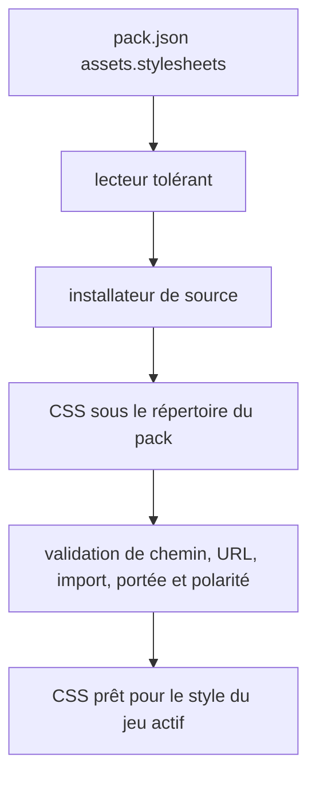
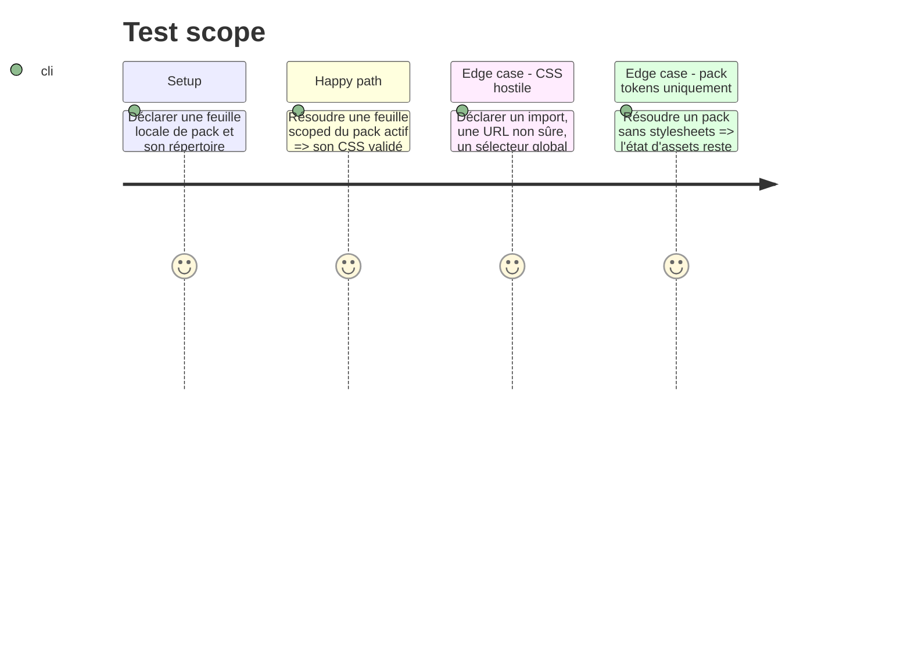

# Instruction: Contrat lu et ressource installée de façon sûre

## Architecture projection

> Tree of the final files. ✅ create · ✏️ modify · ❌ delete

```txt
obsidian-handbook/
├── package.json                  ✏️ expose l’assertion de feuilles au check global
├── src/games/
│   ├── types.ts            ✏️ déclare les feuilles de pack résolues
│   ├── fromSchema.ts       ✏️ lit `assets.stylesheets` avec tolérance contrôlée
│   ├── assets.ts           ✏️ résout, lit et valide les CSS confinés au pack
│   └── sourceInstaller.ts  ✏️ télécharge les feuilles explicitement déclarées
└── tools/
    ├── customPacks.harness.mts      ✏️ prouve lecture, chemins et refus d’asset
    └── packStylesheets.harness.mts  ✅ couvre les règles CSS acceptées et refusées
    └── assert-mist-contract.mjs      ✏️ verrouille la release immuable qui publie le contrat
    └── sourceInstaller.harness.mts   ✏️ prouve le téléchargement des feuilles déclarées
```

## User Journey



## Test Scope



## Tasks to do

### `1)` Étendre le contrat consommé et l’installation déclarative

> Faire parvenir uniquement les ressources CSS explicitement déclarées depuis une source de schéma jusqu’au répertoire installé du pack.

1. Étendre les types et le lecteur de pack pour `assets.stylesheets`, en préservant les packs v1 sans ce champ et les diagnostics tolérants des valeurs mal formées.
2. Passer à la release immuable de `schema-in-the-mist` qui publie ce champ et actualiser le verrou et l’assertion de contrat ; ne pas implémenter contre une forme d’issue non publiée.
3. Inclure chaque feuille déclarée dans la liste d’assets sûre de l’installateur, avec les mêmes limites de nombre, taille et confinement que les images et fontes.
4. Adapter le synchroniseur de développement afin que les changements de feuilles déclarées soient recopiés et déclenchent le rechargement.
5. Exposer le harnais de validation CSS dans `package.json` afin que `pnpm check` le lance.

### `2)` Résoudre et valider les feuilles avant l’écriture DOM

> Convertir une déclaration installée en CSS inject-able seulement si elle reste dans le périmètre du jeu.

1. Lire les feuilles depuis le dossier d’assets résolu, conserver leur ordre de déclaration et ignorer les absentes sans casser les tokens ou fontes.
2. Rejeter atomiquement un fichier qui contient un chemin sortant du pack, `@import`, une URL ou une construction CSS dangereuse ; n’accepter que les sélecteurs ancrés sur la classe du pack actif.
3. Vérifier que les sélecteurs de polarité sont composés avec le jeu et ne nomment que les polarités déclarées ; exposer le CSS validé dans l’état d’assets.

## Test acceptance criteria

| Task | Acceptance criteria |
| --- | --- |
| 1 | La release immuable qui publie le contrat est verrouillée, une source installe les feuilles explicitement déclarées et un pack sans feuille reste compatible. |
| 2 | Seul un fichier CSS intégralement local, scoped au jeu et cohérent avec ses polarités peut atteindre l’état prêt à écrire ; un fichier hostile ou global entier est absent. |
