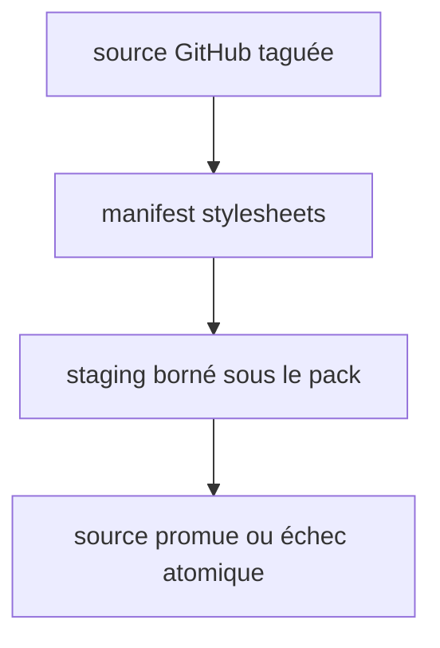
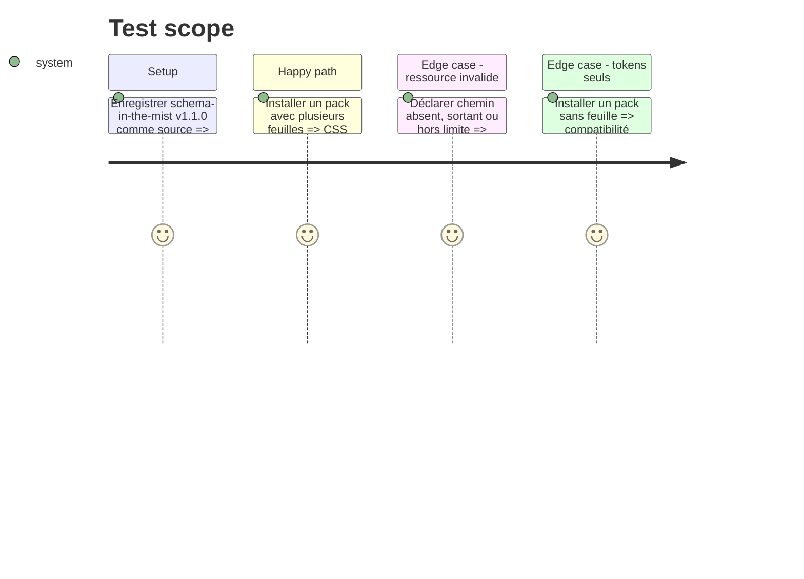

# Instruction: Installer les feuilles déclarées

## Architecture projection

> Tree of the final files. ✅ create · ✏️ modify · ❌ delete

```txt
obsidian-handbook/
├── src/games/{types.ts,fromSchema.ts,assets.ts,sourceInstaller.ts} ✏️ lit, stage et résout les CSS déclarés
├── tools/{customPacks.harness.mts,sourceInstaller.harness.mts} ✏️ couvre ordre, échecs et packs token-only
└── tools/dev-schema-source.mjs ✏️ synchronise les feuilles pendant le développement
```

## User Journey



## Test Scope



## Tasks to do

### `1)` Faire traverser le contrat jusqu’au stockage

> Une feuille déclarée est un asset local et borné avant toute interprétation.

1. Ajouter `assets.stylesheets` aux types et au lecteur tolérant, avec liste vide pour les manifests existants.
2. Télécharger chaque chemin déclaré sous les contrôles de chemin, nombre et taille existants ; tout échec précède la promotion.
3. Synchroniser les feuilles en développement et étendre les harnais pour ordre, traversée, absence et token-only.

## Test acceptance criteria

| Task | Acceptance criteria |
| --- | --- |
| 1 | Les feuilles sont installées uniquement sous leur pack et dans l’ordre du manifeste ; les échecs n’écrasent jamais la source existante. |
