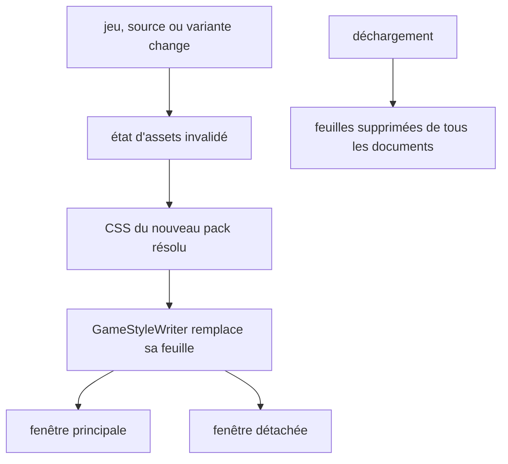
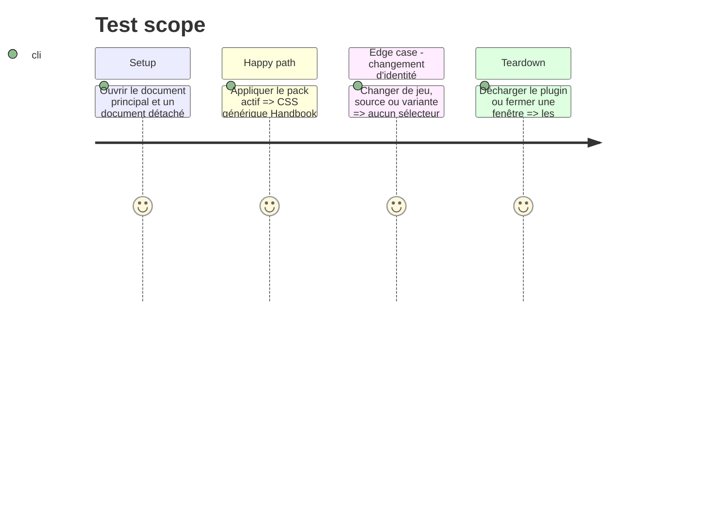

# Instruction: Injection isolée et cycle de vie multi-fenêtres

## Architecture projection

> Tree of the final files. ✅ create · ✏️ modify · ❌ delete

```txt
obsidian-handbook/
├── src/
│   ├── BrumesPlugin.ts                    ✏️ compose le CSS actif et invalide les ressources périmées
│   └── features/modes/styleElement.ts     ✏️ conserve l’ordre générique, fontes, CSS de pack et tokens par document
└── tools/
    ├── assertStyleScope.harness.mts       ✏️ prouve l’ordre et le remplacement atomique de la feuille possédée
    └── assert-reload-styles.mjs           ✏️ verrouille changement, déchargement et fenêtres détachées
```

## User Journey



## Test Scope



## Tasks to do

### `1)` Composer une unique feuille active par document

> Écrire les couches dans un ordre déterministe, après le CSS générique livré par Handbook.

1. Étendre la composition de `BrumesPlugin` afin d’insérer le CSS validé du pack dans l’élément dynamique possédé, après le CSS générique compilé de Handbook, avec un ordre déterministe documenté pour les fontes, tokens et callouts.
2. Garder `GameStyleWriter` comme unique propriétaire de l’élément de style et vérifier que tout document nouvellement ouvert reçoit exactement le même contenu.

### `2)` Invalider et nettoyer toutes les transitions

> Ne laisser aucune feuille de pack devenir une dépendance fantôme.

1. Identifier l’état par pack, installation/source et variante effective afin qu’un résultat asynchrone devenu obsolète soit abandonné.
2. Réappliquer la feuille complète après changement de mode, rechargement des sources, actualisation du registre et changement de variante ; conserver le comportement des packs sans feuille.
3. Retirer l’élément de style lors de la fermeture d’une fenêtre et du déchargement, dans la fenêtre principale comme dans les fenêtres détachées.

## Test acceptance criteria

| Task | Acceptance criteria |
| --- | --- |
| 1 | Chaque document suivi reçoit les couches dans le même ordre, et une feuille de pack ne précède jamais les styles génériques Handbook. |
| 2 | Les transitions et le déchargement retirent tout CSS périmé, sans empêcher les packs à tokens seuls de se rendre. |
