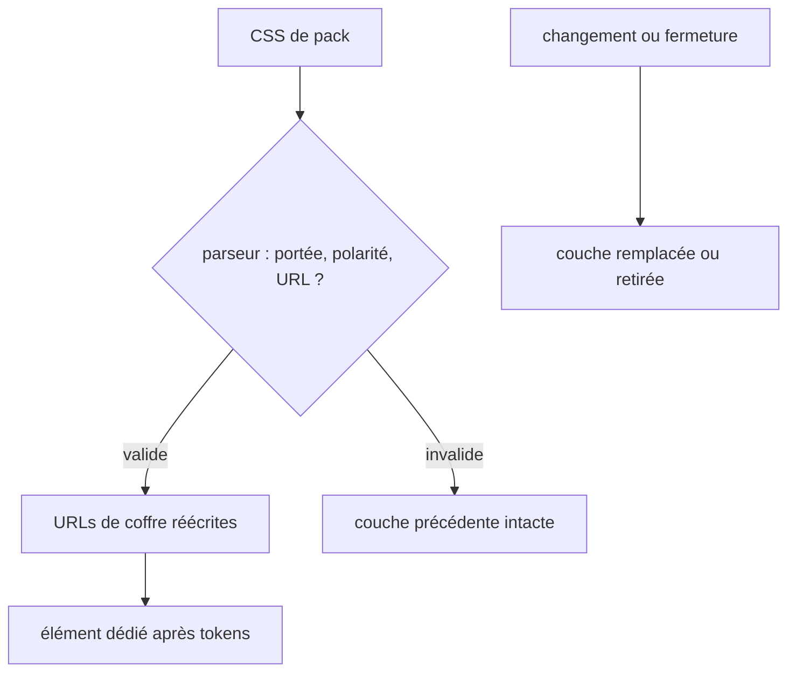

# Instruction: Valider et appliquer la couche CSS de pack

## Architecture projection

> Tree of the final files. ✅ create · ✏️ modify · ❌ delete

```txt
obsidian-handbook/
├── package.json / pnpm-lock.yaml ✏️ épinglent les parseurs CSS
├── src/games/assets.ts ✏️ valide, réécrit et compose les feuilles actives
├── src/features/modes/styleElement.ts ✏️ possède un élément pack-CSS après les tokens
├── src/BrumesPlugin.ts ✏️ invalide jeu, source, variante et déchargement
└── tools/{assertStyleScope.harness.mts,assert-reload-styles.mjs} ✏️ verrouillent portée, URLs et cycle de vie
```

## User Journey



## Test Scope

```mermaid
---
title: Test scope
---
journey
  section Setup
    Ouvrir document principal et détaché avec un pack stylé => éléments tokens et pack-CSS suivis: 5: system
  section Happy path
    Activer le pack => feuilles concaténées après tokens dans les deux documents: 5: system
  section Edge case - CSS hostile
    Fournir sélecteur global, polarité absente, import ou keyframe globale => feuille rejetée sans remplacement partiel: 5: system
  section Edge case - URL
    Référencer asset déclaré => URL de coffre; fournir URL distante, data, absolue, sortante ou inconnue => rejet: 5: system
  section Teardown
    Changer de jeu ou décharger => élément pack-CSS absent de chaque document: 5: system
```

## Tasks to do

### `1)` Valider la grammaire et les ressources CSS

> Le consommateur garde l’autorité d’exécution.

1. Épingler `postcss` et `postcss-selector-parser`, puis analyser règles et at-rules imbriquées sans regex.
2. Autoriser seulement les sélecteurs sous `body.brumes--<pack-id>` ou scope local ; rejeter global, autre jeu, thème nu, import et effets globaux non namespacés.
3. Déduire les polarités autorisées du pack et réécrire uniquement les `url(...)` relatives vers images ou fontes déclarées, avec l’URL de coffre.

### `2)` Écrire et nettoyer la couche dédiée

> Les tokens et le CSS structurel restent deux couches explicites.

1. Étendre `GameStyleWriter` avec un élément pack-CSS après les tokens dans chaque document suivi.
2. Concaténer les fichiers validés dans l’ordre du manifeste ; erreur concise et couche active intacte en cas de refus.
3. Refaire la résolution sur jeu, source ou variante et nettoyer à la fermeture de fenêtre et au déchargement.

### `3)` Prouver portée et cycle de vie

> Les régressions deviennent observables.

1. Tester ordre, règles imbriquées, polarités, URLs interdites et réécriture d’asset déclaré.
2. Tester principal/détaché, changement de jeu, rechargement de source, variante, disposal et token-only.
3. Ajouter l’assertion au check global et documenter le contrat de portée.

## Test acceptance criteria

| Task | Acceptance criteria |
| --- | --- |
| 1 | Aucun CSS global, mal formé, de polarité absente ou à URL non déclarée ne peut être injecté ; un asset déclaré devient une URL de coffre. |
| 2 | La couche pack-CSS suit les tokens dans chaque document et disparaît à chaque transition. |
| 3 | Les assertions prouvent ordre, refus, fenêtres détachées et invariance token-only. |
