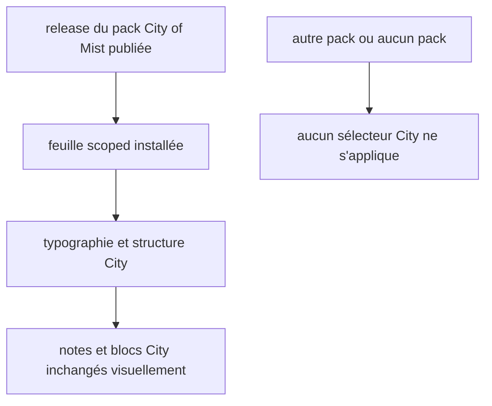
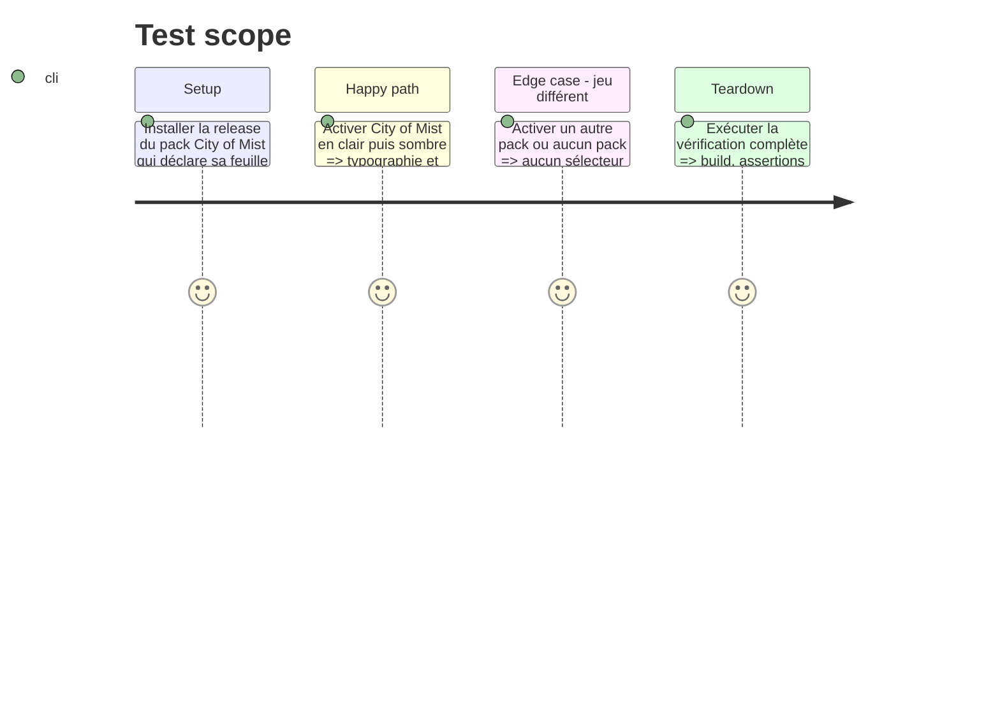

# Instruction: Migration du rendu City of Mist et non-régressions

## Architecture projection

> Tree of the final files. ✅ create · ✏️ modify · ❌ delete

```txt
obsidian-handbook/
├── src/styles/
│   ├── styles.scss                 ✏️ ne référence plus le rendu spécifique City of Mist migré
│   └── city-of-mist/               ❌ partials et fontes devenus propriété du pack publié
├── tools/
│   ├── assert-city-v1-theme.mjs    ✏️ vérifie le rendu City chargé depuis le pack
│   ├── assertStyleScope.harness.mts ✏️ vérifie que le CSS City n'est jamais global
│   └── check.mjs                   ✏️ exécute les nouvelles assertions de feuilles
└── aidd_docs/guidelines/
    └── schema-design.md            ✏️ documente la frontière entre CSS générique et feuille de pack
```

## User Journey



## Test Scope



## Tasks to do

### `1)` Rapatrier la propriété du rendu City vers son pack

> Faire du pack City of Mist la source de la typographie de composants et des règles structurelles spécifiques au jeu.

1. Consommer la release du pack City of Mist qui a déplacé ses règles de composants et polarités vers une feuille déclarée ; traiter cette publication amont comme un prérequis distinct plutôt que d’éditer un pack absent de ce dépôt.
2. Retirer des imports SCSS consommateur et des assets compilés les partials City devenus redondants ; conserver seulement les primitives réellement partagées ou les exceptions documentées par le contrat de portée.
3. Mettre à jour les assertions City pour observer la feuille de pack installée plutôt que des règles SCSS embarquées.

### `2)` Fermer la frontière et les régressions

> Rendre vérifiable qu’un futur pack ne peut pas réintroduire un CSS non isolé.

1. Ajouter les assertions de refus et de portée au check global, puis conserver les assertions existantes de polarités, tokens et fenêtres.
2. Mettre à jour la guideline pour préciser qu’un choix visuel structurel propre à un jeu appartient à sa feuille déclarée, alors que les règles partagées restent dans le SCSS Handbook.
3. Exécuter build et l’ensemble des assertions concernées, y compris les packs personnalisés, les sources installées, le scope de style et City of Mist.

## Test acceptance criteria

| Task | Acceptance criteria |
| --- | --- |
| 1 | City of Mist conserve son rendu spécifique depuis sa feuille de pack, tandis que le CSS consommateur ne porte plus ces règles du jeu. |
| 2 | Le check global détecte un CSS de pack non scoped et les validations existantes restent vertes pour City et les packs sans feuille. |
