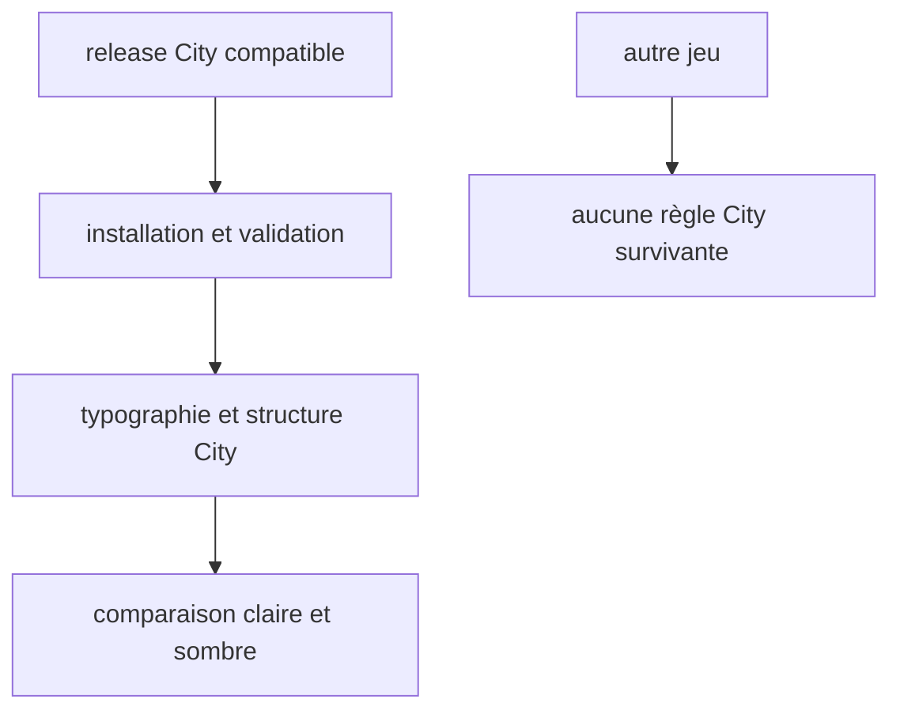
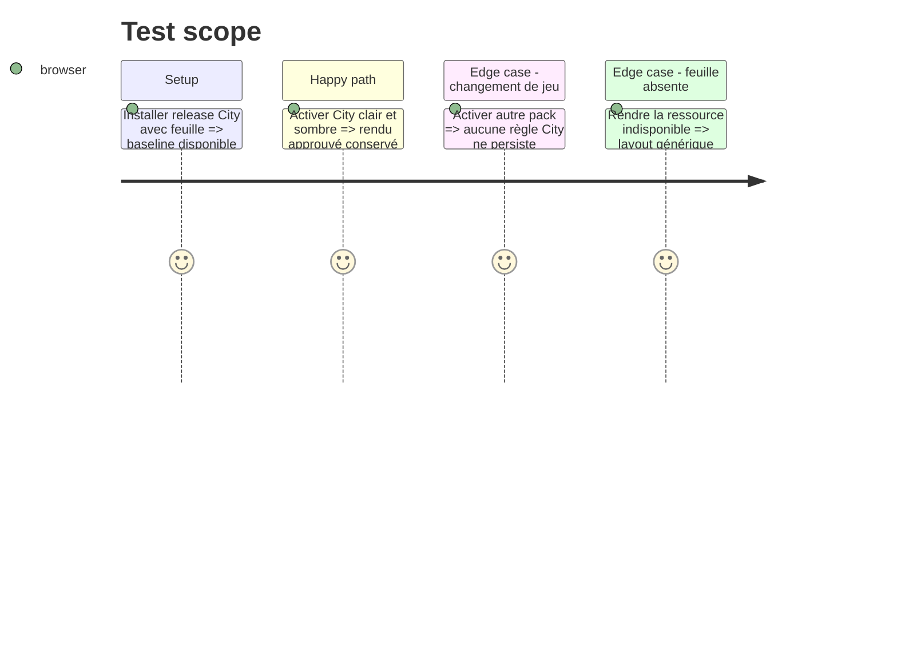

# Instruction: Migrer City of Mist sans dérive visuelle

## Architecture projection

> Tree of the final files. ✅ create · ✏️ modify · ❌ delete

```txt
schema-in-the-mist@release-compatible/
├── handbook/city-of-mist/pack.json ✏️ déclare la feuille City
└── handbook/city-of-mist/assets/styles/city-of-mist.css ✅ possède typographie et structure City
obsidian-handbook/
├── src/styles/city-of-mist/* ✏️ garde géométrie partagée, sécurité et compatibilité éditeur
├── tools/assert-city-v1-theme.mjs ✏️ vérifie feuille installée et polarités
└── aidd_docs/guidelines/schema-design.md ✏️ fixe la frontière producteur/consommateur
```

## User Journey



## Test Scope



## Tasks to do

### `1)` Déplacer seulement les règles que City possède

> Une migration de propriété, pas un second moteur de layout.

1. Classer les partials City : typographie/structure City, géométrie partagée, sécurité/accessibilité et compatibilité éditeur.
2. Dans une release City compatible, déclarer la feuille scoped et y déplacer les seules règles City utilisant les tokens publiés.
3. Retirer les doublons du SCSS Handbook et conserver primitives partagées, resets, fallbacks et exceptions documentées.

### `2)` Comparer et isoler le rendu publié

> Le changement de propriétaire ne change pas l’expérience approuvée.

1. Comparer les fixtures City avant/après en chaque polarité.
2. Tester feuille installée, absence contrôlée et transition City vers les autres jeux.
3. Enregistrer les révisions exactes et exécuter validations producteur et consommateur.

## Test acceptance criteria

| Task | Acceptance criteria |
| --- | --- |
| 1 | Les règles exclusivement City vivent dans sa feuille publiée ; le SCSS consommateur ne garde que le partagé ou la sécurité. |
| 2 | City garde son rendu approuvé et ne contamine jamais un autre pack ni le layout générique. |
