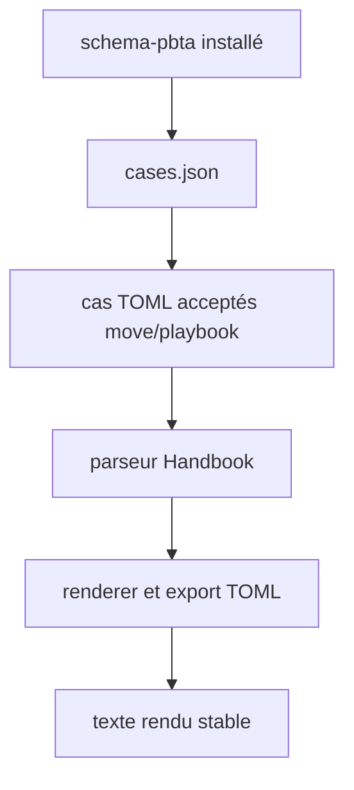
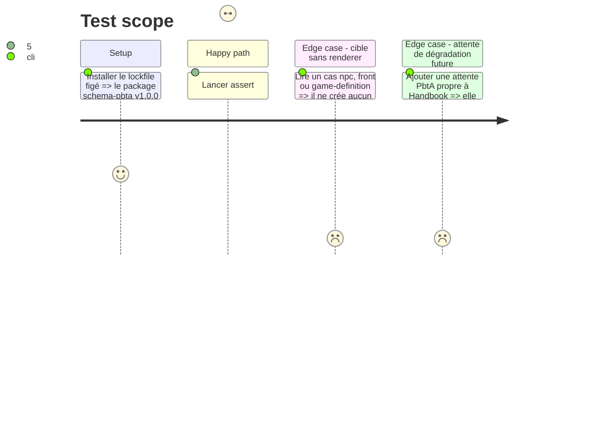

# Instruction: Lecteur de corpus et assertions de projection

## Architecture projection

> Tree of the final files. ✅ create · ✏️ modify · ❌ delete

```txt
obsidian-handbook/
├── tools/
│   ├── pbtaContractCorpus.mts     ✅ résout et valide le manifeste installé
│   └── assertCorpus.harness.mts   ✏️ utilise les cas move/playbook canoniques
└── corpus/
    └── README.md                  ✏️ attribue le contrat PbtA au package publié
```

## User Journey



## Test Scope



## Tasks to do

### `1)` Centraliser la lecture du corpus PbtA publié

> Donner aux harnais un lecteur indépendant du layout de node_modules.

1. Créer `pbtaContractCorpus.mts` en résolvant `schema-pbta/corpus/cases.json` depuis le projet ; valider la version TOML, les chemins internes, l’unicité, les formats et les verdicts du manifeste.
2. Exporter les cas TOML acceptés des seules cibles `move` et `playbook`, ainsi que leur correspondance aux ids `pbta-move` et `pbta-playbook` ; ignorer explicitement les cibles non rendues sans inventer de capacité de jeu.

### `2)` Brancher le corpus canonique dans la garde globale

> Prouver les deux projections et commandes de copie depuis la source propriétaire.

1. Étendre `assertCorpus.harness.mts` : les sources canoniques doivent parser, rendre du texte, passer par `TOML_EXPORTS`, se relire et conserver le texte rendu.
2. Retirer les témoins PbtA du calcul de couverture locale ; toute attente future de dégradation propre à Handbook reste locale sans devenir un verdict du manifeste canonique.
3. Mettre à jour `corpus/README.md` pour distinguer corpus PbtA propriétaire et attentes de projection Handbook.

## Test acceptance criteria

| Task | Acceptance criteria |
| --- | --- |
| 1 | Le lecteur rejette un manifeste, un chemin ou une cible invalide et n’expose que les sources canoniques TOML acceptées de move/playbook. |
| 2 | Les deux blocs PbtA sont prouvés par le package installé : parseur, renderer et export produisent une sortie relisible au même texte, sans renderer ajouté. |
