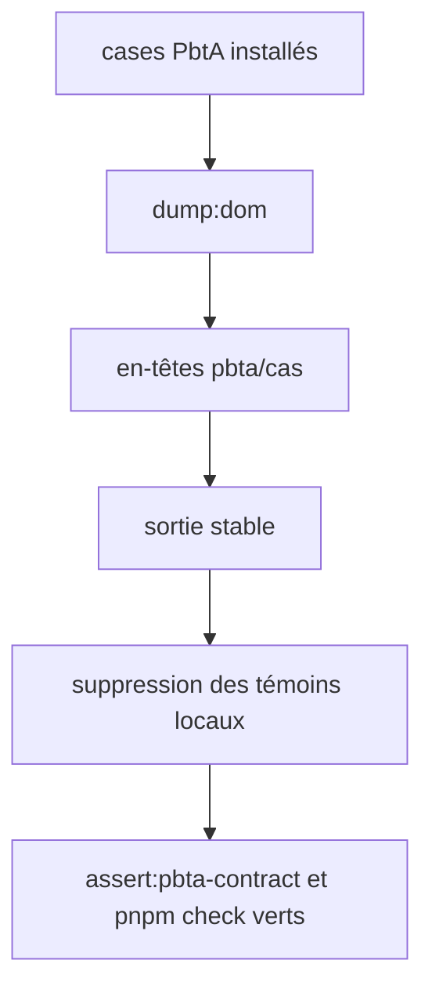
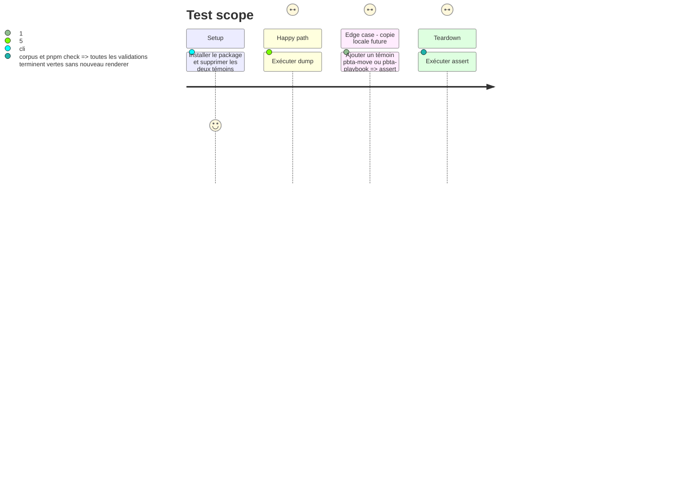

# Instruction: Dump déterministe, retrait des doublons et validation

## Architecture projection

> Tree of the final files. ✅ create · ✏️ modify · ❌ delete

```txt
obsidian-handbook/
├── corpus/
│   └── temoins/{pbta-move,pbta-playbook}.toml  ❌ contrats canoniques dupliqués
├── tools/
│   └── dumpDom.harness.mts                     ✏️ imprime les cas PbtA publiés ordonnés
└── aidd_docs/guidelines/schema-design.md       ✏️ documente le manifeste PbtA installé
```

## User Journey



## Test Scope



## Tasks to do

### `1)` Faire lire les sources canoniques au dump DOM

> Rendre observable la même projection que l’assertion de corpus.

1. Étendre `dumpDom.harness.mts` avec le helper PbtA et imprimer chaque cas move/playbook TOML accepté sous un en-tête stable `pbta/<path>`.
2. Ne pas convertir ni afficher les refus canoniques : le contrat strict les couvre déjà et aucune attente de projection Handbook ne leur est attribuée.

### `2)` Retirer les copies et terminer la migration

> Laisser les deux documents contractuels chez leur propriétaire.

1. Supprimer `corpus/temoins/pbta-move.toml` et `corpus/temoins/pbta-playbook.toml` après le branchement des deux consommateurs, puis ajouter une garde de duplication équivalente à Mist et Adrenaline.
2. Documenter le partage PbtA dans le guide de conception et vérifier les recherches pour confirmer qu’aucune fixture supprimée ni contrat par `game` n’est introduit.
3. Exécuter `pnpm assert:pbta-contract`, `pnpm assert:corpus`, `pnpm dump:dom` et `pnpm check`; ne commenter ou fermer l’issue qu’après ces quatre validations vertes.

## Test acceptance criteria

| Task | Acceptance criteria |
| --- | --- |
| 1 | Le dump présente uniquement les sources PbtA canoniques rendables, sous des en-têtes reproductibles. |
| 2 | Les deux témoins locaux n’existent plus, une nouvelle copie est rejetée et les quatre validations passent sans renderer PbtA supplémentaire ni logique fondée sur `game`. |
