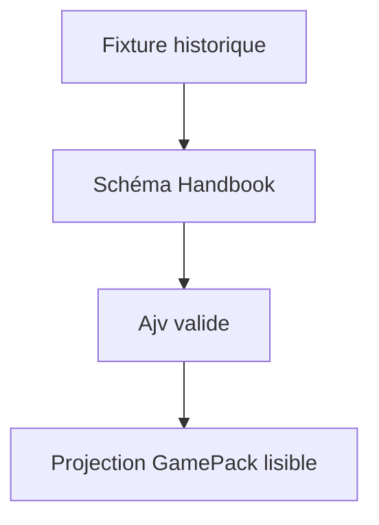
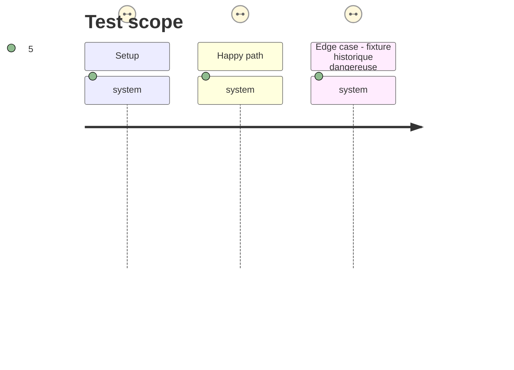

# Instruction: Importer et valider les fixtures historiques

## Architecture projection

> Tree of the final files. ✅ create · ✏️ modify · ❌ delete

```txt
.
├── corpus/game-packs/
│   └── appearance-fixtures/
│       ├── adrenaline.json                    ✅ fixture historique migrée
│       ├── city-of-mist.json                  ✅ fixture historique migrée
│       ├── city-of-mist-shapes.json           ✅ fixture historique migrée
│       ├── legend-in-the-mist.json            ✅ fixture historique migrée
│       └── otherscape.json                    ✅ fixture historique migrée
├── tools/gamePackContract.harness.mts         ✏️ valide chaque fixture importée avec Ajv et la projection Handbook
├── schemas/appearance/README.md               ✅ nomme Handbook comme propriétaire et les fixtures comme corpus de compatibilité
└── aidd_docs/tasks/2026_09/2026_09_15_schema_appearance_retirement/
    └── phase-1.md                             ✏️ porte le statut de livraison
```

## User Journey



## Test Scope



## Tasks to do

### `1)` Rapatrier le corpus inter-jeux

> Garder la couverture documentaire qui justifiait l’ancien dépôt.

1. Copier les cinq JSON sans les transformer, dans un sous-dossier de corpus qui indique leur provenance historique.
2. Ajouter un court README de schéma qui déclare le contrat Handbook canonique, le rôle de compatibilité des fixtures, leur origine et l’abandon explicite du générateur Zod externe.

### `2)` Rendre la migration vérifiable

> Prouver que les fixtures ne deviennent pas de simples fichiers morts.

1. Étendre le harnais `GamePack` pour découvrir les fixtures migrées.
2. Exiger pour chacune une validation Ajv et une projection `readGamePack` non nulle, puis conserver le cas invalide actuel.

## Test acceptance criteria

| Task | Acceptance criteria |
| --- | --- |
| 1 | Les cinq fixtures historiques et leur provenance vivent dans Handbook, à côté du contrat canonique. |
| 2 | `pnpm assert:game-pack-contract` valide et projette chaque fixture migrée tout en refusant le jeton CSS dangereux. |
