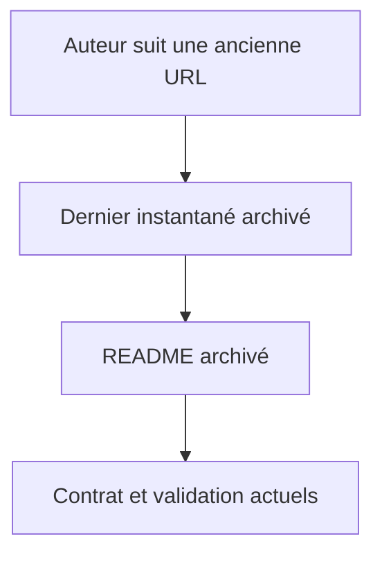
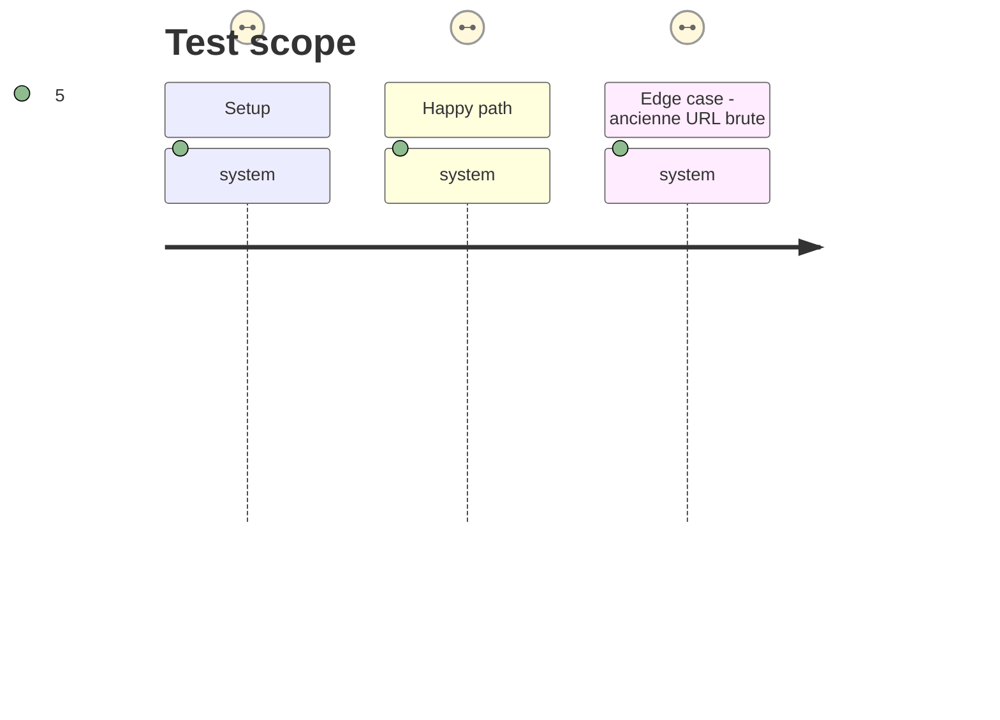

# Instruction: Publier Handbook puis archiver le dépôt

## Architecture projection

> Tree of the final files. ✅ create · ✏️ modify · ❌ delete

```txt
schema-appearance/
├── README.md                                  ✏️ avertit clairement que le contrat est migré vers Handbook
├── CHANGELOG.md                               ✏️ enregistre la dernière publication de compatibilité

handbook/
├── README.md                                  ✏️ relie le contrat local à la migration et au dépôt archivé
├── manifest.json                               ✏️ porte la release qui publie le corpus et le contrat canonique
├── versions.json                               ✏️ enregistre la compatibilité de la release Handbook
└── aidd_docs/tasks/2026_09/2026_09_15_schema_appearance_retirement/
    └── phase-2.md                             ✏️ porte le statut de livraison
```

## User Journey



## Test Scope



## Tasks to do

### `1)` Publier Handbook comme contrat canonique

> Rendre la migration disponible avant de geler son ancien emplacement.

1. Préparer et publier une release Handbook qui contient le schéma, le corpus migré et l’assertion de phase 1.
2. Mettre à jour `manifest.json` et `versions.json` selon le processus de versionnage du plugin.
3. Vérifier l’archive de release : le schéma et les fixtures sont suivis dans le dépôt et l’assertion est verte.

### `2)` Déprécier et archiver après vérification croisée

> Rendre le retrait explicite sans casser les clients qui consultent encore l’ancienne URL.

1. Écrire l’avis d’archivage, sa date, l’URL de la release Handbook et la règle : l’ancienne URL brute reste un instantané, jamais une redirection.
2. Ajouter une dernière entrée de changelog qui relie cette décision au contrat Handbook, puis vérifier qu’aucun consommateur local ni aucune documentation Handbook ne désigne schema-appearance comme source active.
3. Archiver le dépôt GitHub `RebelliousSmile/schema-appearance`; l’archivage verrouille naturellement les nouvelles contributions. Ne pas le supprimer ni réécrire ses tags ou releases.

## Test acceptance criteria

| Task | Acceptance criteria |
| --- | --- |
| 1 | Une release Handbook publiée contient le schéma, les fixtures et l’assertion qui les valide. |
| 2 | Le dépôt séparé indique sans ambiguïté le schéma Handbook à utiliser, est archivé, et son URL historique reste lisible comme instantané. |
