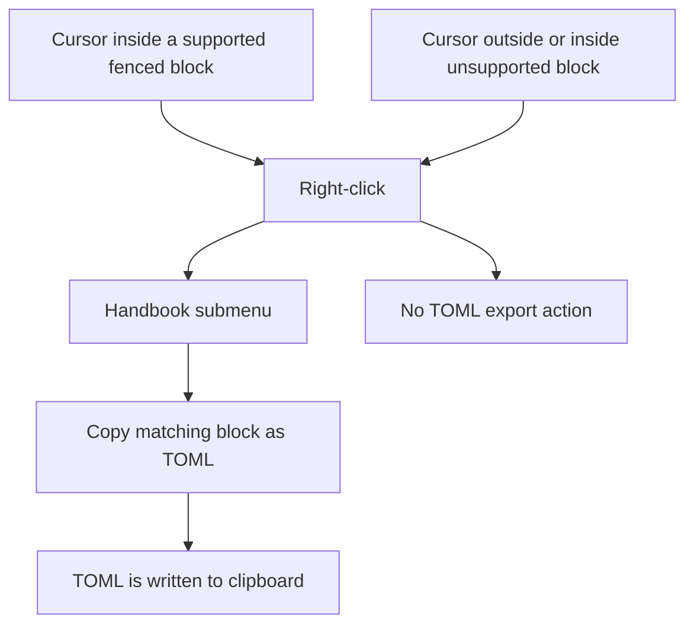
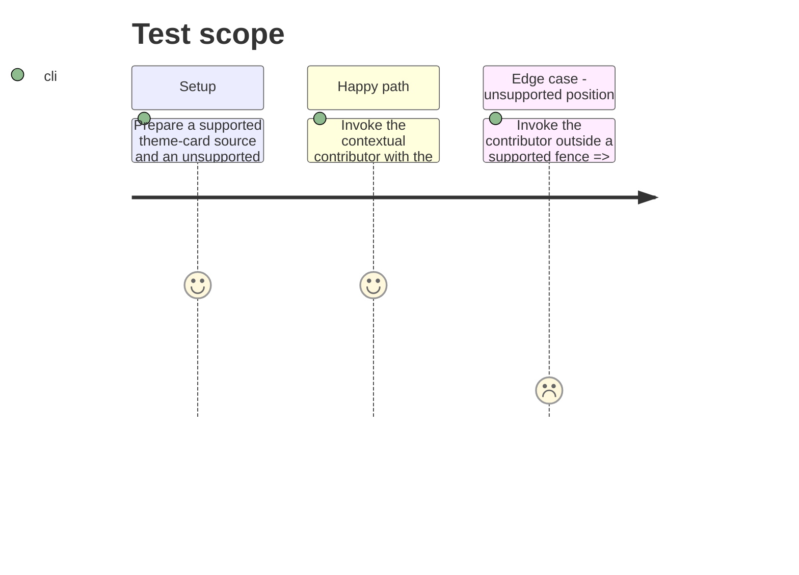

# Instruction: Add contextual export and coverage

## Architecture projection

> Tree of the final files. ✅ create · ✏️ modify · ❌ delete

```txt
.
├── aidd_docs/tasks/2026_09/2026_09_16_contextual-toml-export/
│   ├── plan.md                                 ✅ describes the feature
│   └── phase-1.md                              ✅ specifies this delivery
├── src/
│   ├── contextMenu/index.ts                    ✏️ asks TOML exports to contribute their contextual action
│   └── features/blocks/copyAsToml.ts           ✏️ shares the cursor-aware copy action with the command and context menu
└── tools/contextualTomlExport.harness.mts      ✅ proves only the applicable export is offered and copied
```

## User Journey



## Test Scope



## Tasks to do

### `1)` Share and expose the existing TOML export

> The context menu invokes the same guarded serialization path as the command palette.

1. Extract the cursor-aware export selection and copy execution into reusable helpers.
2. Add one context-menu contributor that offers only the export matching the cursor’s fenced block and enabled game capabilities.
3. Insert its item in the Handbook submenu with a clear separator from insertion actions.
4. Add a focused harness for selection, menu label and copied canonical TOML.

## Test acceptance criteria

| Task | Acceptance criteria |
| ---- | ------------------- |
| 1 | Right-clicking within a valid supported fenced block shows its single `Copy … as TOML` action, which copies its TOML. |
| 1 | Right-clicking outside a supported fenced block adds no TOML export action. |
| 1 | Disabled or mode-inapplicable blocks offer no contextual export. |
