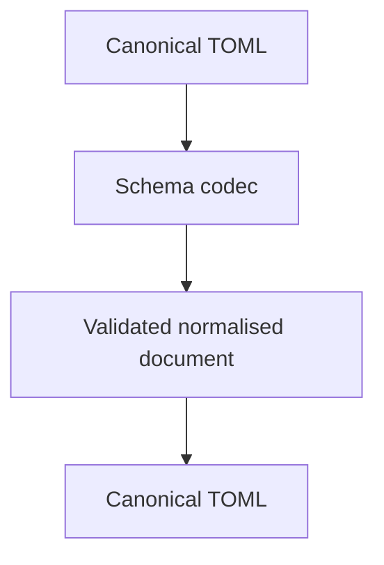
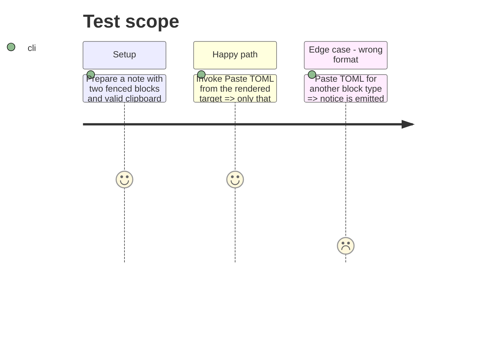

# Instruction: Release canonical schema API

## Architecture projection

> Tree of the final files. ✅ create · ✏️ modify · ❌ delete

```txt
.
├── schema-in-the-mist/
│   ├── src/codecs/                     ✏️ exports versioned parse/validate/normalise/stringify codecs for published targets
│   ├── corpus/                         ✏️ provides accepted, raw-fallback and round-trip cases
│   └── package.json                    ✏️ releases the codec API
└── handbook/aidd_docs/                 ✏️ records the cross-repository delivery dependency
```

## User Journey



## Wireframe

```txt
┌──────────────────────────────────┐
│ (1) Rendered Handbook block       │
│                                  │
│  ┌────────────────────────────┐  │
│  │ (2) Context action          │  │
│  └────────────────────────────┘  │
└──────────────────────────────────┘
```

1. Rendered block: the existing visual card under edit.
2. Context action: existing TOML export plus the clipboard import entry.

## Test Scope



## Tasks to do

### `1)` Publish the transport-to-source contract

> All consumers obtain one canonical answer for the same document.

1. Deliver [`schema-in-the-mist#12`](https://github.com/RebelliousSmile/schema-in-the-mist/issues/12), which owns any missing public canonical codec target.
2. Publish parse, validation, normalisation and canonical TOML stringify support with its accepted/rejected corpus.
3. Release an immutable package version and record its URL and integrity for Handbook.

## Test acceptance criteria

| Task | Acceptance criteria |
| ---- | ------------------- |
| 1 | The same valid TOML produces the same canonical document and canonical TOML for every consumer. |
| 1 | Handbook can pin a released public API without a runtime network dependency. |
