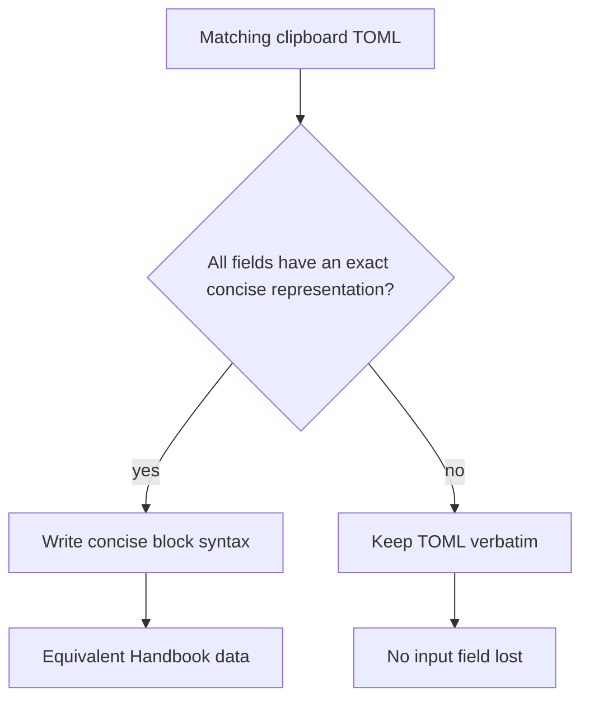
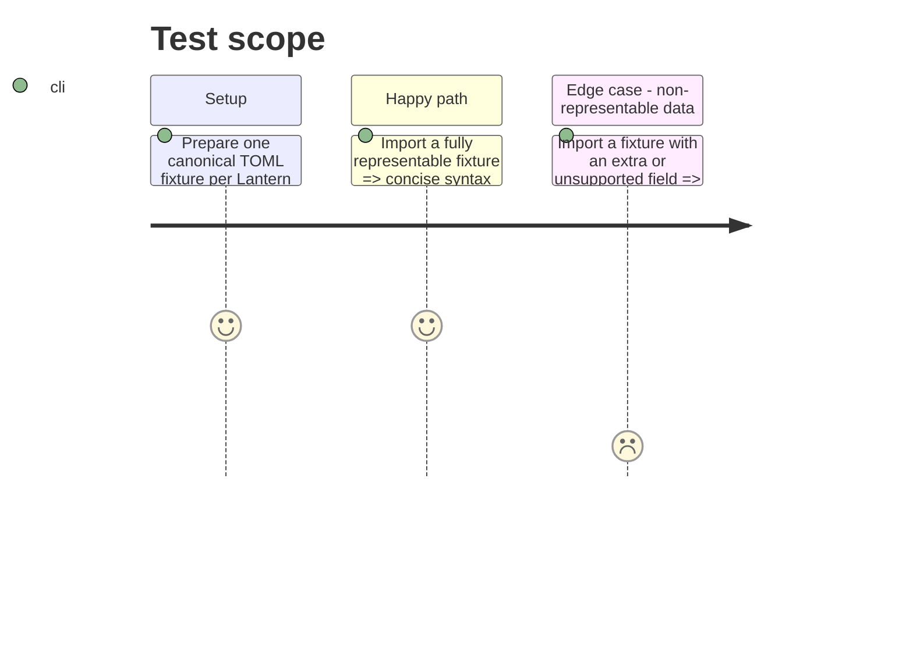

# Instruction: Consume codecs and adapt concise syntax

## Architecture projection

> Tree of the final files. ✅ create · ✏️ modify · ❌ delete

```txt
.
├── src/features/
│   ├── blocks/pasteToml.ts            ✏️ validates through the installed schema codec then selects concise or raw source
│   ├── blocks/tomlExports.ts          ✏️ maps block ids to schema targets and Handbook concise adapters
│   └── contracts/mist-engine.ts       ✏️ pins and guards the published codec API
└── tools/contextualTomlExport.harness.mts ✏️ proves safe conversion and TOML fallback
```

## User Journey



## Test Scope



## Tasks to do

### `1)` Define reversible concise writers

> Every supported concise writer is proven against its own TOML codec.

1. Remove local TOML parsing, validation and canonicalisation from Handbook.
2. Invoke the installed pinned target codec after the user-initiated clipboard read.
3. Use the schema-owned concise-or-raw result directly; Handbook contains no concise writer.
4. Retain guarded section replacement and notices in Handbook; retain raw TOML if comments, metadata, unknown fields or adapter equivalence prevent shortening.

## Test acceptance criteria

| Task | Acceptance criteria |
| ---- | ------------------- |
| 1 | Each supported canonical Lantern fixture imports as concise Handbook syntax and round-trips to equivalent TOML. |
| 1 | Extra keys, metadata, comments or unsupported values leave TOML intact byte-for-byte. |
| 1 | No conversion path silently removes a list entry, scalar, table or metadata field. |
