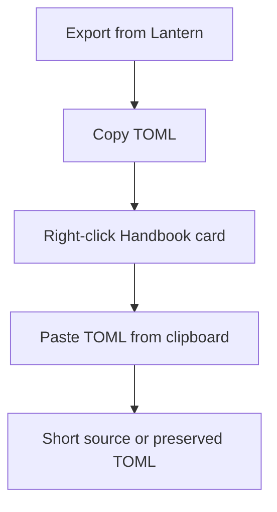
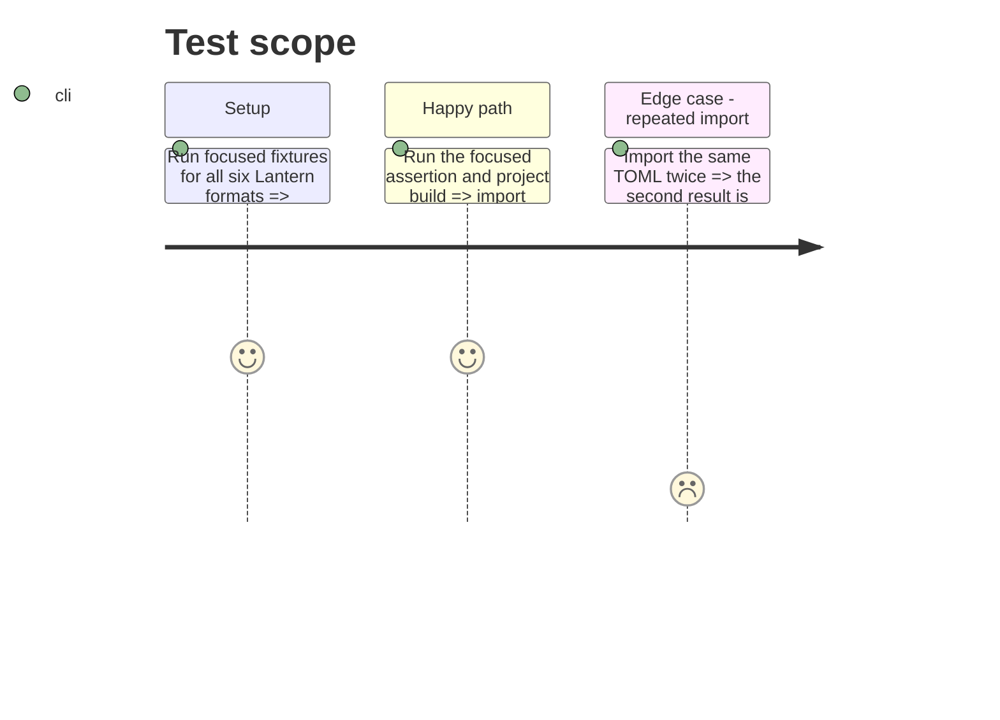

# Instruction: Prove cross-repository contract

## Architecture projection

> Tree of the final files. ✅ create · ✏️ modify · ❌ delete

```txt
.
├── README.md                           ✏️ documents the Lantern → Handbook import action and fallback rule
├── tools/contextualTomlExport.harness.mts ✏️ covers every import outcome end to end
└── package.json                        ✏️ exposes the focused assertion when required
```

## User Journey



## Test Scope



## Tasks to do

### `1)` Document and lock the workflow

> The user-facing flow and its lossless contract remain regression-tested.

1. Consume the published schema corpus rather than copying conversion fixtures into Handbook.
2. Assert the installed package version exposes every target used by the context action.
3. Add the concise workflow and preservation rule to the README, then run assertions, lint and build.

## Test acceptance criteria

| Task | Acceptance criteria |
| ---- | ------------------- |
| 1 | Documentation says where the action lives and when TOML remains TOML. |
| 1 | Reimporting the same document is idempotent for concise and fallback outcomes. |
| 1 | Focused assertion, lint and build pass. |
