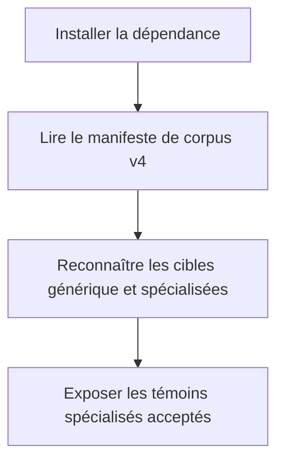
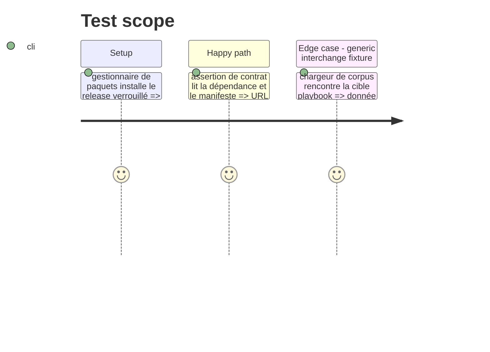

# Instruction: Verrouiller v4 et étendre le corpus de projection

## Architecture projection

> Tree of the final files. ✅ create · ✏️ modify · ❌ delete

```txt
.
├── package.json                                  ✏️ fixe schema-pbta sur l'asset GitHub Release v4.0.0
├── package-lock.json                             ✏️ enregistre l'URL et l'intégrité npm de v4.0.0
├── pnpm-lock.yaml                                ✏️ enregistre l'URL et l'intégrité pnpm de v4.0.0
├── tools/assert-pbta-contract.mjs                ✏️ vérifie le release, le verrou et le corpus v4
└── tools/pbtaContractCorpus.mts                  ✏️ charge le manifeste distribué et classe les cinq cibles spécialisées
```

## User Journey



## Test Scope



## Tasks to do

### `1)` Verrouiller le package publié

> Remplacer la dépendance v1 par le tarball v4.0.0 publié et ses intégrités verrouillées dans les gestionnaires de paquets.

1. Mettre à jour l'URL de dépendance dans les deux manifestes.
2. Régénérer les deux lockfiles depuis cet asset immuable.
3. Faire exiger à l'assertion de release v4.0.0, ses métadonnées verrouillées et le manifeste installé.

### `2)` Modéliser le catalogue de cibles possédé par le package

> Faire exposer au chargeur de corpus les entrées spécialisées acceptées comme cibles de rendu nommées, sans liste de fixtures parallèle détenue par Handbook.

1. Résoudre de façon sûre le manifeste contractuel et les fichiers de cas du package.
2. Étendre le typage et le mapping de cible à Masks, Monster of the Week, Monsterhearts, Urban Shadows et The Sprawl.
3. Préserver la cible `playbook` générique comme entrée d'interchange, sans en faire l'autorité d'un aperçu.

## Test acceptance criteria

| Task | Acceptance criteria |
| --- | --- |
| 1 | A clean install resolves `schema-pbta-4.0.0.tgz` from the public release and both committed lockfiles record its integrity. |
| 1 | The release assertion rejects a v1 URL, missing integrity or a malformed v4 contract manifest. |
| 2 | The loader returns every accepted specialized playbook witness declared by v4 and does not require a Handbook copy. |
| 2 | A generic `playbook` witness cannot enter the specialized-preview selection. |
