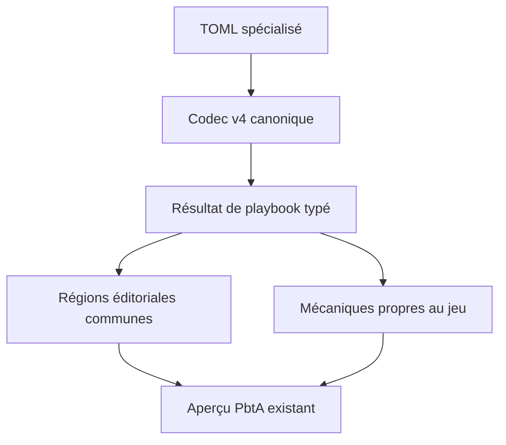
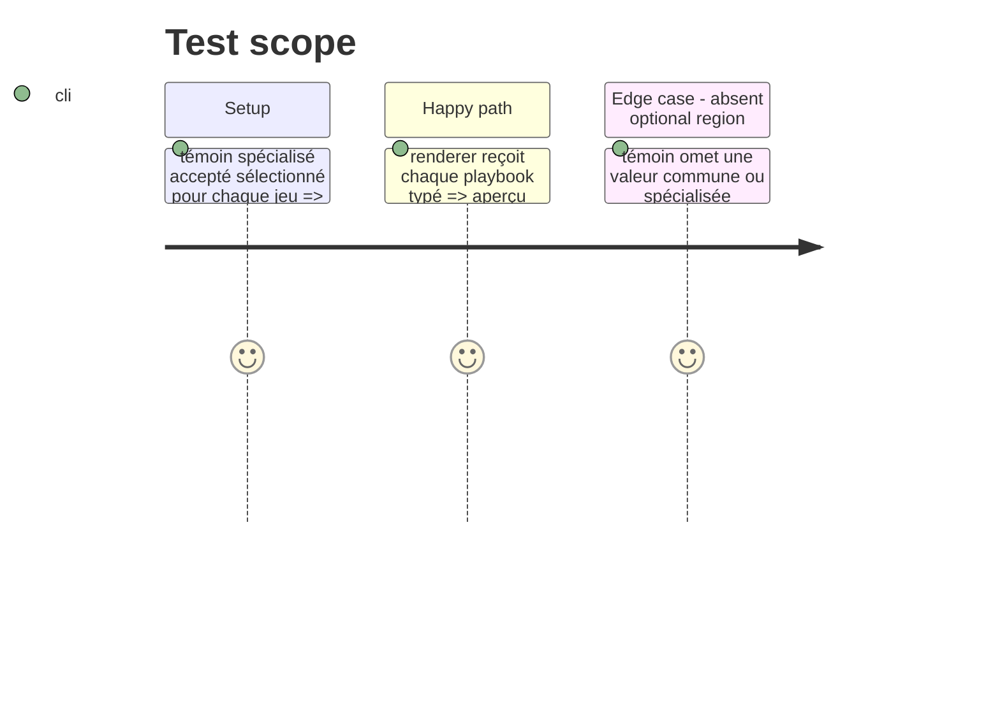

# Instruction: Résoudre et rendre les playbooks spécialisés

## Architecture projection

> Tree of the final files. ✅ create · ✏️ modify · ❌ delete

```txt
.
├── src/features/pbta/
    ├── specializedPlaybooks.ts                   ✅ centralise les codecs v4, le résultat typé et le dispatch par cible
    ├── block.ts                                  ✏️ fait lire au bloc portable un TOML spécialisé résolu
    ├── shape.ts                                  ✏️ décrit les régions éditoriales communes et les zones mécaniques spécialisées
    └── renderer.ts                               ✏️ projette les régions communes et chaque mécanique propre au jeu dans le DOM existant
├── src/features/blocks/tomlExports.ts             ✏️ copie un résultat spécialisé avec le sérialiseur de sa cible, sans le réduire au contrat générique
```

## User Journey



## Test Scope



## Wireframe

```txt
┌──────────────────────────────────────────────────────────────┐
│ (1) Identité et valeurs initiales                              │
├───────────────────────────────┬──────────────────────────────┤
│ (2) Sections éditoriales      │ (3) Mécaniques du jeu         │
│  ouverture · conseil · identité│ valeurs propres au jeu        │
│                               │  mouvements et choix communs  │
├───────────────────────────────┴──────────────────────────────┤
│ (4) Progression et continuation                                │
└──────────────────────────────────────────────────────────────┘
```

1. Identité : l'identité commune et les valeurs initiales du playbook.
2. Éditorial : les régions de prose canoniques complètes fournies par le TOML spécialisé.
3. Mécaniques : les données de mouvement communes et les régions propres à la cible de playbook résolue.
4. Progression : le matériel canonique d'avancement ou de continuation, dans le flux établi de l'aperçu.

## Tasks to do

### `1)` Introduire une frontière de parsing spécialisé

> Résoudre chacune des cinq cibles TOML publiées avec son codec v4 associé et conserver la cible auprès de sa donnée typée.

1. Déclarer le dispatch cible-vers-codec pris en charge dans un module PbtA unique.
2. Retourner un résultat discriminé que le renderer et la commande de copie peuvent traiter exhaustivement.
3. Sérialiser un résultat spécialisé résolu avec son propre codec v4 afin qu'un aller-retour de copie conserve ses régions éditoriales et mécaniques.
4. Garder le parsing et l'export génériques disponibles pour l'auteur portable, sans les utiliser pour revendiquer un aperçu spécialisé.

### `2)` Rendre les fiches spécialisées complètes

> Ajouter des régions sémantiques pour tout le contenu éditorial commun et les mécaniques propres au jeu portées par les cinq schémas, en gardant la hiérarchie de composants PbtA et les jetons visuels actuels.

1. Étendre la forme seulement avec les régions effectivement émises par le renderer.
2. Réutiliser les primitives existantes pour l'identité, les stats, les mouvements, les choix, les listes et les callouts.
3. Ajouter les projections propres aux cibles : vérité/potential/influence de Masks, améliorations de Monster of the Week, strings/conditions/sections éditoriales de Monsterhearts, corruption/end move d'Urban Shadows, et directives/mission gear/cred de The Sprawl lorsqu'ils sont présents.
4. Omettre proprement les données optionnelles et laisser inchangées la composition des packs, l'activation par capacité et la propriété du HTML généré.

## Test acceptance criteria

| Task | Acceptance criteria |
| --- | --- |
| 1 | Each TOML under the five accepted specialized corpus targets is parsed by its corresponding v4 codec and reaches the renderer with its target known. |
| 1 | A copied specialized playbook round-trips through its matching v4 codec without losing its target-specific or editorial fields. |
| 1 | A valid generic playbook can remain portable input but is not presented as a second canonical game sheet. |
| 2 | Every required editorial section in each specialized witness is visible in its rendered preview. |
| 2 | Each witness's game-specific fields are visible without changing the installed pack list, capabilities or existing PbtA visual treatment. |
| 2 | An absent optional field yields no empty semantic region and does not prevent the rest of the preview from rendering. |
