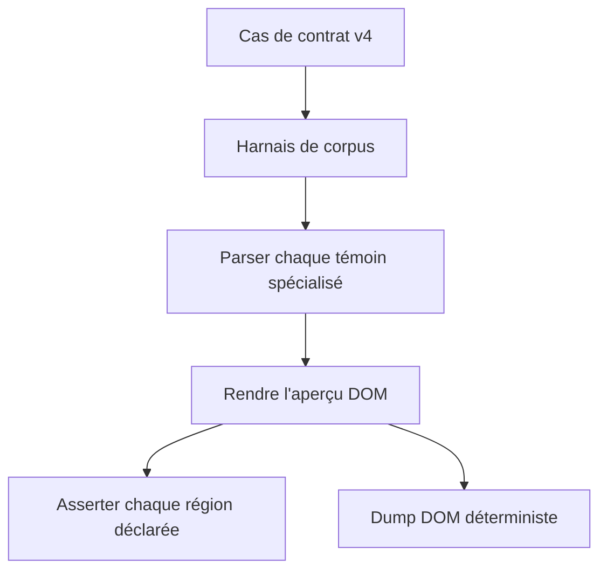
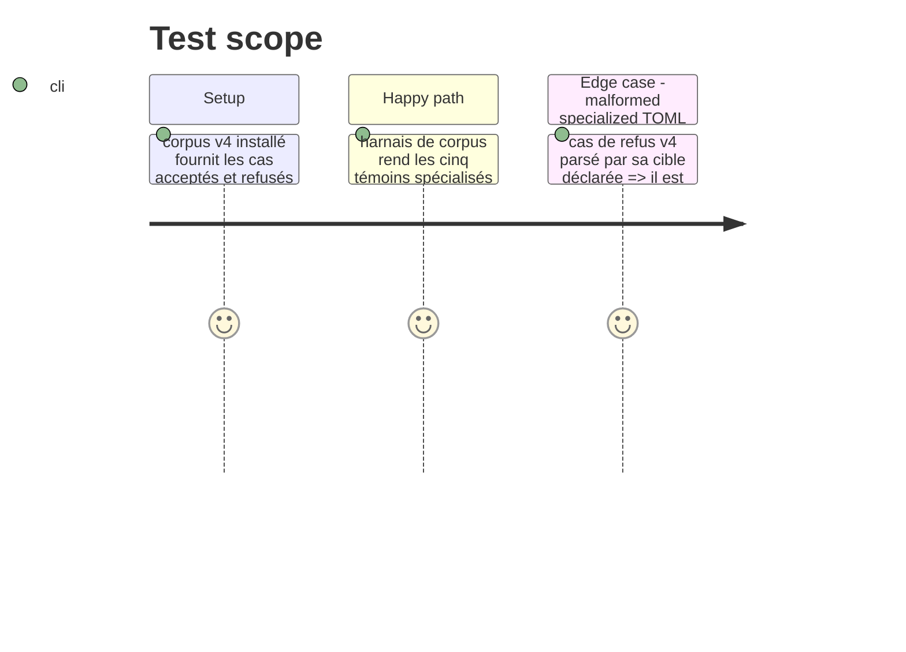

# Instruction: Prouver les aperçus et préserver le contrat portable

## Architecture projection

> Tree of the final files. ✅ create · ✏️ modify · ❌ delete

```txt
.
├── tools/assertCorpus.harness.mts                ✏️ exerce les cinq témoins spécialisés et vérifie les régions rendues
├── tools/dumpDom.harness.mts                     ✏️ imprime les aperçus spécialisés déterministes pour revue de dérivé HTML
├── tools/assert-pbta-contract.mjs                ✏️ couvre les refus et le manifeste spécialisés après la migration
├── tools/pbtaContractCorpus.mts                  ✏️ fournit aux harnais les entrées spécialisées sans duplication
├── tools/pbtaSpecializedProjection.harness.mts   ✅ complète les témoins v4 avec des données strictement de test pour les régions optionnelles
├── tools/assert-pbta-specialized-projection.mjs  ✅ bundle et exécute la couverture de projection spécialisée
└── corpus/README.md                              ✏️ documente la source v4 et la frontière entre interchange et aperçus canoniques
```

## User Journey



## Test Scope



## Tasks to do

### `1)` Transformer le corpus en preuve d'aperçu

> Faire prouver la projection Handbook par les cas spécialisés acceptés et refusés du package plutôt que par des fixtures locales dupliquées.

1. Étendre le harnais de corpus avec un parsing sensible à la cible et des assertions de région pour toute région obligatoire présente dans les témoins v4.
2. Couvrir chaque région spécialisée optionnelle avec le plus petit TOML de test strict accepté par le codec correspondant ; ces entrées prouvent seulement la projection et ne sont jamais des fixtures d'aperçu ou de personnage canonique.
3. Veiller à ce que chaque cible spécialisée apporte un témoin d'aperçu accepté et que son refus du package reste refusé.
4. Garder la couverture portable existante du playbook générique distincte de celle des aperçus spécialisés.

### `2)` Rendre la revue de sortie dérivée reproductible

> Étendre le dump DOM et la documentation du corpus afin qu'une revue puisse comparer le HTML généré sans le traiter comme une donnée source.

1. Émettre des sections DOM stables, étiquetées par cible, pour les cinq aperçus spécialisés.
2. Documenter le chemin de corpus v4 et la frontière de propriété générique-versus-spécialisé.
3. Exécuter les contrôles de contrat/corpus ciblés puis les portes normales de type, lint et build quand le graphe de dépendances est cohérent.

## Test acceptance criteria

| Task | Acceptance criteria |
| --- | --- |
| 1 | The corpus harness fails if a required editorial or target-specific region present in a package witness disappears from its preview. |
| 1 | The specialized projection harness fails if an optional region represented by a strict test input is omitted or empty; those inputs are not distributed or canonical character sheets. |
| 1 | Every package rejection case is rejected by its declared specialized codec and cannot silently fall back to a generic canonical preview. |
| 2 | The DOM dump contains stable, distinguishable sections for all five specialized targets and can be compared before and after a renderer change. |
| 2 | Documentation identifies package-owned TOML/corpus as canonical and generated Handbook HTML as derived. |
| 2 | Focused PbtA contract and corpus checks, followed by repository type, lint and build gates, pass with v4 installed. |
