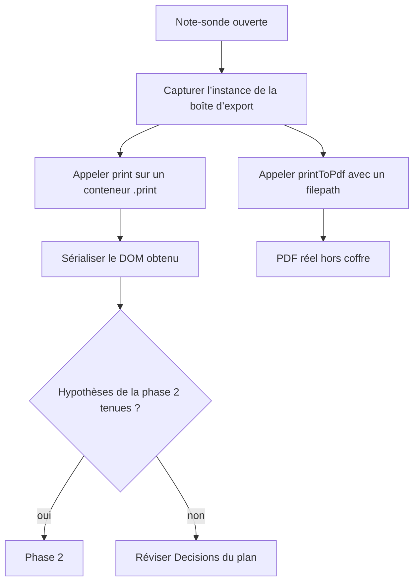

# Instruction: Sonder le DOM d’impression réel

## Architecture projection

> Tree of the final files. ✅ create · ✏️ modify · ❌ delete

```txt
.
├── tools/e2e/
│   ├── layout-regions-cdp.py                ✏️ capture réutilisable : DOM d’impression et PDF réel
│   └── fixtures/layout-regions-print-probe.md ✅ six sections, commentaire HTML, `hr`, note à pied de page
└── aidd_docs/tasks/2026_09/2026_09_18_pdf-layout-regions/
    └── evidence/print-dom.md                ✅ DOM d’impression observé et verdict par hypothèse
```

## User Journey



## Tasks to do

### `1)` Atteindre `print()` sans dialogue natif

> Obtenir le DOM d’impression réel sans passer par `showSaveDialog`.

1. Avant la commande `workspace:export-pdf`, remplacer `require("obsidian").Modal.prototype.open` par une version qui mémorise l’instance dont `print` est une fonction.
2. Exécuter la commande, refermer la boîte, puis appeler `instance.print(div.print, new Component(), false)` sur un `div` posé dans `document.body` de la fenêtre de test.
3. Appeler aussi `instance.printToPdf(options)` avec les options que construit le clic du bouton (lues dans l’asar 1.13.7) : `{ includeName: false, pageSize: "A4", landscape: false, marginsType: 0, scaleFactor: 100, scale: 1, open: false, filepath }`. Le dialogue natif n’est que dans ce clic ; l’appel ouvre la vraie fenêtre d’export masquée, le processus principal écrit le PDF dans le dossier de sortie du test, hors coffre, et `open: false` évite de l’ouvrir.
4. Si l’instance n’est pas atteignable ainsi, arrêter et rapporter : l’hypothèse de sonde est fausse, pas à contourner.

### `2)` Consigner ce que le DOM contient vraiment

> Transformer les hypothèses du plan en faits datés.

1. Sur la note-sonde, sérialiser enfants de premier niveau (balise, classe, premier enfant) avec et sans `includeName`.
2. Vérifier chaque hypothèse : enveloppe `div` nue par bloc, `hr` direct, commentaires HTML absents, titre `h1` direct, ordre identique à `metadataCache.sections`, sections `yaml` et notes à pied de page.
3. Écrire le verdict par hypothèse dans `evidence/print-dom.md`, avec la version d’Obsidian mesurée.

### `3)` Trancher la jointure

> Décider si le rang suffit avant d’écrire le mapper.

1. Si un type de section produit un nombre d’enfants différent d’un, le noter et fixer la règle d’exclusion pour la phase 2.
2. Si la jointure par rang est réfutée, réviser la décision correspondante du `plan.md` avant toute autre phase.

## Test acceptance criteria

| Task | Acceptance criteria |
| --- | --- |
| 1 | Une exécution du parcours produit le DOM d’impression et un PDF réel dans le dossier de sortie, sans dialogue natif et sans rien écrire dans un coffre. |
| 2 | `evidence/print-dom.md` donne, pour chaque hypothèse, « tenue » ou « réfutée » avec l’extrait de DOM qui le prouve. |
| 3 | La règle de jointure de la phase 2 est écrite en une phrase, ou le plan est révisé. |
