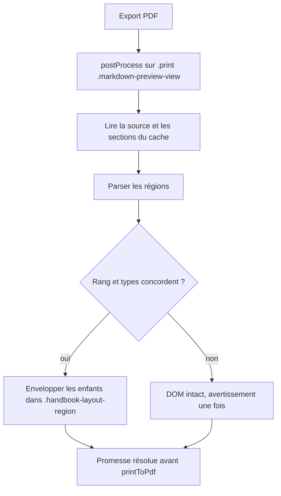

# Instruction: Regrouper les sections du DOM d’impression

## Architecture projection

> Tree of the final files. ✅ create · ✏️ modify · ❌ delete

```txt
.
├── src/features/layoutRegions/
│   ├── printMapper.ts                       ✅ jointure sections de cache ↔ enfants du DOM d’impression
│   ├── printProcessor.ts                    ✅ détecte l’export, lit source et cache, applique les régions
│   ├── sectionMapper.ts                     ✏️ niveau de titre lu aussi sur l’enveloppe nue
│   └── postProcessor.ts                     ✏️ délègue au chemin d’impression quand `getSectionInfo` est nul
└── tools/layoutRegions.harness.mts          ✏️ affirme jointure, garde et groupement d’impression
```

## User Journey



## Tasks to do

### `1)` Reconnaître l’export et rendre la main tard

> Entrer dans le chemin d’impression sans toucher à la lecture.

1. Dans `postProcess`, détecter l’export : `getSectionInfo(element)` nul, `element` de classe `markdown-preview-view`, parent de classe `print`. Toute autre situation garde le chemin existant.
2. Renvoyer une promesse : Obsidian l’attend avant de générer le PDF. Aucun minuteur ni `MutationObserver` (le DOM est complet et figé).
3. Lire la source par `vault.cachedRead` sur `context.sourcePath`, puis `parseLayoutRegions` ; les diagnostics passent par `warnOnce` existant.

### `2)` Joindre sections de cache et enfants imprimés

> Retrouver, par le rang, les blocs d’une région.

1. Construire la liste des sections de `metadataCache` en excluant les seules sections `html` réduites à des commentaires ; la section `yaml` reste et correspond à `div.mod-frontmatter` s’il ouvre la liste, sinon elle est retirée (voir `evidence/print-dom.md`).
2. Écarter du DOM un `h1` de titre direct en tête, puis lister les enfants de premier niveau restants.
3. Sélectionner les enfants dont la section recoupe `region.lineStart..lineEnd` ; refuser si la sélection n’est pas contiguë ou ne commence ni ne finit aux bornes de la région (mêmes règles que `mapRegionToBlocks`).
4. Garde : nombre de sections et types (`heading` ↔ `H1-H6`, `thematicBreak` ↔ `HR`) concordent sur le préfixe jusqu’à la fin de la région ; sinon ne rien déplacer et journaliser une fois.

### `3)` Réutiliser le regroupement de la lecture

> Une seule définition de colonne.

1. Faire lire à `blockHeadingLevel` la classe `el-hN` **ou** la balise `H1-H6` du seul enfant d’une enveloppe nue.
2. Appeler `wrapBlocksInRegion` sur les enveloppes sélectionnées ; poser `data-open-line` comme en lecture.
3. Calculer les sélections de toutes les régions sur la liste d’enfants d’origine, puis envelopper : l’enveloppement d’une région ne décale ainsi jamais le rang de la suivante.
4. Code compatible avec la cible ES basse : `for…of`, `Array.from`, `reduce` ; ni `Object.values` ni `Array.prototype.flat`.

### `4)` Affirmer sans Obsidian

> Prouver jointure et garde dans le harnais durable.

1. Étendre `tools/layoutRegions.harness.mts` avec un faux DOM d’impression (enveloppes nues, `hr` direct, titre `h1` direct) et des sections de cache.
2. Cas exigés : trois colonnes sur six sections donnant deux rangées ; deux régions successives ; une garde qui échoue (type divergent) et laisse le DOM identique ; note sans région, inchangée.

## Test acceptance criteria

| Task | Acceptance criteria |
| --- | --- |
| 1 | Le rendu en lecture est inchangé caractère pour caractère ; l’export attend la fin du regroupement avant de produire le PDF. |
| 2 | Six sections de même niveau dans `columns=3` sont sélectionnées à l’identique de la lecture, avec ou sans titre de note imprimé. |
| 3 | Chaque colonne d’impression commence à un titre de niveau ≤ à celui du premier titre de la région, comme en lecture. |
| 4 | `pnpm assert:layout-regions` échoue si la jointure, la garde ou l’ordre de deux régions est cassé, et passe sur le DOM sain. |
