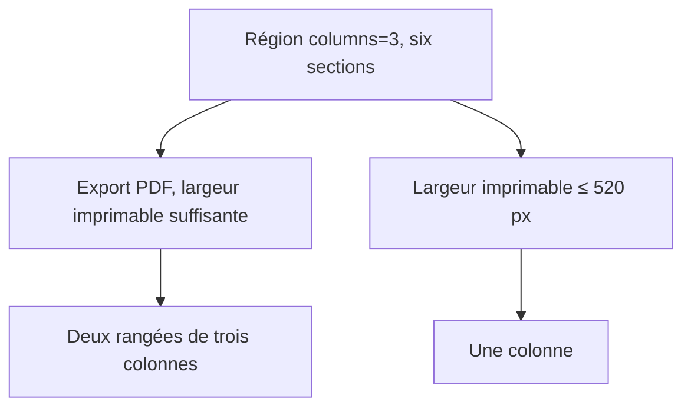

# Instruction: Styliser, prouver et documenter l’export

## Architecture projection

> Tree of the final files. ✅ create · ✏️ modify · ❌ delete

```txt
.
├── src/styles/_layout-regions.scss          ✏️ conteneur de requête et repli pour `.print`
├── tools/
│   ├── assert-layout-regions.mjs            ✏️ exige les sélecteurs d’impression compilés
│   └── e2e/
│       ├── layout-regions-cdp.py            ✏️ affirme colonnes et rangées dans le DOM et dans le PDF réel
│       └── README.md                        ✏️ documente le parcours d’impression
└── README.md                                ✏️ précise que les régions valent aussi à l’export, note la pagination
```

## User Journey



## Tasks to do

### `1)` Donner au DOM d’impression un conteneur de requête

> Le repli étroit ne doit dépendre que de la largeur imprimable.

1. En lecture, `container-type` est posé sur `.markdown-preview-section:has(> .handbook-layout-region)`, absent du DOM d’impression : la requête `@container (max-width: 520px)` n’y a aucun conteneur et ne s’y déclenche jamais. Poser `container-type: inline-size` sur `.print .markdown-preview-view:has(> .handbook-layout-region)`.
2. Vérifier qu’aucune règle de colonnes éditoriales (Adrenaline, Urban Shadows, Monsterhearts) ne s’applique à `.print .markdown-preview-view` ; sinon la neutraliser comme le fait déjà la lecture.
3. Éviter qu’une ligne de colonnes se coupe en travers d’une page : `break-inside: avoid` sur `.handbook-layout-column`, sans forcer de saut de page.

### `2)` Prouver le parcours d’impression réel

> Le critère de l’issue, mesuré dans Obsidian et pas à l’œil.

1. Rejouer la capture de la phase 1 sur la note-sonde d’impression à six sections, dans les thèmes Monsterhearts et Adrenaline.
2. Affirmer sur le DOM : une `.handbook-layout-region` dans `.print`, six colonnes enfants, `grid-template-columns` calculé à trois pistes.
3. Affirmer sur le **PDF réel** produit par `printToPdf` (le critère de l’issue) : les six titres se répartissent sur trois abscisses distinctes et deux ordonnées distinctes, lues par `pypdf` ou `pdfplumber` ; un PDF de la même note sans région les place toutes sur une seule abscisse.
4. Vérifier le repli étroit sur le DOM en réduisant le conteneur d’impression sous 520 px (une seule piste), la région `columns=1`, et une note sans région (DOM identique à celui d’avant le changement).
5. Étendre `assert-layout-regions.mjs` : le CSS compilé contient le sélecteur `.print .markdown-preview-view:has(> .handbook-layout-region)`.

### `3)` Documenter

> Dire ce que l’export fait et ne fait pas.

1. `README.md` : les régions valent aussi à l’export PDF et à l’impression ; la note du repli à 520 px renvoie à la largeur imprimable.
2. `tools/e2e/README.md` : décrire la capture d’impression et ce qu’elle affirme ; ajouter `pypdf` (ou `pdfplumber`) aux prérequis Python, à côté de `websocket-client`.
3. Consigner toute limite de pagination observée (rangée plus haute qu’une page) plutôt que la masquer.
4. Préciser que seul l’export natif d’Obsidian est couvert, pas les plugins d’export tiers dont le DOM diffère.

### `4)` Barrière de validation du dépôt

> Rien ne fusionne sans les preuves durables du dépôt.

1. `rtk proxy pnpm build` passe ; `./node_modules/.bin/eslint src --ext .ts` **et** `pnpm lint` sortent à zéro erreur.
2. `pnpm assert:layout-regions` passe ; `pnpm dump:dom` reste identique à celui d’avant (aucun balisage de bloc modifié).
3. Ne pas commiter `dist/`.

## Test acceptance criteria

| Task | Acceptance criteria |
| --- | --- |
| 1 | Sur une page imprimable large, `columns=3` reste à trois pistes ; sous 520 px de largeur imprimable, une seule piste. |
| 2 | Le PDF réel de la note-sonde place six sections sur trois colonnes et deux rangées, et le DOM d’une note sans région est identique à celui d’avant le changement. |
| 3 | Le README ne prétend plus que les régions n’existent qu’en lecture, précise la portée (export natif) et toute limite de pagination constatée. |
| 4 | Build, deux portées de lint, `assert:layout-regions` et `dump:dom` sont verts et inchangés. |
