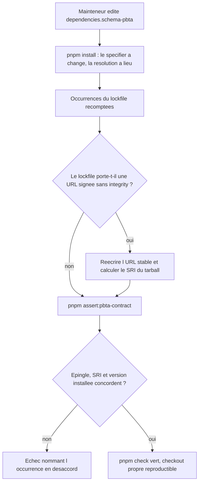

# Instruction: Épingler schema-pbta v5.5.0 et rendre l'épingle vérifiable

## Architecture projection

> Tree of the final files. ✅ create · ✏️ modify · ❌ delete

```txt
.
├── package.json                        ✏️ dependencies.schema-pbta → release v5.5.0
├── pnpm-lock.yaml                      ✏️ specifier, resolution (URL + integrity), version, snapshots
└── tools
    └── assert-pbta-contract.mjs        ✏️ épingle dérivée, SRI exigé, redirection signée interdite
```

## User Journey



## Tasks to do

### `1)` Passer l'épingle à v5.5.0

> Une seule ligne de `package.json` décide de la version consommée.

1. Dans `package.json`, remplacer l'URL de `dependencies["schema-pbta"]` par `https://github.com/RebelliousSmile/schema-pbta/releases/download/v5.5.0/schema-pbta-5.5.0.tgz`.
2. Ne toucher à aucune autre occurrence : les outils doivent lire cette ligne, pas la dupliquer. Hors lockfile, `tools/assert-pbta-contract.mjs:9` est la seule autre occurrence de `5.4.0` dans le dépôt.

### `2)` Regénérer le lockfile sans redirection signée

> Une entrée `release-assets.githubusercontent.com` sans `integrity` expire, et `--no-frozen-lockfile` ne la répare pas : pnpm annonce « Lockfile is up to date, resolution step is skipped ».

1. Lancer `rtk proxy pnpm install` : le specifier de `package.json` diffère désormais de celui du lockfile, donc l'étape de résolution a lieu. Le « Lockfile is up to date, resolution step is skipped » de l'issue survient quand le specifier est déjà enregistré, pas après un changement d'épingle.
2. Si l'installation saute malgré tout la résolution, retirer du lockfile les entrées `schema-pbta` (specifier de l'importeur, bloc `resolution`, `version`, snapshots) et réinstaller — recours, pas premier geste, car une suppression manuelle peut casser le YAML.
3. Recompter les occurrences de `schema-pbta` dans `pnpm-lock.yaml` : les quatre citées par l'issue doivent toutes porter `v5.5.0` / `5.5.0`, snapshots compris — aucune version orpheline.
4. Si `resolution` pointe `release-assets.githubusercontent.com` ou ne porte pas d'`integrity`, appliquer la recette de `51951f5` : télécharger l'asset, vérifier son `sha256` contre le `.sha256` publié, calculer le SRI (`openssl dgst -sha512 -binary schema-pbta-5.5.0.tgz | openssl base64 -A`), puis écrire `resolution: {integrity: sha512-<valeur>, tarball: <URL stable v5.5.0>}`.
5. Vérifier que `rtk proxy pnpm install --frozen-lockfile` réussit sur cet état et que `node_modules/schema-pbta` est en `5.5.0`.

### `3)` Dériver l'épingle dans le lanceur PbtA

> `assert-pbta-contract.mjs` fige encore l'URL et `5.4.0` en littéral, et son message final promet une vérification d'intégrité qu'il ne fait pas.

1. Lire l'URL depuis `package.json`, valider sa forme (`https://github.com/`, `/schema-pbta/releases/download/v`, suffixe `.tgz`) et en extraire la version, comme dans `assert-mist-contract.mjs`.
2. Remplacer les deux littéraux (`releaseUrl`, la regex `version: 5\.4\.0`) par des comparaisons contre cette version dérivée.
3. Ajouter les deux assertions manquantes : la ligne `resolution` du tarball épinglé doit contenir `integrity: sha512-`, et l'entrée `schema-pbta` du lockfile ne doit pas contenir `release-assets.githubusercontent.com`.
4. Comparer la version du paquet installé à la version dérivée en lisant `node_modules/schema-pbta/package.json` par `readFileSync` : `./package.json` n'est pas exporté par le paquet, `import.meta.resolve` y échoue avec `ERR_PACKAGE_PATH_NOT_EXPORTED`.

## Test acceptance criteria

| Task | Acceptance criteria |
| --- | --- |
| 1 | `package.json` est la seule source de la version consommée ; aucun fichier hors lockfile ne contient plus `5.4.0`. |
| 2 | Sur un `node_modules` supprimé, `pnpm install --frozen-lockfile` réinstalle v5.5.0 sans accès à une URL signée, et le lockfile porte le SRI du tarball publié. |
| 2 | Les quatre occurrences `schema-pbta` du lockfile nomment la même version que `package.json`, snapshots inclus. |
| 3 | `pnpm assert:pbta-contract` passe ; en remettant à la main une URL signée sans `integrity` dans le lockfile, il échoue en nommant la redirection ; en désynchronisant `package.json` du lockfile, il échoue en nommant le specifier. |
| 1-3 | `pnpm check`, `pnpm lint` et `pnpm build` sortent en 0. |
